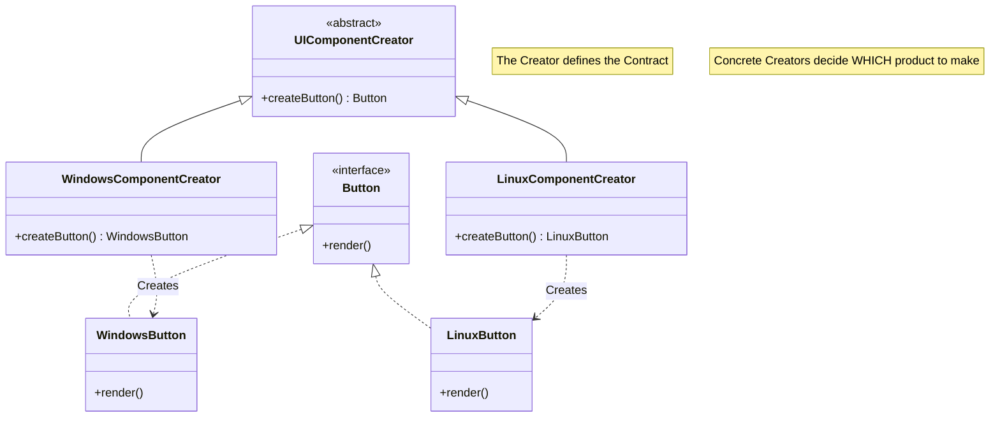
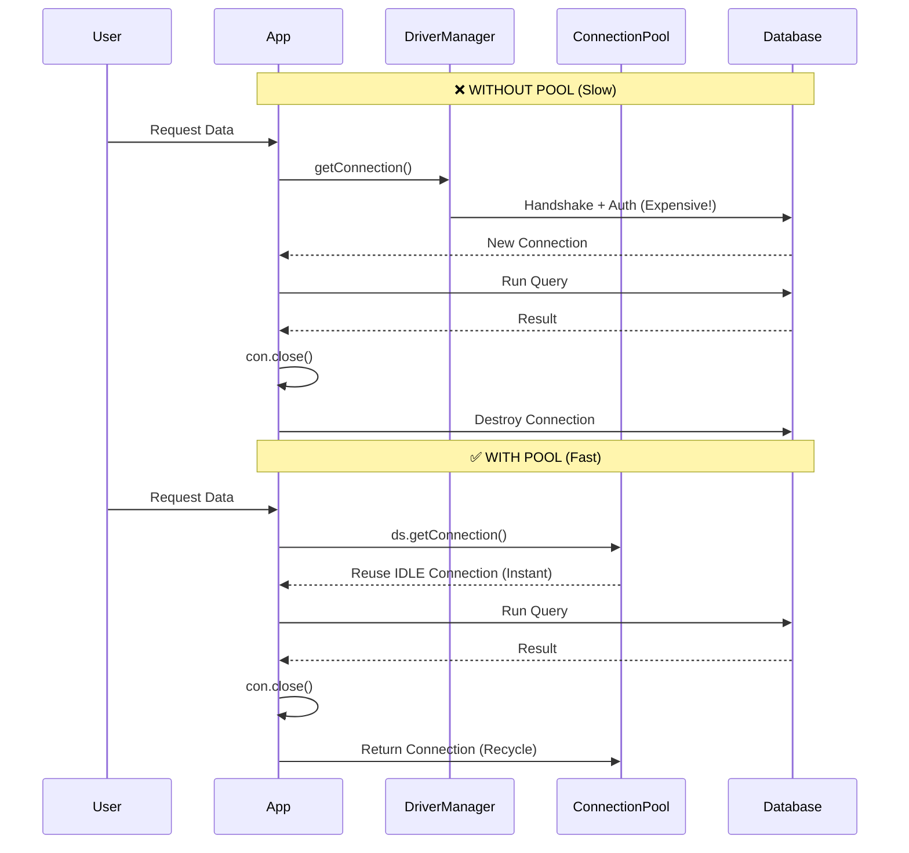
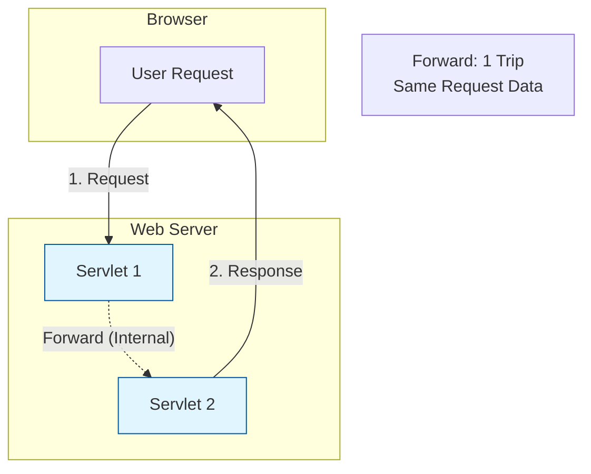
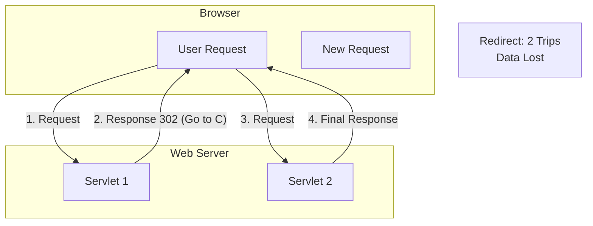

# 🚀 Ultimate Guide: Design Patterns & Jakarta EE

> **Master the Core Concepts**: From Creational Patterns to Advanced Request Processing.

## 📚 Table of Contents
- [1. Design Patterns: Creational](#1--design-patterns-creational)
    - [Simple Factory vs. Factory Method](#simple-factory-vs-factory-method)
    - [The Factory Method Pattern](#the-factory-method-pattern)
- [2. Database Connection Pooling (Day 2)](#2--database-connection-pooling-day-2)
    - [Why Pooling? (The Deep Dive)](#why-pooling-the-deep-dive)
    - [Visual Comparison: Pool vs. No Pool](#visual-comparison-pool-vs-no-pool)
    - [Configuration Masterclass (context.xml)](#configuration-masterclass-contextxml)
    - [JNDI & Dependency Injection](#jndi--dependency-injection)
- [3. Request Processing & Parameters (Day 3)](#3--request-processing--parameters-day-3)
    - [The 3 Scopes of Parameters](#the-3-scopes-of-parameters)
    - [Forward vs. Redirect (The Ultimate Showdown)](#forward-vs-redirect-the-ultimate-showdown)
- [4. 🧠 Interview Mastery (50 Questions)](#4--interview-mastery-50-questions)

---

## 1. 🏭 Design Patterns: Creational

### Simple Factory vs. Factory Method

#### 🛑 The Problem: The "Simple Factory" Trap
Imagine you are building a UI framework. You start with a simple class to create buttons based on the OS.

```java
// Tightly Coupled Logic
public class ButtonFactory {
    public Button createButton(String os) {
        if (os.equals("Windows")) return new WindowsButton();
        else if (os.equals("Linux")) return new LinuxButton();
        else return new MacButton(); // Modifying code every time!
    }
}
```
> **Violation**: This violates the **Open/Closed Principle**. To add "AndroidButton", you must *modify* the tested `ButtonFactory` code, risking bugs.

#### ✅ The Solution: Factory Method Pattern
Instead of one central decision maker, define a **contract** for creation and let subclasses decide *what* to instantiate.

> **Definition**: Define an interface for creating an object, but let subclasses decide which class to instantiate. Factory Method lets a class defer instantiation to subclasses.

### The Component Structure (Mermaid UML)



**Real World Analogy**:
*   **Simple Factory**: A single chef who cooks *everything*. You want Sushi? He cooks it. Pizza? He cooks it. If he quits, the restaurant closes.
*   **Factory Method**: A "Restaurant Franchise" specification. The "Italian Franchise" creates Pizza. The "Japanese Franchise" creates Sushi. To add "Mexican Food", you open a new "Mexican Franchise" (Subclass); you don't change the Italian one.

---

## 2. 🔌 Database Connection Pooling (Day 2)

### Why Pooling? (The Deep Dive)
Establishing a physical database connection is one of the most expensive operations in an application.

<details>
<summary><strong>🔍 Click to see the "Expensive" Steps</strong></summary>

1.  **Driver Loading**: The JDBC driver is loaded into memory.
2.  **Socket Opening**: A TCP/IP socket is opened to the DB server (Network Handshake).
3.  **Authentication**: Username/Password are sent and verified (Encryption overhead).
4.  **Session Creation**: The DB allocates memory for the user session.
5.  **Data Exchange**: Queries are run.
6.  **Connection Close**: Physical socket is torn down.

*Doing steps 1-4 and 6 for every single user request is madness.*
</details>

#### The "Taxi Stand" Analogy 🚖
*   **Without Pool**: For every passenger, you **manufacture a car**, drive them, and then **crush the car**.
*   **With Pool**: You have a **Taxi Stand (Pool)** with 10 cars waiting (**Idle**). Passenger gets in, rides, and the taxi returns to the stand.

### Visual Comparison: Pool vs. No Pool



### Configuration Masterclass (`context.xml`)
This is where the magic happens. Understanding these attributes distinguishes a Junior from a Senior dev.

```xml
<Resource name="jdbc/mypool"
          auth="Container"
          type="javax.sql.DataSource"
          maxTotal="100"       
          maxIdle="30"         
          minIdle="10"
          maxWaitMillis="10000"
          username="root"
          password="password"
          driverClassName="com.mysql.cj.jdbc.Driver"
          url="jdbc:mysql://localhost:3306/mydb"/>
```

| Attribute | Meaning | Best Practice Tip 💡 |
| :--- | :--- | :--- |
| `maxTotal` | Max active connections at once. | Set based on DB capacity (e.g., 100). |
| `maxIdle` | Max connections kept sleeping. | Too high = Memory waste. Too low = Re-creation spikes. |
| `minIdle` | Minimum connections always ready. | Keep a few ready for sudden traffic spikes. |
| `maxWaitMillis` | How long to wait if pool is full. | Never wait forever. Fail fast (e.g., 10s) to avoid hanging threads. |

### JNDI & Dependency Injection
**JNDI (Java Naming and Directory Interface)** is the "Phonebook" of the server. You look up a logical name (`jdbc/mypool`) and get the actual object.

**Steps:**
1.  **Bind**: Tomcat creates the inner `DataSource` and binds it to `java:comp/env/jdbc/mypool`.
2.  **Lookup/Inject**: Your Servlet asks for it.

```java
// ✅ Modern Way: Dependency Injection
@Resource(lookup = "java:comp/env/jdbc/mypool")
private DataSource ds; // Server injects the pool manager here
```

> ⚠️ **Common Mistake**: Forgetting `java:comp/env/` prefix when doing manual lookup.

---

## 3. 🌐 Request Processing & Parameters (Day 3)

### The 3 Scopes of Parameters

| Feature | **Request Param** | **Init Param** | **Context Param** |
| :--- | :--- | :--- | :--- |
| **Scope** | One HTTP Request | **Single Servlet** | **Entire Application** |
| **Defined In** | HTML Form / URL | `web.xml` (`<init-param>`) | `web.xml` (`<context-param>`) |
| **Access** | `request.getParameter()` | `config.getInitParameter()` | `context.getInitParameter()` |
| **Use Case** | User Input (Login ID) | Specific Config (Log path for Servlet A) | Global Config (DB URL, Admin Email) |
| **Interface** | `HttpServletRequest` | `ServletConfig` | `ServletContext` |

### Forward vs. Redirect (The Ultimate Showdown)

When a Servlet hands off work, how does it do it?

#### 1. Forward 🏃
*   **Analogy**: You call reception (Servlet A). Reception transfers you internally to Extension 101 (Servlet B). *You stay on the same line.*
*   **Key Trait**: **One Request**. URL does NOT change. Data is shared.

#### 2. Redirect  boomerang
*   **Analogy**: You call reception. They say "We can't help, call this new number: 555-0199". You hang up and dial the new number.
*   **Key Trait**: **Two Requests**. URL CHANGES. Data is lost (unless in URL/Session).

#### Visual Flowchart





---

## 4. 🧠 Interview Mastery (50 Questions)

### 🟢 Junior Level (Basics)

1.  **What is the main benefit of using a Connection Pool?**
    It drastically improves performance by reusing existing database connections instead of creating a new physical connection (which involves expensive network handshakes) for every request.
2.  **What is the difference between `maxTotal` and `maxIdle` in connection pooling?**
    `maxTotal` is the hard limit of ALL connections (active + idle) that can exist at once. `maxIdle` is the maximum number of connections that can sit sleeping in the pool without being released to free up resources.
3.  **Does `con.close()` close the socket when using a Pool?**
    No. It logically closes the handle and **returns** the physical connection to the pool so it can be reused by another thread.
4.  **Which method changes the URL in the browser: Forward or Redirect?**
    `response.sendRedirect()` changes the URL because it instructs the browser to issue a *new* request to a different location.
5.  **What is the purpose of `web.xml`?**
    It is the Deployment Descriptor. It maps URLs to Servlets, defines parameters (`init-param`, `context-param`), and configures listeners and filters.
6.  **Can `ServletConfig` parameters be shared between two Servlets?**
    No. `ServletConfig` parameters ("init parameters") are private to the specific Servlet definition in `web.xml`.
7.  **What is a "Factory Method"?**
    It is a design pattern where an interface/abstract class defines *how* to create an object, but concrete subclasses decide *which* specific class to instantiate.
8.  **What is the usage of the `@Resource` annotation?**
    It is used for Dependency Injection (DI) in Jakarta EE, most commonly to inject resources like a `DataSource` into a Servlet without manually looking them up.
9.  **What is `java:comp/env`?**
    It is the standard JNDI root context (namespace) where component-specific environment entries (like Datasources) are stored.
10. **Why is `DriverManager.getConnection()` not recommended for production web apps?**
    Because it creates a fresh physical connection for every request. This causes high latency (handshake time) and can exhaust the database server's connection limit under load.
11. **What scope is `ServletContext`?**
    It is **Application Scope** (Global). There is only one `ServletContext` per web application, and it lives as long as the application is running.
12. **How does a servlet access a database connection in a pool?**
    By using a `DataSource` object. You call `ds.getConnection()` which borrows a connection.
13. **What happens if you forget to close a pooled connection?**
    It causes a **Connection Leak**. The connection remains "active" in the pool forever. Eventually, the pool runs out of connections and the application freezes.
14. **Which method is faster: Forward or Redirect?**
    **Forward** is faster because it happens internally within the web container (1 network round-trip). Redirect requires 2 round-trips.
15. **What is an *init* parameter?**
    A configuration value defined for a *single* servlet in `web.xml` (e.g., a file path for that specific servlet to read).
16. **What is a *context* parameter?**
    A global configuration value shared by *all* servlets in the application (e.g., Administrator's email).
17. **What is `JNDI`?**
    Java Naming and Directory Interface. It allows Java applications to look up objects (like DataSources, EJB, or MailSessions) by name.
18. **What does specific logic in `SimpleFactory` violate?**
    The **Open/Closed Principle**. You have to modify the factory class every time you add a new product type.

### 🟠 Intermediate Level (Concepts)

19. **Explain the "Open/Closed Principle" in the context of Factory Pattern.**
    Software entities (classes) should be **Open for Extension** (you can add new subclasses/features) but **Closed for Modification** (you shouldn't touch existing working code to add those features).
20. **Is Factory Method Creational, Structural, or Behavioral?**
    **Creational**. It deals with object creation mechanisms.
21. **How do you pass data during a Redirect?**
    Since the request object is destroyed, you must pass data via **URL Query Strings** (e.g., `?msg=success`) or by storing it in the **HttpSession**.
22. **When should you use `maxWaitMillis`?**
    To prevent the application from hanging indefinitely if the pool is empty. It throws an exception after the specified timeout, allowing the app to fail gracefully/retry.
23. **Can you forward a request to `google.com`?**
    No. `RequestDispatcher.forward()` works only within the same **context** (web application) on the server. To go to an external site, you must use **Redirect**.
24. **Difference between `request.getParameter()` and `request.getAttribute()`?**
    `getParameter()` reads String values sent from the client (Forms/URL). `getAttribute()` reads Objects set by the server (Servlet) to pass data internally (e.g., during a Forward).
25. **What is `RequestDispatcher.include()` used for?**
    To merge the output of another resource (like a JSP header or footer) into the current response stream, while keeping the original Servlet in control of the execution flow.
26. **How do you configure a Global Context Parameter?**
    In `web.xml` using the `<context-param>` tag at the root level (outside any `<servlet>` tag).
27. **What happens if `minIdle` is set to 0?**
    The pool may shrink to zero connections during periods of inactivity. The first user after a quiet period will experience a slight delay as a new physical connection is created.
28. **What is the difference between `bind` and `lookup` in JNDI?**
    **Bind** (done by Server) associates a Name with an Object. **Lookup** (done by App) retrieves the Object using that Name.
29. **Why do we use `try-with-resources` or `finally` block for connections?**
    To guarantee that `con.close()` is called even if an exception occurs. This is the #1 defense against connection leaks.
30. **What is the "Container" in Jakarta EE?**
    The runtime environment (like Tomcat, WildFly) that manages the lifecycle of components (Servlets, Pools), handles security, and provides services like JNDI.
31. **Can `factory method` return an abstract class?**
    Yes, the return type of the factory method is typically an Interface or Abstract Class to allow for polymorphism (returning different subclasses).
32. **What is the difference between `Context` and `InitialContext` in JNDI?**
    `Context` is the Interface defining naming operations. `InitialContext` is the starting point (implementation) you instantiate to begin performing lookups.
33. **(Scenario) You see "No managed connections available within configured blocking timeout". What does this mean?**
    The connection pool is exhausted (all connections are in use) and the `maxWaitMillis` time has expired. It usually indicates a leak or under-provisioned `maxTotal`.
34. **Can you modify a request parameter (`request.setParameter`)?**
    No, standard `HttpServletRequest` parameters are read-only. To pass modified data, you set a request *Attribute*.
35. **Does `Redirect` preserve the `request` scope attributes?**
    No. A Redirect triggers a completely new HTTP request from the browser, so the old request attributes are lost.

### 🔴 Senior Level (Architecture & Scenarios)

36. **Describe the complete lifecycle of a JDBC connection in a Pooled environment.**
    1. **Startup**: Pool initializes `minIdle` connections.
    2. **Borrow**: App calls `ds.getConnection()`. Pool checks for idle conn. If none, creates new (up to `maxTotal`).
    3. **Use**: App executes SQL.
    4. **Return**: App calls `close()`. Connection is validated and returned to idle pool.
    5. **Eviction**: If idle too long (>timeout), pool closes physical socket to free memory.
37. **Scenario: User logs in successfully. Do you Forward or Redirect to the dashboard? Why?**
    **Redirect**. This implements the **Post/Redirect/Get (PRG)** pattern. It prevents the user from accidentally re-submitting the login form (POST) if they refresh the page.
38. **Scenario: User submits invalid data to a form. Forward or Redirect?**
    **Forward**. You want to preserve the `request` object (containing their input and error messages) to redisplay the form so they don't have to re-type everything.
39. **Comparison: `RequestDispatcher` vs `HttpServletResponse.sendRedirect` network impact.**
    Forward = **1 RTT** (Round Trip Time). Redirect = **2 RTTs** (Request 1 -> 302 Response -> Request 2 -> Final Response). Redirect is inherently slower.
40. **What role does JNDI play in decoupling?**
    It removes infrastructure details (DB URL, Credentials) from the Java code. The code only knows the *logical name*. The Server Admin manages the physical configuration. This allows changing DBs without recompiling code.
41. **Can you look up a DataSource without `@Resource`?**
    Yes, using the programmatic approach:
    `Context ctx = new InitialContext(); DataSource ds = (DataSource) ctx.lookup("java:comp/env/jdbc/mypool");`
42. **Critical issue: App hangs after exactly 100 requests. What's the likely cause?**
    A **Connection Leak**. Your pool `maxTotal` is likely 100, and your code is not properly closing connections in a `finally` block.
43. **How does "Connection Validation" work in a pool?**
    Pools can be configured with a `validationQuery` (like "SELECT 1"). The pool runs this query before giving a connection to the app (`testOnBorrow`) to ensure the physical socket is still valid.
44. **Design Pattern: Is Singleton used in this architecture?**
    Yes. The `ServletContext` is a Singleton (one per app). The `DataSource` instance itself is typically a Singleton managed by the Container.
45. **What is `maxConnLifetimeMillis`?**
    A setting to forcibly retire a connection after it has existed for X milliseconds, regardless of activity. This helps prevents issues with firewalls closing long-lived sockets silently.
46. **Can `ServletContext` store objects?**
    Yes, using `setAttribute("key", object)`. It acts as a global in-memory cache for the application, but be careful of thread safety and memory usage.
47. **(Scenario) You need to move from MySQL to Oracle. What changes in the code?**
    **Zero code changes** (ideally). You only change the driver and URL in the server's `context.xml`. The Java code continues to use the same JNDI name and `DataSource` interface.
48. **If `Forward` is internal, does the browser history update?**
    No. The browser history treats the entire sequence as one page visit. The Back button will take you to the page *before* the one that forwarded.
49. **What is "Attribute Scope" vs "Parameter"?**
    **Parameters** are Strings sent by Client. **Attributes** are Objects set by Server. Attributes exist in Request, Session, and Application scopes.
50. **Why might `testOnBorrow` negatively impact performance?**
    It creates a "ping" query (round-trip) for *every* connection request. For high-performance apps, this adds latency. Optimizations include `testWhileIdle` (background validation) instead.
