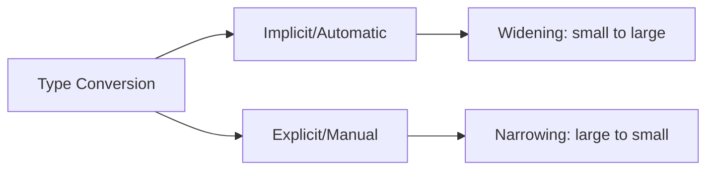
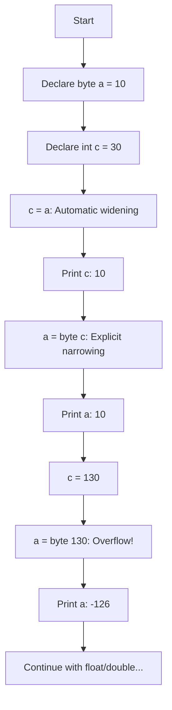
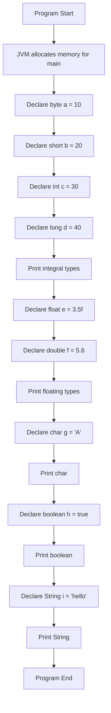

# 📊 Data Types and Variables in Java

## Table of Contents
1. [Introduction to Variables](#introduction-to-variables)
2. [Primitive Data Types](#primitive-data-types)
3. [Size and Range of Data Types](#size-and-range-of-data-types)
4. [Default Values](#default-values)
5. [Type Conversion (Casting)](#type-conversion-casting)
6. [Unicode Character System](#unicode-character-system)
7. [Reference Types](#reference-types)
8. [Code Examples with Explanations](#code-examples-with-explanations)
9. [Interview Questions](#interview-questions)

---

## Introduction to Variables

A **variable** is a named memory location that stores a value. In Java, every variable has:
- **Name**: Identifier to access the variable
- **Type**: What kind of data it can hold
- **Value**: The actual data stored

### Variable Declaration Syntax:
```java
dataType variableName;           // Declaration
dataType variableName = value;   // Declaration with initialization
```

### Types of Variables:

| Variable Type | Where Declared | When Created | Default Value |
|--------------|----------------|--------------|---------------|
| **Local Variable** | Inside method/block | When method is called | None (must initialize) |
| **Instance Variable** | Inside class, outside method | When object is created | Type-specific default |
| **Static Variable** | Inside class with `static` | When class is loaded | Type-specific default |

---

## Primitive Data Types

Java has **8 primitive data types** divided into 4 categories:

### Category 1: Integer Types

| Type | Size | Range | Use Case |
|------|------|-------|----------|
| `byte` | 1 byte (8 bits) | -128 to 127 | Saving memory in large arrays |
| `short` | 2 bytes (16 bits) | -32,768 to 32,767 | Saving memory |
| `int` | 4 bytes (32 bits) | -2^31 to 2^31-1 | Default for integers |
| `long` | 8 bytes (64 bits) | -2^63 to 2^63-1 | Large numbers |

### Category 2: Floating-Point Types

| Type | Size | Precision | Use Case |
|------|------|-----------|----------|
| `float` | 4 bytes (32 bits) | ~7 decimal digits | Saving memory |
| `double` | 8 bytes (64 bits) | ~15 decimal digits | Default for decimals |

### Category 3: Character Type

| Type | Size | Range | Use Case |
|------|------|-------|----------|
| `char` | 2 bytes (16 bits) | 0 to 65,535 (Unicode) | Single character |

### Category 4: Boolean Type

| Type | Size | Values | Use Case |
|------|------|--------|----------|
| `boolean` | 1 bit (JVM dependent) | `true` or `false` | Conditional logic |

---

## Size and Range of Data Types

### Memory Representation

```
┌─────────────────────────────────────────────────────────────────┐
│                    PRIMITIVE DATA TYPES                          │
├─────────────────────────────────────────────────────────────────┤
│                                                                  │
│  byte    [████████]                              1 byte          │
│           8 bits                                                 │
│                                                                  │
│  short   [████████████████]                      2 bytes         │
│           16 bits                                                │
│                                                                  │
│  int     [████████████████████████████████]      4 bytes         │
│           32 bits                                                │
│                                                                  │
│  long    [████████████████████████████████      8 bytes         │
│           ████████████████████████████████]                      │
│           64 bits                                                │
│                                                                  │
│  float   [████████████████████████████████]      4 bytes         │
│           32 bits (IEEE 754)                                     │
│                                                                  │
│  double  [████████████████████████████████      8 bytes         │
│           ████████████████████████████████]                      │
│           64 bits (IEEE 754)                                     │
│                                                                  │
│  char    [████████████████]                      2 bytes         │
│           16 bits (Unicode)                                      │
│                                                                  │
│  boolean [█]                                     1 bit           │
│           (actual size JVM dependent)                            │
│                                                                  │
└─────────────────────────────────────────────────────────────────┘
```

### Detailed Range Table

| Data Type | Size (bytes) | Minimum Value | Maximum Value |
|-----------|-------------|---------------|---------------|
| byte | 1 | -128 | 127 |
| short | 2 | -32,768 | 32,767 |
| int | 4 | -2,147,483,648 | 2,147,483,647 |
| long | 8 | -9,223,372,036,854,775,808 | 9,223,372,036,854,775,807 |
| float | 4 | ~1.4E-45 | ~3.4E+38 |
| double | 8 | ~4.9E-324 | ~1.8E+308 |
| char | 2 | 0 ('\u0000') | 65,535 ('\uffff') |
| boolean | - | false | true |

### Formula for Integer Range:
For n bits: **-2^(n-1)** to **2^(n-1) - 1**

Example for byte (8 bits):
- Minimum: -2^7 = -128
- Maximum: 2^7 - 1 = 127

---

## Default Values

When instance/static variables are declared but not initialized, Java assigns default values:

| Data Type | Default Value |
|-----------|---------------|
| byte | 0 |
| short | 0 |
| int | 0 |
| long | 0L |
| float | 0.0f |
| double | 0.0d |
| char | '\u0000' (null character) |
| boolean | false |
| Reference types | null |

> ⚠️ **Important**: Local variables do NOT have default values. They MUST be initialized before use.

```java
public class DefaultValueDemo {
    // Instance variables - get default values
    int instanceNum;        // Default: 0
    boolean instanceFlag;   // Default: false
    String instanceStr;     // Default: null
    
    public static void main(String[] args) {
        // Local variable - NO default value
        int localNum;
        // System.out.println(localNum); // ERROR: Variable not initialized
        
        localNum = 10;  // Must initialize before use
        System.out.println(localNum);  // OK: 10
        
        DefaultValueDemo obj = new DefaultValueDemo();
        System.out.println(obj.instanceNum);   // Output: 0
        System.out.println(obj.instanceFlag);  // Output: false
        System.out.println(obj.instanceStr);   // Output: null
    }
}
```

---

## Type Conversion (Casting)

Type conversion allows changing a value from one data type to another.

### Two Types of Conversion:



### 1. Implicit/Automatic Conversion (Widening)

Happens automatically when converting from smaller to larger type.

**Conversion Hierarchy:**
```
byte → short → int → long → float → double
         ↑
        char
```

```java
// Automatic Conversion Examples
byte a = 10;
int c = a;        // byte to int - AUTOMATIC
System.out.println(c);  // Output: 10

char ch = 'A';
int k = ch;       // char to int - AUTOMATIC
System.out.println(k);  // Output: 65 (ASCII value of 'A')

int num = 100;
double d = num;   // int to double - AUTOMATIC
System.out.println(d);  // Output: 100.0
```

### 2. Explicit Conversion (Narrowing/Casting)

Required when converting from larger to smaller type. Data may be lost!

**Syntax:** `(targetType) value`

```java
// Explicit Conversion Examples
int c = 30;
byte a = (byte) c;    // int to byte - EXPLICIT CAST needed
System.out.println(a);  // Output: 30

double d = 4.8;
int num = (int) d;    // double to int - EXPLICIT, loses decimal
System.out.println(num);  // Output: 4

// Float literal requires 'f' suffix
float e = 3.5f;       // 3.5 is double by default
float f = (float) 3.5;  // Alternative: explicit cast
```

### Complete Code Example with Explanations

```java
package core1;

public class Main {

    public static void main(String[] args) {
        
        // ========== INTEGER TYPES ==========
        byte a = 10;        // Line 1: Declare byte, assign 10
        int c = 30;         // Line 2: Declare int, assign 30
        
        c = a;              // Line 3: byte to int (AUTOMATIC)
                            // No cast needed - byte fits in int
        System.out.println(c);  // Output: 10
        
        // a = c;           // Line 4: ERROR! int cannot auto-convert to byte
                            // Possible loss of data
        
        a = (byte) c;       // Line 5: int to byte (EXPLICIT CAST)
                            // We tell compiler: "I know what I'm doing"
        System.out.println(a);  // Output: 10
        
        // ========== OVERFLOW DEMONSTRATION ==========
        c = 130;            // Line 6: 130 is beyond byte range (-128 to 127)
        a = (byte) c;       // Line 7: Explicit cast
        System.out.println(a);  // Output: -126 (OVERFLOW!)
        
        // Why -126? 
        // 130 in binary: 10000010
        // As signed byte: interpreted as -126
        
        // ========== FLOATING POINT TYPES ==========
        double d = 4.8;     // Line 8: 4.8 is double by DEFAULT
        System.out.println(d);  // Output: 4.8
        
        // float d = 3.5;   // Line 9: ERROR! 3.5 is double, can't fit in float
        
        float e = 3.5f;     // Line 10: 'f' suffix makes it float literal
        float f = (float) 3.5;  // Line 11: Alternative: explicit cast
        System.out.println(e + "\t" + f);  // Output: 3.5    3.5
        
        // ========== CHAR TO INT ==========
        char ch = 'A';      // Line 12: Character 'A'
        int k = ch;         // Line 13: char to int (AUTOMATIC)
                            // Gets Unicode/ASCII value
        System.out.println(k);  // Output: 65
        
        // ========== INT TO CHAR ==========
        int num = 97;       // Line 14: ASCII value of 'a'
        char ch1 = (char) num;  // Line 15: int to char (EXPLICIT)
        System.out.println(ch1);  // Output: a
        
        // ========== DIRECT ASSIGNMENT ==========
        char dd2 = 100;     // Line 16: Assign int literal directly to char
                            // Valid because 100 is within char range
        System.out.println(dd2);  // Output: d (ASCII 100)
        
        // ========== DOUBLE TO CHAR ==========
        double dd = 100.5;  // Line 17: Double value
        char ch2 = (char) dd;   // Line 18: double to char (truncates decimal)
        System.out.println(ch2);  // Output: d (takes 100, ignores .5)
        
        // ========== CHAR TO DOUBLE ==========
        char ch3 = 'P';     // Line 19: Character 'P'
        double dd1 = ch3;   // Line 20: char to double (AUTOMATIC)
        System.out.println(dd1);  // Output: 80.0 (ASCII of 'P')
        
        // ========== INCOMPATIBLE TYPES ==========
        boolean val = true;  // Line 21: Boolean value
        // int k = val;      // Line 22: ERROR! boolean is NOT compatible 
                             // with any numeric type
    }
}
```

### Execution Flow:



### Type Compatibility Chart

| From \ To | byte | short | int | long | float | double | char | boolean |
|-----------|------|-------|-----|------|-------|--------|------|---------|
| byte | - | ✓ | ✓ | ✓ | ✓ | ✓ | ✗ | ✗ |
| short | C | - | ✓ | ✓ | ✓ | ✓ | ✗ | ✗ |
| int | C | C | - | ✓ | ✓ | ✓ | C | ✗ |
| long | C | C | C | - | ✓ | ✓ | C | ✗ |
| float | C | C | C | C | - | ✓ | C | ✗ |
| double | C | C | C | C | C | - | C | ✗ |
| char | C | C | ✓ | ✓ | ✓ | ✓ | - | ✗ |
| boolean | ✗ | ✗ | ✗ | ✗ | ✗ | ✗ | ✗ | - |

**Legend:** ✓ = Automatic, C = Cast needed, ✗ = Not compatible

---

## Unicode Character System

### What is Unicode?

Unicode is a universal character encoding standard that assigns a unique number to every character across all languages.

- **ASCII**: 7 bits, 128 characters (English only)
- **Unicode**: 16 bits in Java, 65,536 characters (all languages)

### Unicode in Java

```java
// Different ways to represent characters
char ch1 = 'A';           // Direct character
char ch2 = 65;            // ASCII/Unicode value
char ch3 = '\u0041';      // Unicode escape sequence

System.out.println(ch1);  // A
System.out.println(ch2);  // A
System.out.println(ch3);  // A

// International characters
char hindi = '\u0905';    // अ (Devanagari A)
char chinese = '\u4E2D';  // 中 (Chinese "middle")
char emoji = '\u263A';    // ☺ (Smiley)
```

### Common Unicode Values

| Character | Unicode | Decimal |
|-----------|---------|---------|
| A-Z | \u0041-\u005A | 65-90 |
| a-z | \u0061-\u007A | 97-122 |
| 0-9 | \u0030-\u0039 | 48-57 |
| Space | \u0020 | 32 |
| Newline | \u000A | 10 |

---

## Reference Types

Reference types store addresses (references) to objects, not the actual data.

### Primitive vs Reference Types

| Aspect | Primitive | Reference |
|--------|-----------|-----------|
| Storage | Actual value | Address of object |
| Memory | Stack | Heap (object), Stack (reference) |
| Default | Type-specific | null |
| Examples | int, char, boolean | String, Arrays, Classes |

### Example: String (Most Common Reference Type)

```java
public class ReferenceDemo {
    public static void main(String[] args) {
        // Primitive type
        int num = 100;       // 'num' stores actual value 100
        
        // Reference type
        String str = "Hello"; // 'str' stores ADDRESS of String object
        
        // Memory visualization:
        // Stack          Heap
        // -----          ----
        // num: 100
        // str: 0x1234 → [Hello]
        
        System.out.println(num);  // 100
        System.out.println(str);  // Hello
    }
}
```

---

## Code Examples with Explanations

### Complete Data Types Demo

```java
public class Datatypes_Demo {                           // Line 1: Class declaration
    public static void main(String[] args) {            // Line 2: Main method - entry point
        
        // ========== INTEGRAL TYPES ==========
        byte a = 10;    // Line 3: 1 byte, range -128 to 127
                        // Use: Save memory in large arrays
        
        short b = 20;   // Line 4: 2 bytes, range -32768 to 32767
                        // Use: Save memory compared to int
        
        int c = 30;     // Line 5: 4 bytes, most common integer type
                        // Default type for integer literals
        
        long d = 40;    // Line 6: 8 bytes, for very large numbers
                        // Note: Can add 'L' suffix: 40L
        
        // Print all integral types
        System.out.println(a + "\t" + b + "\t" + c + "\t" + d);
        // Output: 10    20    30    40
        // \t is tab character for spacing
        
        // ========== FLOATING POINT TYPES ==========
        float e = 3.5f;   // Line 7: 4 bytes, 'f' suffix required
                          // 3.5 without 'f' is double by default
        
        double f = 5.6;   // Line 8: 8 bytes, default decimal type
                          // No suffix needed
        
        System.out.println(e + "\t" + f);
        // Output: 3.5    5.6
        
        // ========== CHARACTER TYPE ==========
        char g = 'A';     // Line 9: 2 bytes, single character
                          // Must use single quotes ''
        
        System.out.println(g);
        // Output: A
        
        // ========== BOOLEAN TYPE ==========
        boolean h = true;  // Line 10: true or false only
                           // Cannot use 0/1 like C/C++
        
        System.out.println(h);
        // Output: true
        
        // ========== REFERENCE TYPE ==========
        String i = "hello";  // Line 11: String is a class (reference type)
                             // Must use double quotes ""
        
        System.out.println(i);
        // Output: hello
    }
}
```

### Execution Flow Diagram



---

## Interview Questions

### Q1: What are primitive data types in Java?
**Answer**: Java has 8 primitive types: byte, short, int, long (integers), float, double (decimals), char (character), boolean (true/false).

### Q2: What is the default value of int and boolean?
**Answer**: Default value of int is 0, boolean is false. These apply to instance/static variables only.

### Q3: Why is char 2 bytes in Java?
**Answer**: Java uses Unicode encoding which requires 2 bytes (16 bits) to represent characters from all world languages, unlike ASCII which uses only 1 byte.

### Q4: What happens when you assign 130 to a byte variable?
**Answer**: Since byte range is -128 to 127, assigning 130 causes overflow. The value wraps around: 130 becomes -126.

### Q5: What is the difference between implicit and explicit type casting?
**Answer**:
- **Implicit (Widening)**: Automatic, small to large type, no data loss
- **Explicit (Narrowing)**: Manual using `(type)`, large to small, may lose data

### Q6: Why does "float f = 3.5;" give error?
**Answer**: By default, decimal literals are double (8 bytes). You cannot assign double to float (4 bytes) without explicit cast. Use `3.5f` or `(float)3.5`.

### Q7: Can we convert boolean to int in Java?
**Answer**: No. Boolean is not compatible with any numeric type in Java. This is different from C/C++ where 0 is false and non-zero is true.

### Q8: What is the size of boolean in Java?
**Answer**: The JVM specification doesn't define exact size. It's typically 1 bit conceptually but may use 1 byte or more in actual implementation.

### Q9: What is Unicode?
**Answer**: Unicode is a universal character encoding standard that provides a unique number for every character regardless of platform, program, or language. Java uses UTF-16 encoding.

### Q10: What is the difference between String and char?
**Answer**:
- **char**: Primitive type, single character, uses single quotes `'A'`
- **String**: Reference type (class), sequence of characters, uses double quotes `"Hello"`

---

## Quick Reference

### Declaration Examples
```java
byte b = 100;
short s = 1000;
int i = 100000;
long l = 100000L;
float f = 3.14f;
double d = 3.14159;
char c = 'A';
boolean flag = true;
String str = "Hello";
```

### Suffix Requirements
| Type | Suffix | Example |
|------|--------|---------|
| long | L or l | 100L |
| float | F or f | 3.14f |
| double | D or d (optional) | 3.14 or 3.14d |

### Common Conversions
```java
int → byte:      (byte) intValue
double → int:    (int) doubleValue
char → int:      automatic
int → char:      (char) intValue
String → int:    Integer.parseInt(str)
int → String:    String.valueOf(num)
```

---

*Previous: [01_Introduction_to_Java.md](./01_Introduction_to_Java.md)*  
*Next: [03_Operators.md](./03_Operators.md)*
