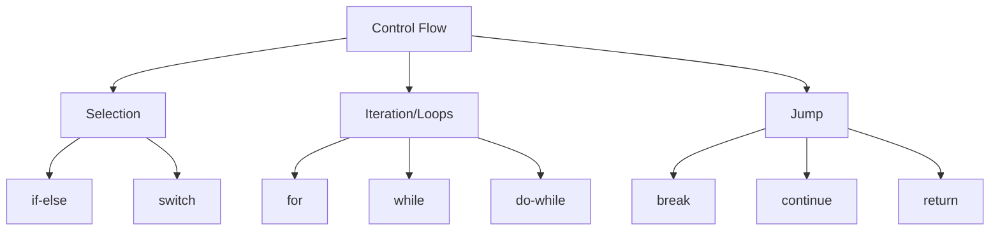
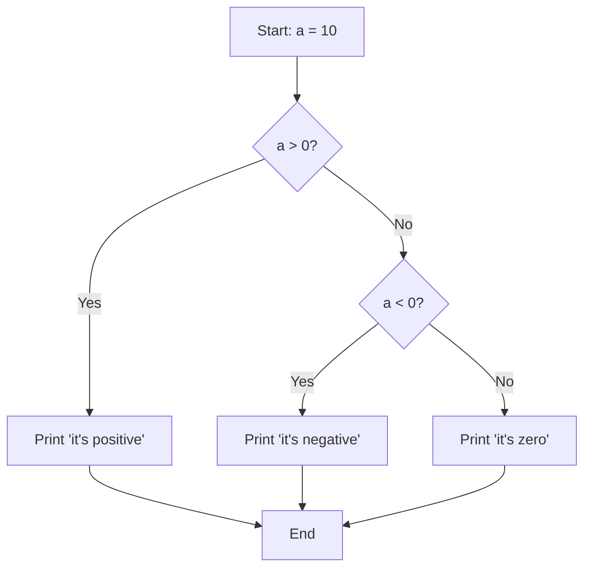
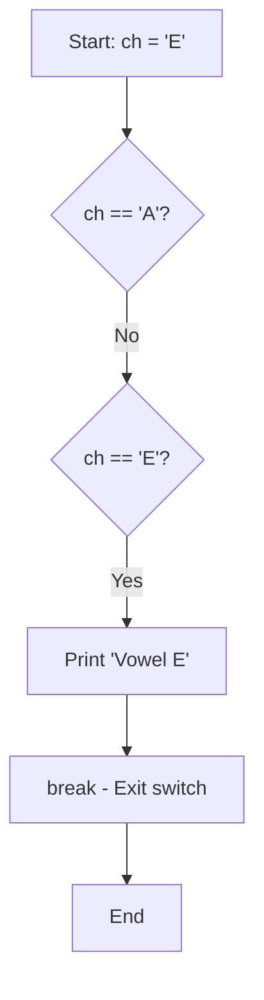
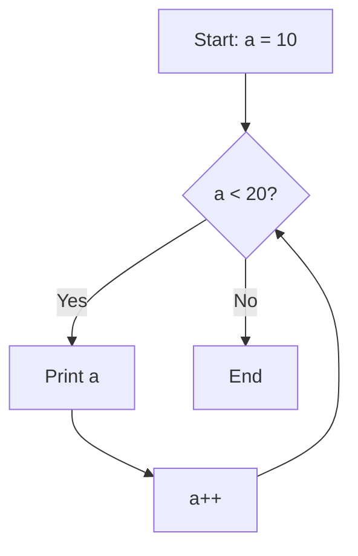

# 🔄 Control Flow Statements in Java

## Table of Contents
1. [Introduction to Control Flow](#introduction-to-control-flow)
2. [Selection/Conditional Statements](#selectionconditional-statements)
3. [Looping Statements](#looping-statements)
4. [Jump Statements](#jump-statements)
5. [Labeled Loops](#labeled-loops)
6. [Pattern Programs](#pattern-programs)
7. [Interview Questions](#interview-questions)

---

## Introduction to Control Flow

Control flow statements determine the order in which statements are executed. They allow making decisions and repeating code.



---

## Selection/Conditional Statements

### 1. if Statement

Executes code block only if condition is true.

```java
// Syntax
if (condition) {
    // code to execute if condition is true
}
```

### 2. if-else Statement

Executes one block if true, another if false.

```java
// Syntax
if (condition) {
    // code if true
} else {
    // code if false
}
```

### 3. if-else-if Ladder

Multiple conditions checked in sequence.

```java
// Syntax
if (condition1) {
    // code if condition1 is true
} else if (condition2) {
    // code if condition2 is true
} else if (condition3) {
    // code if condition3 is true
} else {
    // code if all conditions are false
}
```

### Complete if-else Example with Explanation:

```java
public class If_Demo {                              // Line 1: Class declaration
    public static void main(String[] args) {        // Line 2: Main method
        int a = 10;                                 // Line 3: Declare and initialize variable
        
        if (a > 0) {                                // Line 4: Check if a is positive
            System.out.println("it's positive");    // Line 5: Executes if a > 0
        }
        else if (a < 0) {                           // Line 6: Check if a is negative
            System.out.println("it's negative");    // Line 7: Executes if a < 0
        }
        else {                                      // Line 8: Default case
            System.out.println("it's zero");        // Line 9: Executes if a == 0
        }
    }
}
```

### Execution Flow:



### Line-by-Line Explanation:

| Line | Code | Explanation |
|------|------|-------------|
| 1 | `public class If_Demo` | Declares a public class named If_Demo |
| 2 | `public static void main...` | Entry point of the program |
| 3 | `int a = 10;` | Creates integer variable 'a' with value 10 |
| 4 | `if (a > 0)` | Checks if a is greater than 0. True for a=10 |
| 5 | `System.out.println...` | Prints "it's positive" since condition is true |
| 6-9 | else-if, else | These blocks are skipped since first condition was true |

---

### 4. switch Statement

Selects one of many code blocks to execute based on a value.

```java
// Syntax
switch (expression) {
    case value1:
        // code
        break;
    case value2:
        // code
        break;
    default:
        // code if no case matches
}
```

### switch Supported Types:
- byte, short, int, char
- String (from Java 7)
- Enum

### Complete switch Example with Explanation:

```java
public class Switch_Demo {                              // Line 1: Class declaration
    public static void main(String args[]) {            // Line 2: Main method
        char ch = 'E';                                  // Line 3: Declare char variable
        
        switch(ch) {                                    // Line 4: Switch on character value
            // byte, int, short and char and String supported
            
            case 'A':                                   // Line 5: If ch equals 'A'
                System.out.println("Vowel A");          // Line 6: Print message
                break;                                  // Line 7: Exit switch block
                
            case 'E':                                   // Line 8: If ch equals 'E'
                System.out.println("Vowel E");          // Line 9: Print message
                break;                                  // Line 10: Exit switch block
                
            case 'I':                                   // Line 11: If ch equals 'I'
                System.out.println("Vowel I");          // Line 12: Print message
                break;                                  // Line 13: Exit switch block
                
            case 'O':                                   // Line 14: If ch equals 'O'
                System.out.println("Vowel O");          // Line 15: Print message
                break;                                  // Line 16: Exit switch block
                
            case 'U':                                   // Line 17: If ch equals 'U'
                System.out.println("Vowel U");          // Line 18: Print message
                break;                                  // Line 19: Exit switch block
                
            default:                                    // Line 20: If no case matches
                System.out.println("Not a Vowel");      // Line 21: Print default message
        }
    }
}
```

### Execution Flow:



### Output: `Vowel E`

### Fall-through Behavior (Without break):

```java
char ch = 'A';
switch(ch) {
    case 'A': System.out.println("A");
              // No break - falls through!
    case 'E': System.out.println("E");
              break;
    default:  System.out.println("Default");
}
// Output: A
//         E
```

> ⚠️ **Important**: Without `break`, execution "falls through" to next case!

---

## Looping Statements

### 1. for Loop

Best when number of iterations is known.

```java
// Syntax
for (initialization; condition; update) {
    // code to repeat
}
```

### for Loop Example:

```java
public class For_Demo_1 {                           // Line 1: Class declaration
    public static void main(String[] args) {        // Line 2: Main method
        int i;                                      // Line 3: Declare loop variable
        
        for (i = 0; i < 5; i++) {                   // Line 4: Loop from 0 to 4
            System.out.println(i);                  // Line 5: Print current value
        }
    }
}
```

### for Loop Execution Flow:

```
Step 1: i = 0 (initialization - runs once)
Step 2: Check i < 5? (0 < 5) → true → execute body, print 0
Step 3: i++ → i = 1
Step 4: Check i < 5? (1 < 5) → true → execute body, print 1
Step 5: i++ → i = 2
Step 6: Check i < 5? (2 < 5) → true → execute body, print 2
Step 7: i++ → i = 3
Step 8: Check i < 5? (3 < 5) → true → execute body, print 3
Step 9: i++ → i = 4
Step 10: Check i < 5? (4 < 5) → true → execute body, print 4
Step 11: i++ → i = 5
Step 12: Check i < 5? (5 < 5) → false → EXIT loop
```

### Output:
```
0
1
2
3
4
```

---

### 2. while Loop (Pre-Test Loop)

Checks condition BEFORE executing the body.

```java
// Syntax
while (condition) {
    // code to repeat
}
```

### while Loop Example:

```java
public class While_Demo {                           // Line 1: Class declaration
    public static void main(String[] args) {        // Line 2: Main method
        int a = 10;                                 // Line 3: Initialize counter
        
        // Pre-Test Loop: Condition checked first
        while (a < 20) {                            // Line 4: Check condition
            System.out.println(a);                  // Line 5: Print current value
            a++;                                    // Line 6: Increment counter
        }
    }
}
```

### while Loop Flow:



### Output:
```
10
11
12
13
14
15
16
17
18
19
```

---

### 3. do-while Loop (Post-Test Loop)

Executes body at least once, then checks condition.

```java
// Syntax
do {
    // code to repeat
} while (condition);
```

### do-while Loop Example:

```java
public class Do_While_Demo {                        // Line 1: Class declaration
    public static void main(String[] args) {        // Line 2: Main method
        int a = 10;                                 // Line 3: Initialize counter
        
        // Post-Test Loop: Body executes first, then condition checked
        do {                                        // Line 4: Start do block
            System.out.println(a);                  // Line 5: Print current value
            a++;                                    // Line 6: Increment counter
        } while (a < 20);                           // Line 7: Check condition
    }
}
```

### Key Difference: while vs do-while

```java
// while: May execute 0 times
int x = 20;
while (x < 10) {           // Condition false immediately
    System.out.println(x); // Never executes!
}

// do-while: Executes at least once
int y = 20;
do {
    System.out.println(y); // Executes once! Prints 20
} while (y < 10);
```

---

### 4. Nested Loops

Loop inside another loop.

```java
package datatypes_pro;

public class Nested_For_Demo {                      // Line 1: Class declaration
    public static void main(String[] args) {        // Line 2: Main method
        int i, j;                                   // Line 3: Declare loop variables
        
        for (i = 0; i < 3; i++) {                   // Line 4: Outer loop (rows)
            for (j = 0; j < 3; j++) {               // Line 5: Inner loop (columns)
                System.out.println(i + "\t" + j);   // Line 6: Print i and j
            }
            System.out.println();                   // Line 7: Blank line after each row
        }
    }
}
```

### Nested Loop Execution:

```
Outer i=0:
    Inner j=0: Print "0  0"
    Inner j=1: Print "0  1"
    Inner j=2: Print "0  2"
    Print blank line

Outer i=1:
    Inner j=0: Print "1  0"
    Inner j=1: Print "1  1"
    Inner j=2: Print "1  2"
    Print blank line

Outer i=2:
    Inner j=0: Print "2  0"
    Inner j=1: Print "2  1"
    Inner j=2: Print "2  2"
    Print blank line
```

### Output:
```
0	0
0	1
0	2

1	0
1	1
1	2

2	0
2	1
2	2
```

---

## Jump Statements

### 1. break Statement

Exits the current loop or switch immediately.

```java
for (int i = 0; i < 10; i++) {
    if (i == 5) {
        break;  // Exit loop when i equals 5
    }
    System.out.println(i);
}
// Output: 0 1 2 3 4
```

### 2. continue Statement

Skips current iteration and continues with next.

```java
for (int i = 0; i < 10; i++) {
    if (i == 5) {
        continue;  // Skip printing 5
    }
    System.out.println(i);
}
// Output: 0 1 2 3 4 6 7 8 9
```

### continue with Different Loops:

```
continue with for loop:
  - Skips to update expression (i++)
  - Then checks condition

continue with while loop:
  - Skips directly to condition check
  - Be careful: may cause infinite loop if update is after continue!

continue with do-while:
  - Skips to condition check at the end
```

---

## Labeled Loops

Labels allow breaking/continuing outer loops from inner loops.

```java
public class LabeledLoopDemo {
    public static void main(String[] args) {
        
        outer:  // Label for outer loop
        for (int i = 0; i < 3; i++) {
            
            inner:  // Label for inner loop
            for (int j = 0; j < 3; j++) {
                
                if (j == 1) {
                    break outer;  // Breaks OUTER loop, not just inner
                }
                System.out.println("i=" + i + ", j=" + j);
            }
        }
        System.out.println("After loops");
    }
}
```

### Output:
```
i=0, j=0
After loops
```

### Without Label vs With Label:

```java
// Without label: break exits only inner loop
for (int i = 0; i < 3; i++) {
    for (int j = 0; j < 3; j++) {
        if (j == 1) break;  // Exits inner loop only
        System.out.print(j + " ");
    }
    System.out.println();
}
// Output:
// 0
// 0
// 0

// With label: break exits named outer loop
outer:
for (int i = 0; i < 3; i++) {
    for (int j = 0; j < 3; j++) {
        if (j == 1) break outer;  // Exits outer loop
        System.out.print(j + " ");
    }
    System.out.println();
}
// Output:
// 0 
```

---

## Pattern Programs

Pattern programs are excellent for understanding nested loops.

### Pattern 1: Right Triangle

```java
/*
*
* *
* * *
* * * *
* * * * *
*/

public class Pattern1 {
    public static void main(String[] args) {
        int n = 5;
        for (int i = 1; i <= n; i++) {           // Rows: 1 to 5
            for (int j = 1; j <= i; j++) {       // Stars: 1 to i
                System.out.print("* ");
            }
            System.out.println();                 // New line after each row
        }
    }
}
```

### Execution Trace:
```
i=1: j loops 1 time  → *
i=2: j loops 2 times → * *
i=3: j loops 3 times → * * *
i=4: j loops 4 times → * * * *
i=5: j loops 5 times → * * * * *
```

### Pattern 2: Inverted Right Triangle

```java
/*
* * * * *
* * * *
* * *
* *
*
*/

public class Pattern2 {
    public static void main(String[] args) {
        int n = 5;
        for (int i = n; i >= 1; i--) {           // Rows: 5 to 1
            for (int j = 1; j <= i; j++) {       // Stars: 1 to i
                System.out.print("* ");
            }
            System.out.println();
        }
    }
}
```

### Pattern 3: Number Triangle

```java
/*
1
1 2
1 2 3
1 2 3 4
1 2 3 4 5
*/

public class Pattern3 {
    public static void main(String[] args) {
        int n = 5;
        for (int i = 1; i <= n; i++) {
            for (int j = 1; j <= i; j++) {
                System.out.print(j + " ");       // Print column number
            }
            System.out.println();
        }
    }
}
```

### Pattern 4: Pyramid

```java
/*
    *
   * *
  * * *
 * * * *
* * * * *
*/

public class Pattern4 {
    public static void main(String[] args) {
        int n = 5;
        for (int i = 1; i <= n; i++) {
            // Print spaces
            for (int j = n - i; j >= 1; j--) {
                System.out.print(" ");
            }
            // Print stars
            for (int k = 1; k <= i; k++) {
                System.out.print("* ");
            }
            System.out.println();
        }
    }
}
```

### Pattern Analysis:
```
Row 1: 4 spaces, 1 star
Row 2: 3 spaces, 2 stars
Row 3: 2 spaces, 3 stars
Row 4: 1 space,  4 stars
Row 5: 0 spaces, 5 stars

Spaces = n - row_number
Stars = row_number
```

---

## Interview Questions

### Q1: What is the difference between while and do-while?
**Answer**:
- **while**: Pre-test loop, condition checked first, may execute 0 times
- **do-while**: Post-test loop, body executes first, executes at least once

### Q2: Can switch statement work with String?
**Answer**: Yes, from Java 7 onwards. switch supports byte, short, int, char, String, and Enum.

### Q3: What happens if break is missing in switch case?
**Answer**: Fall-through occurs. Execution continues to the next case without checking its condition until a break is encountered.

### Q4: What is the difference between break and continue?
**Answer**:
- **break**: Exits the entire loop
- **continue**: Skips current iteration, continues with next

### Q5: Can we have multiple initialization in for loop?
**Answer**: Yes, using comma:
```java
for (int i = 0, j = 10; i < j; i++, j--) { }
```

### Q6: What is a labeled loop?
**Answer**: A loop with a name (label) that allows breaking or continuing that specific loop from nested loops.

### Q7: What is an infinite loop?
**Answer**: A loop that never terminates:
```java
while(true) { }
for(;;) { }
```

### Q8: Can we use floating-point in for loop?
**Answer**: Yes, but not recommended due to precision issues:
```java
for (double d = 0.0; d < 1.0; d += 0.1) { } // May not work as expected
```

### Q9: What happens if condition is omitted in for loop?
**Answer**: It becomes true by default, creating an infinite loop:
```java
for (int i = 0; ; i++) { } // Infinite loop
```

### Q10: Can switch have duplicate case values?
**Answer**: No, duplicate case values cause compilation error.

---

## Quick Reference

### Loop Selection Guide

| Scenario | Best Loop |
|----------|-----------|
| Known iterations | for |
| Unknown iterations, check first | while |
| Unknown iterations, execute at least once | do-while |
| Iterating over array/collection | for-each |

### Syntax Summary

```java
// if-else
if (condition) { } else { }

// switch
switch (value) { case x: break; default: }

// for
for (init; condition; update) { }

// while
while (condition) { }

// do-while
do { } while (condition);

// break
break;          // Exit current loop
break label;    // Exit labeled loop

// continue
continue;       // Skip to next iteration
continue label; // Skip in labeled loop
```

---

*Previous: [03_Operators.md](./03_Operators.md)*  
*Next: [05_OOP_Fundamentals.md](./05_OOP_Fundamentals.md)*
