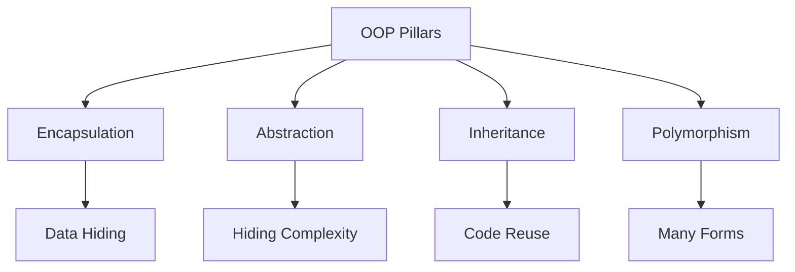
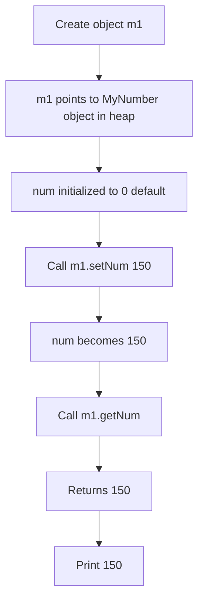
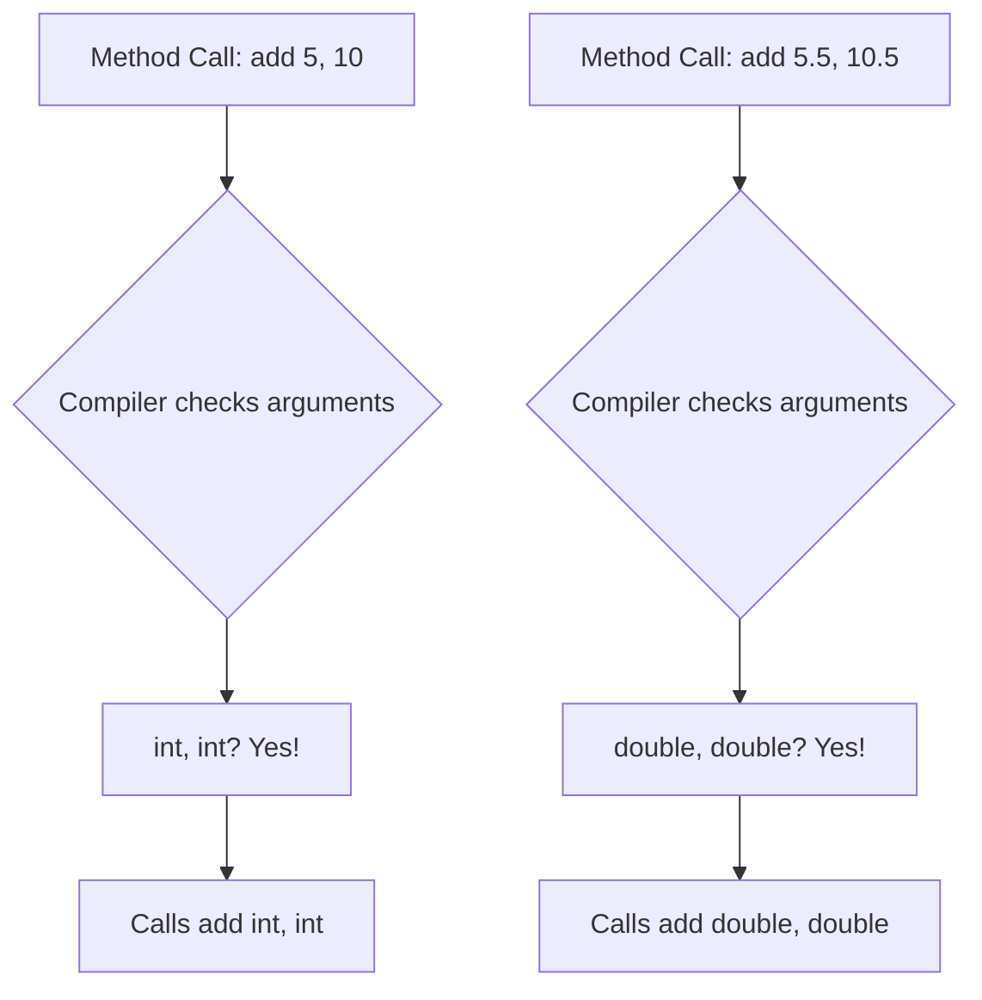

# 🎯 Object-Oriented Programming Fundamentals

## Table of Contents
1. [Introduction to OOP](#introduction-to-oop)
2. [Drawbacks of Procedural Programming](#drawbacks-of-procedural-programming)
3. [Class and Object](#class-and-object)
4. [Member Variables and Methods](#member-variables-and-methods)
5. [Encapsulation](#encapsulation)
6. [Abstraction](#abstraction)
7. [The 'this' Keyword](#the-this-keyword)
8. [Function Overloading](#function-overloading)
9. [Static Members](#static-members-introduction)
10. [Code Examples with Explanations](#code-examples-with-explanations)
11. [Interview Questions](#interview-questions)

---

## Introduction to OOP

**Object-Oriented Programming (OOP)** is a programming paradigm based on the concept of "objects" which contain data (attributes) and code (methods).

### Core Principles of OOP:



### Key OOP Concept:

> **"Everything in OOP revolves around representing real-world entities as objects."**

---

## Drawbacks of Procedural Programming

Before OOP, we had **Procedure-Oriented Programming (POP)** like C.

### Problems with POP:

| Issue | Description |
|-------|-------------|
| **Functions Only** | Deals with functions, no real-world entity representation |
| **Difficult Maintenance** | Large applications have many functions, hard to manage |
| **No Data Security** | Global data can be modified from any function |
| **No Real-World Mapping** | Cannot represent entities like Person, Vehicle, Account |
| **Code Repetition** | Same logic often repeated in multiple functions |

### Example of the Problem:

```
POP Approach (C):
┌──────────────────────────────────────────────────────────────┐
│  Global Data: name, age, balance                             │
│                         │                                     │
│  ┌──────────┐ ┌──────────┐ ┌──────────┐ ┌──────────┐        │
│  │ function1│ │ function2│ │ function3│ │ function4│        │
│  └────┬─────┘ └────┬─────┘ └────┬─────┘ └────┬─────┘        │
│       │            │            │            │               │
│       └────────────┴────────────┴────────────┘               │
│                         │                                     │
│              All can access/modify global data               │
│                    NO SECURITY!                              │
└──────────────────────────────────────────────────────────────┘
```

---

## Class and Object

### What is an Object?

In everyday life, we see objects around us:
- Person
- AC
- Chair
- Laptop
- Mobile

Each object has:
1. **Attributes (State)**: Properties that describe the object
2. **Behavior (Methods)**: Actions the object can perform

### What is a Class?

A **class** is a blueprint/template that describes how objects should be structured.

```
CLASS = Blueprint/Template/Idea
OBJECT = Real instance/entity created from class
```

### Analogy:

| Class | Object |
|-------|--------|
| House Blueprint | Actual House |
| Cookie Cutter | Cookies |
| Person Template | Sachin, Virat, Rohit |

### Class and Object Example:

```java
// CLASS: Template/Blueprint that describes a Person
class Person {
    // ATTRIBUTES (What a person HAS)
    String name;
    int age;
    String address;
    
    // BEHAVIORS (What a person DOES)
    void walk() {
        System.out.println("Walking...");
    }
    void talk() {
        System.out.println("Talking...");
    }
    void eat() {
        System.out.println("Eating...");
    }
    void sleep() {
        System.out.println("Sleeping...");
    }
}

// Usage:
Person sachin = new Person();  // Object 1
Person virat = new Person();   // Object 2
Person rohit = new Person();   // Object 3
```

### Memory Visualization:

```
  Stack                              Heap
┌─────────────┐                ┌─────────────────┐
│ sachin: 0x100│───────────────►│ Person Object   │
├─────────────┤                │ name: null      │
│ virat: 0x200 │───────────┐   │ age: 0          │
├─────────────┤            │   │ address: null   │
│ rohit: 0x300 │─────────┐ │   └─────────────────┘
└─────────────┘          │ │   
                         │ │   ┌─────────────────┐
                         │ └──►│ Person Object   │
                         │     │ name: null      │
                         │     │ age: 0          │
                         │     │ address: null   │
                         │     └─────────────────┘
                         │     
                         │     ┌─────────────────┐
                         └────►│ Person Object   │
                               │ name: null      │
                               │ age: 0          │
                               │ address: null   │
                               └─────────────────┘
```

---

## Member Variables and Methods

### Types of Members:

| Type | Also Called | Belongs To |
|------|-------------|------------|
| Instance Variable | Member Variable | Each Object |
| Instance Method | Member Method | Each Object |
| Static Variable | Class Variable | Class itself |
| Static Method | Class Method | Class itself |

### Instance Members Example:

```java
class MyNumber {
    private int num;   // Instance member/member variable
                       // Each object gets its own copy

    // Member functions/methods
    public void setNum(int k) {   // Setter
        num = k;
    }
    
    public int getNum() {         // Getter
        return num;
    }
}
```

---

## Encapsulation

**Encapsulation** is bundling data (variables) and methods that operate on the data within a single unit (class), and restricting direct access to some components.

### Key Points:
- **Private data** + **Public methods** = Encapsulation
- Also known as **Data Hiding**
- Access data only through getters/setters

### Rules of Encapsulation:
1. Declare variables as `private`
2. Provide `public` getter and setter methods
3. All manipulation happens through methods

### Complete Encapsulation Example:

```java
class MyNumber {                                    // Line 1: Class declaration
    private int num;   // Instance member/variable  // Line 2: PRIVATE data
                       // Cannot access directly!
    
    // Setter - allows controlled modification
    public void setNum(int k) {                     // Line 3: Public setter
        num = k;                                    // Line 4: Set private variable
    }
    
    // Getter - allows controlled access
    public int getNum() {                           // Line 5: Public getter
        return num;                                 // Line 6: Return private variable
    }
}

public class Demo1 {                                // Line 7: Main class
    public static void main(String args[]) {        // Line 8: Entry point
        MyNumber m1 = new MyNumber();               // Line 9: Create object
        
        // m1.num = 150;  // ERROR! num is private  // Line 10: Direct access blocked
        
        m1.setNum(150);                             // Line 11: Use setter instead
        System.out.println(m1.getNum());            // Line 12: Use getter to access
    }
}
```

### Execution Flow:



### Why Encapsulation?

```java
// WITHOUT Encapsulation (BAD)
class Account {
    public double balance;  // Anyone can modify!
}

Account acc = new Account();
acc.balance = -5000;  // Invalid but allowed!

// WITH Encapsulation (GOOD)
class Account {
    private double balance;  // Protected
    
    public void setBalance(double amount) {
        if (amount >= 0) {           // Validation!
            balance = amount;
        } else {
            System.out.println("Invalid amount!");
        }
    }
}

Account acc = new Account();
acc.setBalance(-5000);  // Rejected by validation
```

### Benefits of Encapsulation:

| Benefit | Description |
|---------|-------------|
| **Data Hiding** | Internal data protected from outside |
| **Flexibility** | Can change implementation without affecting users |
| **Reusability** | Encapsulated code easier to reuse |
| **Testability** | Easier to test individual units |
| **Validation** | Can add checks in setters |

---

## Abstraction

**Abstraction** means showing relevant details and hiding unnecessary complexity.

### Real-World Examples:

| Object | What You See | What's Hidden |
|--------|--------------|---------------|
| Car | Steering, Pedals, Dashboard | Engine, Transmission, Wiring |
| ATM | Buttons, Screen | Software, Network, Vault |
| TV Remote | Buttons | Infrared signals, Circuits |

### Types of Abstraction:

1. **Data Abstraction**: Hiding data complexity
2. **Control Abstraction**: Hiding implementation of behavior

### Abstraction vs Encapsulation:

| Aspect | Abstraction | Encapsulation |
|--------|-------------|---------------|
| Focus | Hiding complexity | Hiding data |
| Purpose | Show "what" | Hide "how" |
| Implementation | Abstract classes, Interfaces | Private + Getters/Setters |
| Design Level | Design phase | Implementation phase |

---

## The 'this' Keyword

`this` is a reference that points to the **current object** (the object on which method was called).

### Why Do We Need 'this'?

When you create multiple objects, each object has its own copy of instance variables. But there's only **one copy of methods** shared by all objects. How does the method know which object called it?

**Answer: Through `this` reference!**

### Visual Explanation:

```
Objects in Heap:           Shared Method Area:
┌──────────────┐           ┌──────────────────────────────┐
│ Object 1     │           │ void setName(String name) {  │
│ name: "Abc"  │◄──────────│     this.name = name;        │
└──────────────┘    this   │ }                            │
                           └──────────────────────────────┘
┌──────────────┐                       ▲
│ Object 2     │                       │
│ name: "Xyz"  │◄──────────────────────┘ this points to
└──────────────┘                         invoking object
```

### 'this' Keyword Usage:

```java
class Employee {
    private String name;   // Instance variable
    
    public void setName(String name) {  // Parameter 'name'
        this.name = name;  // this.name = instance variable
                           // name = local parameter
    }
}
```

### 'this' Keyword Rules:

| Rule | Explanation |
|------|-------------|
| `this` refers to current object | The object on which method was called |
| Cannot use `this` in static context | Static methods don't have 'this' (no object) |
| Used to differentiate parameters | When parameter name matches instance variable |

### Complete 'this' Example:

```java
class Student {
    private String name;
    private int age;
    
    public void setName(String name) {
        // 'name' alone refers to parameter
        // 'this.name' refers to instance variable
        this.name = name;
    }
    
    public void setAge(int age) {
        this.age = age;  // this.age = instance, age = parameter
    }
    
    public String getName() {
        return this.name;  // 'this' optional here but makes it clear
    }
}

public class Demo {
    public static void main(String[] args) {
        Student s1 = new Student();
        s1.setName("Rahul");   // 'this' inside setName refers to s1
        
        Student s2 = new Student();
        s2.setName("Priya");   // 'this' inside setName refers to s2
    }
}
```

---

## Function Overloading

**Function Overloading** (also called Method Overloading) means having multiple methods with the **same name** but **different parameters**.

### Why Overloading?

Without overloading, you'd need different function names:
```c
// C language - no overloading
void addInt(int a, int b) { ... }
void addDouble(double a, double b) { ... }
void addString(char a[], char b[]) { ... }
```

With overloading in Java:
```java
// Java - overloading allowed
void add(int a, int b) { ... }
void add(double a, double b) { ... }
void add(String a, String b) { ... }
```

### Overloading Rules:

Methods are overloaded if they differ in:
1. **Number of parameters**
2. **Type of parameters**
3. **Order of parameters**

> ⚠️ **Return type alone is NOT enough to overload!**

### Overloading Examples:

```java
class Calculator {
    // Different number of parameters
    int add(int a, int b) {
        return a + b;
    }
    
    int add(int a, int b, int c) {
        return a + b + c;
    }
    
    // Different types of parameters
    double add(double a, double b) {
        return a + b;
    }
    
    String add(String a, String b) {
        return a + b;  // Concatenation
    }
    
    // Different order of parameters
    void display(String name, int age) {
        System.out.println(name + " is " + age);
    }
    
    void display(int age, String name) {
        System.out.println(age + " years old: " + name);
    }
}

public class OverloadingDemo {
    public static void main(String[] args) {
        Calculator calc = new Calculator();
        
        System.out.println(calc.add(5, 10));           // Calls int, int
        System.out.println(calc.add(5, 10, 15));       // Calls int, int, int
        System.out.println(calc.add(5.5, 10.5));       // Calls double, double
        System.out.println(calc.add("Hello", "World")); // Calls String, String
        
        calc.display("John", 25);      // Calls String, int
        calc.display(25, "John");      // Calls int, String
    }
}
```

### Compile-Time Polymorphism:

Method overloading is also called **Compile-Time Polymorphism** or **Static Polymorphism** because the compiler decides which method to call at compile time based on arguments.



---

## Static Members (Introduction)

**Static members** belong to the **class itself**, not to any specific object.

### Key Characteristics:

| Instance Members | Static Members |
|------------------|----------------|
| One copy per object | One copy for entire class |
| Accessed via object | Accessed via class name |
| Memory when object created | Memory when class loaded |
| Uses 'this' | Cannot use 'this' |

### Static Example:

```java
class Account {
    // Instance variables (each account has its own)
    private int accId;
    private String name;
    private double balance;
    
    // Static variable (shared by ALL accounts)
    private static int rateOfInterest = 8;
    
    // Static method to access static variable
    public static int getRateOfInterest() {
        return rateOfInterest;
    }
}

public class Demo {
    public static void main(String[] args) {
        // Access static without creating object
        System.out.println(Account.getRateOfInterest());  // 8
    }
}
```

---

## Code Examples with Explanations

### Complete OOP Example:

```java
// Designed by Developer
class Account {                                         // Line 1: Class declaration
    // Instance variables - unique to each object
    private int id;                                     // Line 2: Account ID
    private String name, type;                          // Line 3: Holder name, account type
    private double balance;                             // Line 4: Account balance
    
    // Static variable - shared by all accounts
    private static final int rate = 8;                  // Line 5: Interest rate (constant)
    
    // Static method to access static variable
    public static int getRate() {                       // Line 6: Static getter
        return rate;                                    // Line 7: Return rate
    }
    
    // Instance methods - Setters
    public void setId(int id) {                         // Line 8: Setter for id
        this.id = id;                                   // Line 9: 'this' distinguishes
    }
    public int getId() {                                // Line 10: Getter for id
        return id;                                      // Line 11: Return id
    }
    public void setName(String name) {                  // Line 12: Setter for name
        this.name = name;                               // Line 13: Set name
    }
    public String getName() {                           // Line 14: Getter for name
        return name;                                    // Line 15: Return name
    }
    public void setType(String type) {                  // Line 16: Setter for type
        this.type = type;                               // Line 17: Set type
    }
    public String getType() {                           // Line 18: Getter for type
        return type;                                    // Line 19: Return type
    }
    public void setBalance(double balance) {            // Line 20: Setter for balance
        this.balance = balance;                         // Line 21: Set balance
    }
    public double getBalance() {                        // Line 22: Getter for balance
        return balance;                                 // Line 23: Return balance
    }
}

public class AccountDemo {                              // Line 24: Main class
    public static void main(String args[]) {            // Line 25: Entry point
        
        // Create first account
        Account a1 = new Account();                     // Line 26: Create Account object
        a1.setId(1);                                    // Line 27: Set ID
        a1.setName("Abc");                              // Line 28: Set name
        a1.setType("Saving");                           // Line 29: Set type
        a1.setBalance(30000);                           // Line 30: Set balance
        
        // Display first account
        System.out.println(a1.getId() + "\t" + a1.getName() + "\t" + 
                          a1.getType() + "\t" + a1.getBalance());
        // Output: 1    Abc    Saving    30000.0
        
        // Create second account
        Account a2 = new Account();                     // Line 31: Another Account
        a2.setId(2);                                    // Line 32: Set ID
        a2.setName("Xyz");                              // Line 33: Set name
        a2.setType("Current");                          // Line 34: Set type
        a2.setBalance(80000);                           // Line 35: Set balance
        
        // Display second account
        System.out.println(a2.getId() + "\t" + a2.getName() + "\t" + 
                          a2.getType() + "\t" + a2.getBalance());
        // Output: 2    Xyz    Current    80000.0
        
        // Access static variable via class name
        System.out.println("Rate of interest is\t" + Account.getRate());
        // Output: Rate of interest is    8
    }
}
```

### Memory Diagram:

```
┌─────────────────── Stack ───────────────────┐
│  main()                                      │
│  ├── a1: 0x100 (reference)                  │
│  └── a2: 0x200 (reference)                  │
└──────────────────────────────────────────────┘
                     │
                     ▼
┌─────────────────── Heap ────────────────────┐
│                                              │
│  0x100: Account Object                       │
│  ├── id: 1                                   │
│  ├── name: "Abc"                             │
│  ├── type: "Saving"                          │
│  └── balance: 30000.0                        │
│                                              │
│  0x200: Account Object                       │
│  ├── id: 2                                   │
│  ├── name: "Xyz"                             │
│  ├── type: "Current"                         │
│  └── balance: 80000.0                        │
│                                              │
└──────────────────────────────────────────────┘

┌─────────────── Method Area ─────────────────┐
│  Account.class                               │
│  ├── Static: rate = 8                        │
│  └── Methods: getRate(), setId(), getId()... │
└──────────────────────────────────────────────┘
```

---

## Interview Questions

### Q1: What is Object-Oriented Programming?
**Answer**: OOP is a programming paradigm that organizes code around objects (containing data and behavior) rather than functions. It's based on four principles: Encapsulation, Abstraction, Inheritance, and Polymorphism.

### Q2: What is the difference between class and object?
**Answer**:
- **Class**: Blueprint/template describing structure
- **Object**: Actual instance created from class

### Q3: What is encapsulation?
**Answer**: Encapsulation is bundling data and methods together while hiding data by making it private. Access is provided through public getter/setter methods.

### Q4: What is the purpose of 'this' keyword?
**Answer**: 'this' refers to the current object. It's used to:
- Differentiate instance variables from parameters
- Pass current object as parameter
- Call other constructors using this()

### Q5: Can we use 'this' in static method?
**Answer**: No. 'this' refers to the current object, but static methods don't belong to any object.

### Q6: What is method overloading?
**Answer**: Method overloading is having multiple methods with the same name but different parameters (number, type, or order).

### Q7: Is method overloading based on return type?
**Answer**: No. Return type alone cannot differentiate overloaded methods. Parameters must differ.

### Q8: What is compile-time polymorphism?
**Answer**: Method overloading is compile-time polymorphism because the compiler decides which method to call based on arguments at compile time.

### Q9: What is the difference between abstraction and encapsulation?
**Answer**:
- **Abstraction**: Hiding complexity, showing only relevant details
- **Encapsulation**: Hiding data, bundling data with methods

### Q10: Why do we make instance variables private?
**Answer**: To achieve encapsulation. Private variables:
- Cannot be accessed directly from outside
- Allows validation in setters
- Provides flexibility to change implementation

---

## Quick Reference

### OOP Terms Summary

| Term | Definition |
|------|------------|
| Class | Blueprint for objects |
| Object | Instance of a class |
| Instance Variable | Variable belonging to each object |
| Instance Method | Method that operates on object state |
| Static Variable | Variable shared by all objects |
| Static Method | Method that doesn't need object |
| Encapsulation | Private data + Public methods |
| Abstraction | Hiding complexity |
| this | Reference to current object |
| Overloading | Same name, different parameters |

### Best Practices

```java
// 1. Make variables private
private int value;

// 2. Provide getters/setters
public int getValue() { return value; }
public void setValue(int val) { this.value = val; }

// 3. Use 'this' when parameter matches variable name
public void setName(String name) { this.name = name; }

// 4. Validate in setters
public void setAge(int age) {
    if (age > 0) this.age = age;
}
```

---

*Previous: [04_Control_Flow.md](./04_Control_Flow.md)*  
*Next: [06_Relationships_in_OOP.md](./06_Relationships_in_OOP.md)*
