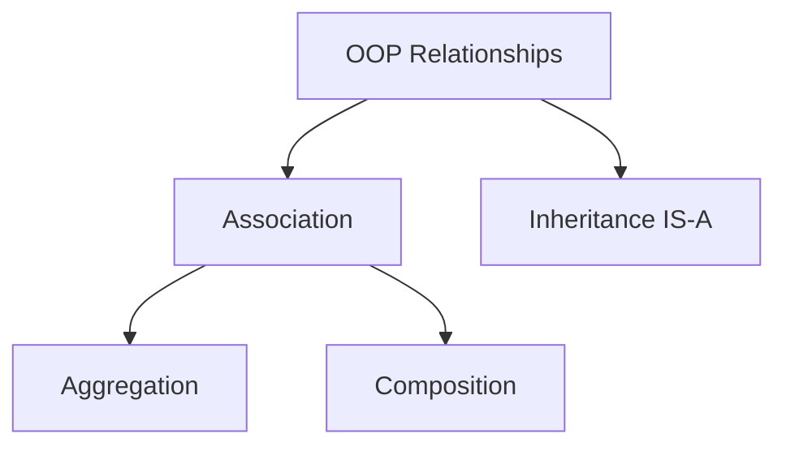
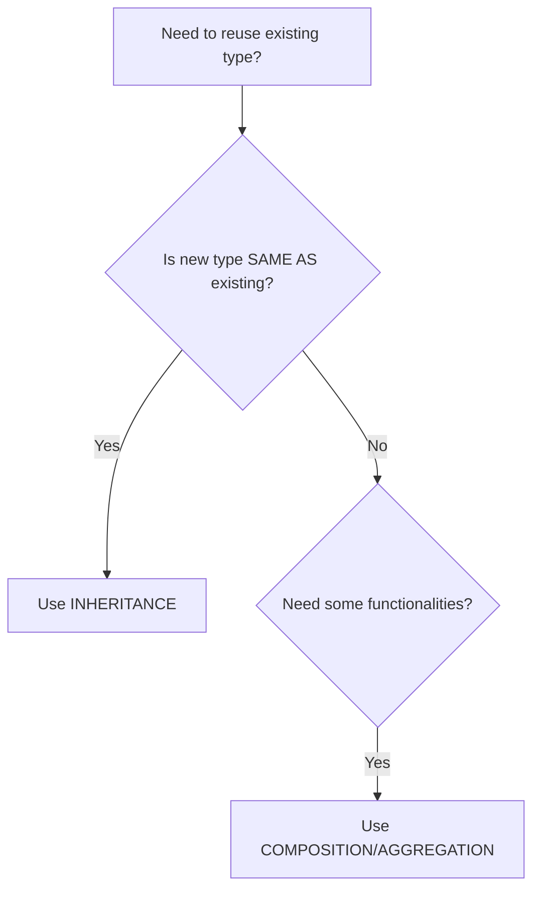

# 🔗 Relationships in Object-Oriented Programming

## Table of Contents
1. [Introduction to OOP Relationships](#introduction-to-oop-relationships)
2. [Object Communication](#object-communication)
3. [Association](#association)
4. [Aggregation (Has-A Weak)](#aggregation-has-a-weak)
5. [Composition (Has-A Strong)](#composition-has-a-strong)
6. [Aggregation vs Composition](#aggregation-vs-composition)
7. [Reusability](#reusability)
8. [Cohesion](#cohesion)
9. [Coupling](#coupling)
10. [Code Examples with Explanations](#code-examples-with-explanations)
11. [Interview Questions](#interview-questions)

---

## Introduction to OOP Relationships

In real-world applications, objects don't work in isolation. They interact with and relate to each other.

### Types of Relationships:



| Relationship | Type | Meaning |
|--------------|------|---------|
| **Association** | General | Objects are related |
| **Aggregation** | Has-A (Weak) | Whole-Part, part can exist independently |
| **Composition** | Has-A (Strong) | Whole-Part, part cannot exist independently |
| **Inheritance** | Is-A | Child is a type of Parent |

---

## Object Communication

In OOP, objects communicate with each other by **sending messages** (calling methods).

### How Objects Communicate:

```java
// Student object communicates with Course object
Student student = new Student();
Course course = new Course();

// Student asks Course for information
String courseName = course.getName();      // Message: "What's your name?"
int duration = course.getDuration();       // Message: "How long are you?"
double fees = course.getFees();            // Message: "How much do you cost?"

// Course asks Student for information
String qualification = student.getQualification();  // Message: "What's your education?"
```

### Visual Representation:

```
┌──────────────┐                    ┌──────────────┐
│   Student    │                    │    Course    │
├──────────────┤    getMessage()    ├──────────────┤
│ - name       │◄──────────────────►│ - courseName │
│ - qualif.    │    sendMessage()   │ - duration   │
│              │                    │ - fees       │
├──────────────┤                    ├──────────────┤
│ + getInfo()  │                    │ + getInfo()  │
└──────────────┘                    └──────────────┘
```

---

## Association

**Association** represents a relationship between two or more objects where they can interact with each other.

### Types:
- **One-to-One**: One student has one ID card
- **One-to-Many**: One teacher teaches many students
- **Many-to-One**: Many students belong to one department
- **Many-to-Many**: Many students take many courses

### Association Example:

```java
class Teacher {
    private String name;
    private Department department;  // Association with Department
    
    // Teacher knows about Department
    public void setDepartment(Department dept) {
        this.department = dept;
    }
}

class Department {
    private String name;
    private List<Teacher> teachers;  // Association with multiple Teachers
}
```

---

## Aggregation (Has-A Weak)

**Aggregation** is a specialized form of association where:
- There is a **"part-of"** or **"has-a"** relationship
- Parts can exist **independently** of the whole
- Weak ownership: If whole is destroyed, parts survive

### Real-World Examples:

| Whole | Part | Independence |
|-------|------|--------------|
| Department | Teacher | Teacher can exist without department |
| Team | Player | Player can join another team |
| Library | Book | Book can exist in another library |
| University | Professor | Professor can work elsewhere |

### Aggregation Code Example:

```java
package aggregation;

class Teacher {                                         // Line 1: Part class
    private String name;                                // Line 2: Teacher's name
    private int age;                                    // Line 3: Teacher's age
    
    public Teacher(String name, int age) {              // Line 4: Constructor
        this.name = name;                               // Line 5: Initialize name
        this.age = age;                                 // Line 6: Initialize age
    }
    
    public String getName() {                           // Line 7: Getter for name
        return name;                                    // Line 8: Return name
    }
    
    public void setName(String name) {                  // Line 9: Setter for name
        this.name = name;                               // Line 10: Set name
    }
    
    public int getAge() {                               // Line 11: Getter for age
        return age;                                     // Line 12: Return age
    }
    
    public void setAge(int age) {                       // Line 13: Setter for age
        this.age = age;                                 // Line 14: Set age
    }
    
    public void work() {                                // Line 15: Teacher's behavior
        System.out.println("Teacher is working");       // Line 16: Print message
    }
}

class Department {                                      // Line 17: Whole class
    private Teacher teacher;   // AGGREGATION: Has-A    // Line 18: Reference to Teacher
    private String dname;                               // Line 19: Department name
    
    public Department(String dname) {                   // Line 20: Constructor
        teacher = null;        // Teacher not created here! // Line 21: Initially no teacher
        this.dname = dname;                             // Line 22: Set department name
    }
    
    public String getDname() {                          // Line 23: Getter
        return dname;                                   // Line 24: Return name
    }
    
    public void addTeacher(Teacher teacher) {           // Line 25: Add existing teacher
        this.teacher = teacher;  // Teacher passed from outside // Line 26: Assign reference
    }
    
    public void perform() {                             // Line 27: Department activity
        System.out.println(dname + "\t");               // Line 28: Print department
        teacher.work();                                 // Line 29: Teacher works
    }
}

public class AggregationDemo {                          // Line 30: Main class
    public static void main(String[] args) {            // Line 31: Entry point
        
        // Create departments
        Department sd = new Department("Science Department");  // Line 32: Create Science Dept
        Department md = new Department("Maths Department");    // Line 33: Create Maths Dept
        
        System.out.println(sd.getDname());              // Line 34: Print: Science Department
        System.out.println(md.getDname());              // Line 35: Print: Maths Department
        
        // Create teacher OUTSIDE department (independent)
        Teacher t1 = new Teacher("Abc", 35);            // Line 36: Create teacher
        System.out.println(t1.getName() + "\t" + t1.getAge()); // Line 37: Print teacher info
        
        // Add teacher to Maths department
        md.addTeacher(t1);                              // Line 38: Assign teacher to dept
        md.perform();                                   // Line 39: Maths Department + Teacher working
        
        // Close Maths department
        System.out.println("Lets close the maths department");  // Line 40
        md = null;  // Department destroyed              // Line 41: Delete department reference
        
        // BUT teacher STILL EXISTS!
        System.out.println(t1.getName() + " still exists and can join some other department");
        // Line 42: Teacher survives!
        
        // Add same teacher to Science department
        sd.addTeacher(t1);                              // Line 43: Teacher joins Science
        sd.perform();                                   // Line 44: Science Department + Teacher working
        
        // Later, close Science department
        sd = null;  // Department destroyed              // Line 45: Delete Science dept
        System.out.println(t1.getName() + " still exists and can join some other department");
        // Line 46: Teacher still alive!
    }
}
```

### Output:
```
Science Department
Maths Department
Abc	35
Maths Department	
Teacher is working
Lets close the maths department
Abc still exists and can join some other department
Science Department	
Teacher is working
Abc still exists and can join some other department
```

### Key Observation:

```
┌─────────────────────────────────────────────────────────────┐
│  AGGREGATION: Teacher created OUTSIDE Department            │
│                                                             │
│  Department has reference to Teacher, but:                  │
│  • Department does NOT create Teacher                       │
│  • Teacher passed in from outside                           │
│  • When Department destroyed, Teacher survives              │
│                                                             │
│  Lifecycle: Teacher > Department (Teacher lives longer)     │
└─────────────────────────────────────────────────────────────┘
```

---

## Composition (Has-A Strong)

**Composition** is a stronger form of aggregation where:
- Parts **cannot exist** without the whole
- Strong ownership: If whole is destroyed, parts are destroyed too
- Parts are created **inside** the whole

### Real-World Examples:

| Whole | Part | Independence |
|-------|------|--------------|
| House | Rooms | Rooms destroyed when house demolished |
| Human | Heart | Heart cannot exist without human |
| Car | Engine | Engine specific to that car |
| Computer | CPU | CPU belongs to that computer |

### Composition Code Example:

```java
import java.util.Scanner;

class Room {                                            // Line 1: Part class
    private String name;                                // Line 2: Room name
    
    public Room(String name) {                          // Line 3: Constructor
        this.name = name;                               // Line 4: Initialize name
    }
    
    public Room() {                                     // Line 5: Default constructor
        name = null;                                    // Line 6: No name initially
    }
    
    public String getName() {                           // Line 7: Getter
        return name;                                    // Line 8: Return name
    }
    
    public void setName(String name) {                  // Line 9: Setter
        this.name = name;                               // Line 10: Set name
    }
}

class House {                                           // Line 11: Whole class
    private Room rooms[];      // COMPOSITION: Has-A    // Line 12: Array of rooms
    private String name;                                // Line 13: House name
    private String address;                             // Line 14: House address
    private int no_rooms;                               // Line 15: Number of rooms
    
    public House(String name, String address, int no_rooms) {  // Line 16: Constructor
        this.name = name;                               // Line 17: Set house name
        this.address = address;                         // Line 18: Set address
        this.no_rooms = no_rooms;                       // Line 19: Set room count
        
        // ROOMS CREATED INSIDE HOUSE (Composition!)
        this.rooms = new Room[no_rooms];                // Line 20: Create room array
        String rname;
        Scanner sc = new Scanner(System.in);
        
        for (int i = 0; i < no_rooms; i++) {            // Line 21: Loop for each room
            System.out.println("enter room name");      // Line 22: Prompt
            rname = sc.next();                          // Line 23: Read room name
            this.rooms[i] = new Room();                 // Line 24: CREATE room here!
            this.rooms[i].setName(rname);               // Line 25: Set room name
        }
    }
    
    public String getName() {                           // Line 26: Getter for house name
        return name;                                    // Line 27: Return name
    }
    
    public String getAddress() {                        // Line 28: Getter for address
        return address;                                 // Line 29: Return address
    }
    
    void showRooms() {                                  // Line 30: Display all rooms
        for (int i = 0; i < no_rooms; i++) {            // Line 31: Loop rooms
            System.out.println(rooms[i].getName());     // Line 32: Print room name
        }
    }
}

public class CompositeDemo {                            // Line 33: Main class
    public static void main(String args[]) {            // Line 34: Entry point
        
        // Create house (rooms created INSIDE)
        House house = new House("Samrat Mansion", "Juhu,Mumbai", 4);  // Line 35
        
        System.out.println(house.getName());            // Line 36: Print house name
        System.out.println(house.getAddress());         // Line 37: Print address
        System.out.println("house has following rooms"); // Line 38
        house.showRooms();                              // Line 39: Print all rooms
        
        // Renovate/destroy house
        System.out.println("Lets renovate the house");  // Line 40
        house = null;  // House destroyed, ALL ROOMS DESTROYED! // Line 41
        
        // Cannot access rooms anymore - they don't exist!
    }
}
```

### Key Observation:

```
┌─────────────────────────────────────────────────────────────┐
│  COMPOSITION: Rooms created INSIDE House constructor        │
│                                                             │
│  • House creates Room objects internally                    │
│  • Rooms cannot exist outside House                         │
│  • When House is destroyed, all Rooms are destroyed         │
│                                                             │
│  Lifecycle: House = Rooms (Same lifetime)                   │
└─────────────────────────────────────────────────────────────┘
```

---

## Aggregation vs Composition

| Aspect | Aggregation | Composition |
|--------|-------------|-------------|
| **Relationship** | Has-A (Weak) | Has-A (Strong) |
| **Part Creation** | Outside the whole | Inside the whole |
| **Part Existence** | Independent | Dependent |
| **When Whole Dies** | Part survives | Part dies too |
| **UML Symbol** | Empty diamond ◇ | Filled diamond ◆ |
| **Example** | Department-Teacher | House-Room |

### Visual Comparison:

```
AGGREGATION:                       COMPOSITION:
──────────────                     ─────────────

   Teacher                           Room
      │                                │
      │ exists before                  │ created by
      ▼                                ▼
┌────────────┐                    ┌────────────┐
│ Department │ ◇────────────────► │   House    │ ◆─────────► Room
└────────────┘    references      └────────────┘    creates
      │                                │
      │ destroyed                      │ destroyed
      ▼                                ▼
   Teacher                           Room
   SURVIVES!                        DESTROYED!
```

---

## Reusability

**Reusability** means using existing code/types while creating new types.

### Two Ways to Achieve Reusability:

| Method | Relationship | When to Use |
|--------|--------------|-------------|
| **Composition/Aggregation** | Has-A | Need some functionalities |
| **Inheritance** | Is-A | New type is same as existing type |

### Decision Guide:



### Examples:

```java
// INHERITANCE: Car IS-A FourWheeler (same type)
class FourWheeler {
    void drive() { }
}
class Car extends FourWheeler {  // Car inherits from FourWheeler
    // Car IS a type of FourWheeler
}

// COMPOSITION: Car HAS-A Engine (different type, needs functionality)
class Engine {
    void start() { }
}
class Car {
    private Engine engine;  // Car has Engine (not IS an Engine!)
    
    Car() {
        engine = new Engine();  // Creates its own engine
    }
    
    void start() {
        engine.start();  // Uses Engine's functionality
    }
}
```

---

## Cohesion

**Cohesion** refers to how focused and single-purposed a class is.

### Types:

| Type | Description | Quality |
|------|-------------|---------|
| **Low Cohesion** | Class does many unrelated tasks | ❌ Bad |
| **High Cohesion** | Class does one thing well | ✅ Good |

### Low Cohesion Example (BAD):

```java
// BAD: This class does too many unrelated things
class EverythingClass {
    void addNumbers(int a, int b) { }      // Math operation
    void createWindow() { }                 // UI operation
    void connectDatabase() { }              // Database operation
    void sendEmail() { }                    // Email operation
    void printReport() { }                  // Report operation
}
```

### High Cohesion Example (GOOD):

```java
// GOOD: Each class does one thing well

class Calculator {                          // Only math operations
    int add(int a, int b) { return a + b; }
    int subtract(int a, int b) { return a - b; }
}

class WindowManager {                       // Only UI operations
    void createWindow() { }
    void closeWindow() { }
}

class DatabaseManager {                     // Only database operations
    void connect() { }
    void disconnect() { }
}
```

### Benefits of High Cohesion:

| Benefit | Explanation |
|---------|-------------|
| **Low Maintenance** | Changes affect only one class |
| **Reusability** | Focused classes are easier to reuse |
| **Readability** | Clear purpose, easier to understand |
| **Testability** | Single responsibility, easier to test |

> **SRP (Single Responsibility Principle)**: A class should have only one reason to change.

---

## Coupling

**Coupling** refers to how dependent classes are on each other.

### Types:

| Type | Description | Quality |
|------|-------------|---------|
| **Tight Coupling** | Classes highly dependent | ❌ Bad |
| **Loose Coupling** | Classes minimally dependent | ✅ Good |

### Tight Coupling Example (BAD):

```java
// Tightly coupled: Application depends on specific Triangle class
class Triangle {
    void draw() {
        System.out.println("Drawing Triangle");
    }
}

class Application {
    void perform() {
        // Program to IMPLEMENTATION (concrete class)
        Triangle t = new Triangle();  // Tightly coupled!
        t.draw();
    }
}

// Problem: If we want Circle instead, we must CHANGE Application class!
```

### Loose Coupling Example (GOOD):

```java
// Interface (abstraction)
interface Shape {
    void draw();
}

// Implementations
class Triangle implements Shape {
    public void draw() { System.out.println("Drawing Triangle"); }
}

class Circle implements Shape {
    public void draw() { System.out.println("Drawing Circle"); }
}

class Rectangle implements Shape {
    public void draw() { System.out.println("Drawing Rectangle"); }
}

// Loosely coupled: Application depends on interface, not implementation
class Application {
    void perform(Shape shape) {  // Program to INTERFACE
        shape.draw();            // Works with ANY Shape!
    }
}

public class Demo {
    public static void main(String[] args) {
        Application app = new Application();
        
        app.perform(new Triangle());   // Pass Triangle
        app.perform(new Circle());     // Pass Circle
        app.perform(new Rectangle());  // Pass Rectangle
        
        // Application class NEVER changes!
    }
}
```

### Visual Comparison:

```
TIGHT COUPLING:
───────────────
┌─────────────┐         ┌──────────┐
│ Application │─────────│ Triangle │
└─────────────┘  knows  └──────────┘
       │         only
       │  change ▼ needed if different shape
       │
       └──────────────────────────────┐
                                      │
┌─────────────┐         ┌──────────┐  │
│ Application │ MUST ───│  Circle  │◄─┘
│  (modified) │ change  └──────────┘


LOOSE COUPLING:
───────────────
                     ┌──────────────┐
                ┌───►│   Triangle   │
                │    └──────────────┘
┌─────────────┐ │    ┌──────────────┐
│ Application │─┼───►│    Circle    │
└─────────────┘ │    └──────────────┘
       │        │    ┌──────────────┐
       │        └───►│  Rectangle   │
       │             └──────────────┘
       │
       ▼
  Depends on Shape interface
  (No change needed for new shapes!)
```

### Benefits of Loose Coupling:

| Benefit | Explanation |
|---------|-------------|
| **Flexibility** | Easy to swap implementations |
| **Maintainability** | Changes don't ripple through |
| **Testability** | Can use mock objects |
| **Extensibility** | Add new types without changes |

---

## Code Examples with Explanations

### Coupling Demo with Inheritance Hierarchy:

```java
// Parent class representing all four-wheelers
class FourWheeler {
    void drive() {
        System.out.println("Driving...");
    }
}

// Child classes
class Bus extends FourWheeler {
    @Override
    void drive() { System.out.println("Driving Bus"); }
}

class Car extends FourWheeler {
    @Override
    void drive() { System.out.println("Driving Car"); }
}

class Truck extends FourWheeler {
    @Override
    void drive() { System.out.println("Driving Truck"); }
}

// TIGHT COUPLING: Driver depends on specific Car
class TightCoupledDriver {
    void perform() {
        Car c = new Car();  // Program to implementation
        c.drive();
        
        // To drive Bus, must CHANGE this code!
    }
}

// LOOSE COUPLING: Driver depends on FourWheeler (abstraction)
class LooseCoupledDriver {
    void perform(FourWheeler f) {  // Program to interface
        f.drive();  // Works with ANY FourWheeler!
    }
}

public class CouplingDemo {
    public static void main(String[] args) {
        LooseCoupledDriver driver = new LooseCoupledDriver();
        
        driver.perform(new Car());    // Driving Car
        driver.perform(new Bus());    // Driving Bus
        driver.perform(new Truck());  // Driving Truck
        
        // Driver class doesn't change!
    }
}
```

---

## Interview Questions

### Q1: What is Association?
**Answer**: Association represents a relationship between objects. It can be one-to-one, one-to-many, many-to-one, or many-to-many.

### Q2: What is the difference between Aggregation and Composition?
**Answer**:
- **Aggregation**: Weak has-a. Part can exist independently. Part created outside whole.
- **Composition**: Strong has-a. Part cannot exist without whole. Part created inside whole.

### Q3: Give a real example of Aggregation.
**Answer**: Department and Teacher. A teacher can exist without a department and can join another department if one closes.

### Q4: Give a real example of Composition.
**Answer**: House and Rooms. Rooms cannot exist without the house. When house is demolished, rooms are destroyed.

### Q5: What is Cohesion?
**Answer**: Cohesion is how focused a class is on a single task. High cohesion (good) means the class has one responsibility. Low cohesion (bad) means the class does many unrelated things.

### Q6: What is Coupling?
**Answer**: Coupling is the degree of dependency between classes. Loose coupling (good) means classes are independent. Tight coupling (bad) means classes are highly dependent.

### Q7: How to achieve Loose Coupling?
**Answer**: Program to interface/abstraction rather than implementation. Use dependency injection. Follow the Dependency Inversion Principle.

### Q8: When to use Inheritance vs Composition?
**Answer**:
- Use **Inheritance** when "new class IS-A existing class" (same type)
- Use **Composition** when "new class HAS-A existing class" (uses functionality)

### Q9: What is SRP?
**Answer**: Single Responsibility Principle - A class should have only one reason to change. This leads to high cohesion.

### Q10: What is "Program to Interface"?
**Answer**: Depending on abstractions (interfaces/abstract classes) rather than concrete implementations. This leads to loose coupling.

---

## Quick Reference

### Relationships Summary

| Relationship | Symbol | Meaning | Example |
|--------------|--------|---------|---------|
| Association | ―――――― | Related | Student-Course |
| Aggregation | ◇―――――― | Has-A (weak) | Department-Teacher |
| Composition | ◆―――――― | Has-A (strong) | House-Room |
| Inheritance | △―――――― | Is-A | Car-Vehicle |

### Design Principles

```
HIGH COHESION + LOOSE COUPLING = GOOD DESIGN

High Cohesion:
- One class, one purpose
- Single Responsibility Principle

Loose Coupling:
- Program to interface
- Dependency Inversion Principle
```

---

*Previous: [05_OOP_Fundamentals.md](./05_OOP_Fundamentals.md)*  
*Next: [07_Constructors.md](./07_Constructors.md)*
