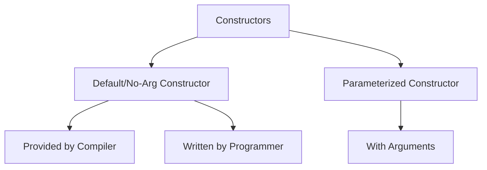
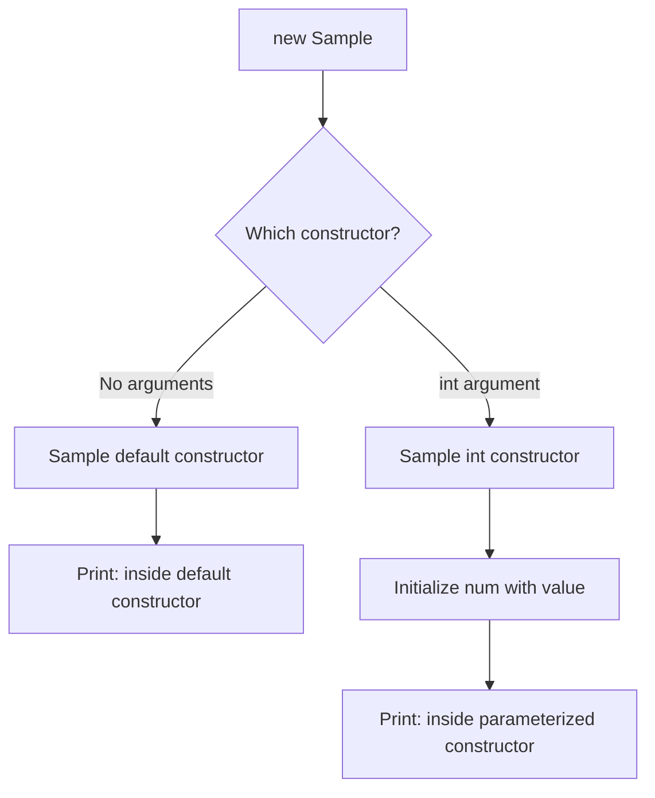

# 🏗️ Constructors in Java

## Table of Contents
1. [What is a Constructor?](#what-is-a-constructor)
2. [Types of Constructors](#types-of-constructors)
3. [Default Constructor](#default-constructor)
4. [Parameterized Constructor](#parameterized-constructor)
5. [Constructor Overloading](#constructor-overloading)
6. [Constructor Chaining](#constructor-chaining)
7. [Object Creation Process](#object-creation-process)
8. [Code Examples with Explanations](#code-examples-with-explanations)
9. [Interview Questions](#interview-questions)

---

## What is a Constructor?

A **constructor** is a special member function used to initialize objects when they are created.

### Characteristics of Constructor:

| Feature | Description |
|---------|-------------|
| **Same name as class** | Constructor name must match class name |
| **No return type** | Not even void |
| **Called automatically** | When object is created with `new` |
| **Purpose** | Initialize instance variables |
| **Can be overloaded** | Multiple constructors with different parameters |

### Constructor vs Method:

| Aspect | Constructor | Method |
|--------|-------------|--------|
| Name | Same as class name | Any valid identifier |
| Return type | None | Must have (including void) |
| Called | Automatically with `new` | Explicitly by programmer |
| Purpose | Initialize object | Perform actions |
| Inheritance | Not inherited | Inherited |

---

## Types of Constructors



### 1. Default (No-Arg) Constructor
- Constructor with **no parameters**
- If no constructor defined, **compiler provides** one automatically
- Once any constructor is defined, compiler stops providing default

### 2. Parameterized Constructor
- Constructor with **one or more parameters**
- Used to initialize objects with specific values

---

## Default Constructor

### Compiler-Provided Default Constructor:

```java
class Sample {                                      // Line 1: Class declaration
    // Compiler provides default constructor here automatically!
    // It looks like:
    // Sample() { }
    
    private int num;                                // Line 2: Instance variable
    
    public void setNum(int num) {                   // Line 3: Setter
        this.num = num;                             // Line 4: Set value
    }
    
    public int getNum() {                           // Line 5: Getter
        return num;                                 // Line 6: Return value
    }
}

public class ConstructorDemo1 {                     // Line 7: Main class
    public static void main(String args[]) {        // Line 8: Entry point
        Sample s1 = new Sample();  // Invokes compiler's default constructor
        // Line 9: Creates object, default constructor initializes num to 0
        
        s1.setNum(200);                             // Line 10: Set num to 200
        System.out.println(s1.getNum());            // Line 11: Print 200
    }
}
```

### Output: `200`

### Programmer-Defined No-Arg Constructor:

```java
class Sample {                                      // Line 1: Class declaration
    
    Sample() {                                      // Line 2: No-arg constructor
        System.out.println("inside default constructor");  // Line 3
    }

    private int num;                                // Line 4: Instance variable
    
    public void setNum(int num) {                   // Line 5: Setter
        this.num = num;                             // Line 6: Set value
    }
    
    public int getNum() {                           // Line 7: Getter
        return num;                                 // Line 8: Return value
    }
}

public class ConstructorDemo2 {                     // Line 9: Main class
    public static void main(String args[]) {        // Line 10: Entry point
        Sample s1 = new Sample();  // Invokes programmer's constructor
        // Output: "inside default constructor"
        
        s1.setNum(200);                             // Line 11: Set num to 200
        System.out.println(s1.getNum());            // Line 12: Print 200
    }
}
```

### Output:
```
inside default constructor
200
```

---

## Parameterized Constructor

Used to initialize objects with specific values at creation time.

```java
class Sample {                                      // Line 1: Class declaration
    
    private int num;                                // Line 2: Instance variable
    
    // Parameterized constructor
    Sample(int num) {                               // Line 3: Constructor with parameter
        this.num = num;                             // Line 4: Initialize using parameter
        System.out.println("inside parameterized constructor");  // Line 5
    }
    
    public void setNum(int num) {                   // Line 6: Setter
        this.num = num;
    }
    
    public int getNum() {                           // Line 7: Getter
        return num;
    }
}

public class Demo {
    public static void main(String args[]) {
        // Must pass argument now!
        Sample s1 = new Sample(100);  // Creates object with num=100
        System.out.println(s1.getNum());  // Output: 100
        
        // Sample s2 = new Sample();  // ERROR! No default constructor!
    }
}
```

### Output:
```
inside parameterized constructor
100
```

> ⚠️ **Important**: Once you define ANY constructor, compiler stops providing default constructor!

---

## Constructor Overloading

Like methods, constructors can be overloaded (same name, different parameters).

```java
class Sample {                                      // Line 1: Class declaration
    // Constructor overloading
    
    private int num;                                // Line 2: Instance variable

    Sample() {                                      // Line 3: No-arg constructor
        System.out.println("inside default constructor");  // Line 4
    }
    
    Sample(int num) {                               // Line 5: Parameterized constructor
        this.num = num;                             // Line 6: Initialize num
        System.out.println("inside parameterized constructor");  // Line 7
    }
    
    public void setNum(int num) {                   // Line 8: Setter
        this.num = num;
    }
    
    public int getNum() {                           // Line 9: Getter
        return num;
    }
}

public class ConstructorDemo3 {                     // Line 10: Main class
    public static void main(String args[]) {        // Line 11: Entry point
        
        // Invokes no-arg constructor
        Sample s1 = new Sample();                   // Line 12
        // Output: "inside default constructor"
        
        s1.setNum(100);
        System.out.println(s1.getNum());            // Output: 100
        
        // Invokes parameterized constructor
        Sample s2 = new Sample(200);                // Line 13
        // Output: "inside parameterized constructor"
        
        System.out.println(s2.getNum());            // Output: 200
    }
}
```

### Output:
```
inside default constructor
100
inside parameterized constructor
200
```

### Execution Flow:



---

## Constructor Chaining

One constructor calling another constructor in the same class using `this()`.

```java
class Employee {
    private int id;
    private String name;
    private double salary;
    
    // Constructor 1: No arguments
    Employee() {
        this(0, "Unknown", 0.0);  // Calls Constructor 3
        System.out.println("No-arg constructor");
    }
    
    // Constructor 2: Only id
    Employee(int id) {
        this(id, "Unknown", 0.0);  // Calls Constructor 3
        System.out.println("One-arg constructor");
    }
    
    // Constructor 3: All arguments (master constructor)
    Employee(int id, String name, double salary) {
        this.id = id;
        this.name = name;
        this.salary = salary;
        System.out.println("All-args constructor");
    }
    
    void display() {
        System.out.println(id + " " + name + " " + salary);
    }
}

public class ChainDemo {
    public static void main(String[] args) {
        Employee e1 = new Employee();
        // Output: 
        // All-args constructor
        // No-arg constructor
        
        e1.display();  // 0 Unknown 0.0
    }
}
```

### Rules for this():
1. `this()` must be the **first statement** in constructor
2. Cannot have both `this()` and `super()` in same constructor
3. Avoids code duplication

---

## Object Creation Process

When you write `new ClassName()`, two things happen:

### Step 1: Memory Allocation
- Memory is allocated in **heap** for instance variables
- Variables get default values

### Step 2: Constructor Call
- Constructor is invoked
- Variables can be initialized with custom values

### Visual Representation:

```
MyClass obj = new MyClass(100);

Step 1: Memory Allocation
┌─────────────────────────────────────────────────────┐
│                      HEAP                           │
│  ┌─────────────────┐                               │
│  │   MyClass       │                               │
│  │   num: 0        │  ← Default value              │
│  │   name: null    │  ← Default value              │
│  └─────────────────┘                               │
└─────────────────────────────────────────────────────┘

Step 2: Constructor Execution
┌─────────────────────────────────────────────────────┐
│                      HEAP                           │
│  ┌─────────────────┐                               │
│  │   MyClass       │                               │
│  │   num: 100      │  ← Initialized by constructor │
│  │   name: null    │                               │
│  └─────────────────┘                               │
└─────────────────────────────────────────────────────┘

Stack:
┌─────────────┐
│  obj: 0x100 │──────────────► Points to object in heap
└─────────────┘
```

---

## Code Examples with Explanations

### Complete Account Class with Constructors:

```java
class Account {                                     // Line 1: Class declaration
    private int id;                                 // Line 2: Account ID
    private String name;                            // Line 3: Holder name
    private String type;                            // Line 4: Account type
    private double balance;                         // Line 5: Balance
    
    // Default constructor
    Account() {                                     // Line 6: No-arg constructor
        id = 0;
        name = "Unknown";
        type = "Savings";
        balance = 0.0;
        System.out.println("Default Account created");  // Line 7
    }
    
    // Parameterized constructor
    Account(int id, String name, String type, double balance) {  // Line 8
        this.id = id;                               // Line 9: Use 'this' to distinguish
        this.name = name;                           // Line 10
        this.type = type;                           // Line 11
        this.balance = balance;                     // Line 12
        System.out.println("Account created for " + name);  // Line 13
    }
    
    // Copy constructor (creates copy of another object)
    Account(Account other) {                        // Line 14
        this.id = other.id;
        this.name = other.name;
        this.type = other.type;
        this.balance = other.balance;
        System.out.println("Copy of account created");
    }
    
    // Display method
    void display() {                                // Line 15
        System.out.println(id + "\t" + name + "\t" + type + "\t" + balance);
    }
}

public class AccountDemo {                          // Line 16: Main class
    public static void main(String args[]) {        // Line 17: Entry point
        
        // Using default constructor
        Account a1 = new Account();                 // Line 18
        a1.display();
        // Output: Default Account created
        //         0    Unknown    Savings    0.0
        
        // Using parameterized constructor
        Account a2 = new Account(101, "John", "Current", 50000);  // Line 19
        a2.display();
        // Output: Account created for John
        //         101    John    Current    50000.0
        
        // Using copy constructor
        Account a3 = new Account(a2);               // Line 20: Copy of a2
        a3.display();
        // Output: Copy of account created
        //         101    John    Current    50000.0
    }
}
```

### When to Use Which Constructor:

| Constructor Type | When to Use |
|------------------|-------------|
| Default | Create object with default values |
| Parameterized | Create object with specific initial values |
| Copy | Create a duplicate of existing object |

---

## Interview Questions

### Q1: What is a constructor?
**Answer**: A constructor is a special method used to initialize objects. It has the same name as the class and no return type.

### Q2: What is the difference between constructor and method?
**Answer**:
- Constructor: Same name as class, no return type, called automatically
- Method: Any name, must have return type, called explicitly

### Q3: Can constructor be private?
**Answer**: Yes. Private constructor is used in:
- Singleton pattern (only one object allowed)
- Utility classes (only static methods)
- Factory pattern (object creation controlled)

### Q4: What is constructor overloading?
**Answer**: Having multiple constructors with different parameter lists in the same class.

### Q5: What is the default constructor?
**Answer**: A no-argument constructor. If no constructor is defined, compiler provides one automatically.

### Q6: Can constructor be inherited?
**Answer**: No. Constructors are not inherited, but child constructor can call parent constructor using `super()`.

### Q7: What is constructor chaining?
**Answer**: One constructor calling another constructor using `this()` (same class) or `super()` (parent class).

### Q8: Can constructor have return type?
**Answer**: No. If you add a return type, it becomes a regular method, not a constructor.

### Q9: What happens if we define only parameterized constructor?
**Answer**: Compiler doesn't provide default constructor. Using `new ClassName()` will cause error.

### Q10: Can constructor be static?
**Answer**: No. Constructors are associated with object creation, and `static` means no object context.

---

## Quick Reference

### Constructor Syntax

```java
class MyClass {
    // Default constructor
    MyClass() {
        // initialization
    }
    
    // Parameterized constructor
    MyClass(int value) {
        // initialization with value
    }
    
    // Multiple parameters
    MyClass(int a, String b) {
        // initialization
    }
}

// Usage
MyClass obj1 = new MyClass();           // Calls default
MyClass obj2 = new MyClass(10);         // Calls parameterized
MyClass obj3 = new MyClass(10, "Hi");   // Calls multi-param
```

### Key Rules

```
1. Constructor name = Class name
2. No return type (not even void)
3. Called automatically with 'new'
4. Can be overloaded
5. Cannot be static, final, abstract
6. this() must be first statement
7. No constructor defined → Compiler provides default
8. Any constructor defined → Compiler stops providing default
```

---

*Previous: [06_Relationships_in_OOP.md](./06_Relationships_in_OOP.md)*  
*Next: [08_Static_Members.md](./08_Static_Members.md)*
