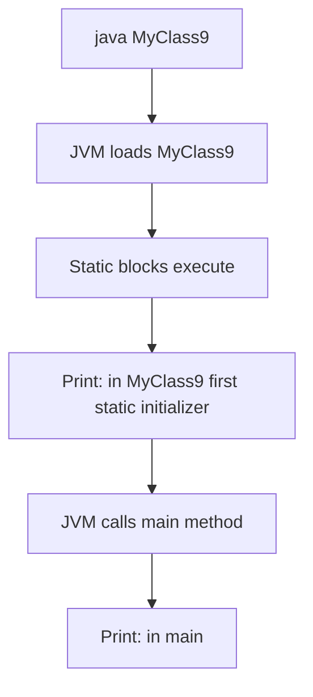

# ⚡ Static Members in Java

## Table of Contents
1. [Introduction to Static](#introduction-to-static)
2. [Static Variables](#static-variables)
3. [Static Methods](#static-methods)
4. [Static vs Non-Static Relationship](#static-vs-non-static-relationship)
5. [Static Block (Static Initializer)](#static-block-static-initializer)
6. [Non-Static Block (Instance Initializer)](#non-static-block-instance-initializer)
7. [Execution Order](#execution-order)
8. [Code Examples with Explanations](#code-examples-with-explanations)
9. [Interview Questions](#interview-questions)

---

## Introduction to Static

The `static` keyword indicates that a member belongs to the **class itself**, not to any specific object.

### Static vs Instance Members:

| Aspect | Static Members | Instance Members |
|--------|----------------|------------------|
| **Belongs to** | Class | Object |
| **Memory allocation** | When class is loaded | When object is created |
| **Number of copies** | One copy shared by all | One copy per object |
| **Access** | ClassName.member | objectRef.member |
| **Can access** | Only static members | Both static and instance |
| **Uses 'this'** | No | Yes |

### Visual Representation:

```
┌─────────────────── Class Area (Method Area) ───────────────────┐
│                                                                 │
│   Static Members (ONE copy for entire class):                   │
│   ┌──────────────────────────────────────────┐                 │
│   │  static int count = 0                     │                 │
│   │  static double rate = 8.5                 │                 │
│   │  static void displayCount() { }           │                 │
│   └──────────────────────────────────────────┘                 │
│                                                                 │
└─────────────────────────────────────────────────────────────────┘

┌─────────────────── Heap (Objects) ──────────────────────────────┐
│                                                                 │
│   Instance Members (One copy per object):                       │
│                                                                 │
│   Object 1 (0x100)        Object 2 (0x200)                     │
│   ┌────────────────┐      ┌────────────────┐                   │
│   │ id: 101        │      │ id: 102        │                   │
│   │ name: "Abc"    │      │ name: "Xyz"    │                   │
│   │ balance: 5000  │      │ balance: 8000  │                   │
│   └────────────────┘      └────────────────┘                   │
│                                                                 │
└─────────────────────────────────────────────────────────────────┘
```

---

## Static Variables

**Static variables** (also called **class variables**) are shared by all objects of the class.

### Characteristics:
- Allocated when class is loaded
- Only ONE copy exists
- Accessed using class name
- Also called "class variables"

### When to Use Static Variables:

| Use Case | Example |
|----------|---------|
| Constants | `static final double PI = 3.14159;` |
| Counters | Track number of objects created |
| Shared data | Rate of interest for all accounts |
| Configuration | Application-wide settings |

### Static Variable Example:

```java
class Sample {                                      // Line 1: Class declaration
    private int num;                                // Line 2: Instance variable
    private static int cnt = 10;                    // Line 3: Static variable
    
    public Sample(int num) {                        // Line 4: Constructor
        this.num = num;                             // Line 5: Set instance variable
    }
    
    public void setNum(int num) {                   // Line 6: Instance setter
        this.num = num;
    }
    
    public int getNum() {                           // Line 7: Instance getter
        return num;
    }
    
    public static int getCnt() {                    // Line 8: Static getter
        return cnt;                                 // Line 9: Return static variable
    }
}
        
public class MyClass8 {                             // Line 10: Main class
    public static void main(String args[]) {        // Line 11: Entry point
        
        Sample s1 = new Sample(100);                // Line 12: Create object 1
        System.out.println(s1.getNum());            // Line 13: Print 100
        
        Sample s2 = new Sample(200);                // Line 14: Create object 2
        System.out.println(s2.getNum());            // Line 15: Print 200
        
        // Access static using CLASS NAME (preferred)
        System.out.println(Sample.getCnt());        // Line 16: Print 10
    }
}
```

### Memory Diagram:

```
After creating s1 and s2:

Class Area:
┌──────────────────────┐
│  Sample.class        │
│  ───────────────     │
│  static cnt = 10     │◄─── Shared by all objects
│  getCnt() method     │
└──────────────────────┘

Heap:
┌───────────────┐      ┌───────────────┐
│  s1 Object    │      │  s2 Object    │
│  num: 100     │      │  num: 200     │
└───────────────┘      └───────────────┘
     │                       │
     └───────────┬───────────┘
                 │
                 ▼
         Both share static 'cnt'
```

---

## Static Methods

**Static methods** belong to the class, not to objects.

### Rules for Static Methods:
1. Can access only static variables directly
2. Can call only other static methods directly
3. Cannot use `this` or `super`
4. Can be called without creating object

### Static Method Example:

```java
class Calculator {
    // Static utility methods - no object needed
    
    public static int add(int a, int b) {
        return a + b;
    }
    
    public static int subtract(int a, int b) {
        return a - b;
    }
    
    public static double squareRoot(double num) {
        return Math.sqrt(num);
    }
}

public class Demo {
    public static void main(String[] args) {
        // Call static methods using CLASS NAME
        int sum = Calculator.add(5, 3);            // 8
        int diff = Calculator.subtract(10, 4);     // 6
        double sqrt = Calculator.squareRoot(16);   // 4.0
        
        System.out.println(sum + ", " + diff + ", " + sqrt);
    }
}
```

---

## Static vs Non-Static Relationship

Understanding what can access what:

```
┌─────────────────────────────────────────────────────────────────┐
│                    ACCESS RULES                                  │
├─────────────────────────────────────────────────────────────────┤
│                                                                  │
│  Static Context (static method/block)                           │
│  ├─── Can access: static variables ✓                            │
│  ├─── Can access: static methods ✓                              │
│  ├─── Can access: instance variables ✗ (need object reference)  │
│  ├─── Can access: instance methods ✗ (need object reference)    │
│  └─── Can use 'this': ✗                                         │
│                                                                  │
│  Non-Static Context (instance method)                            │
│  ├─── Can access: static variables ✓                            │
│  ├─── Can access: static methods ✓                              │
│  ├─── Can access: instance variables ✓                          │
│  ├─── Can access: instance methods ✓                            │
│  └─── Can use 'this': ✓                                         │
│                                                                  │
└─────────────────────────────────────────────────────────────────┘
```

### Code Example:

```java
class Demo {
    int instanceVar = 10;           // Instance variable
    static int staticVar = 20;      // Static variable
    
    void instanceMethod() {         // Instance method
        System.out.println("Instance method");
    }
    
    static void staticMethod() {    // Static method
        System.out.println("Static method");
    }
    
    // Inside STATIC method
    static void testFromStatic() {
        // Can access static
        System.out.println(staticVar);    // ✓ OK
        staticMethod();                    // ✓ OK
        
        // Cannot access instance directly
        // System.out.println(instanceVar);  // ✗ ERROR
        // instanceMethod();                 // ✗ ERROR
        // System.out.println(this.instanceVar); // ✗ ERROR
        
        // Can access instance through object reference
        Demo obj = new Demo();
        System.out.println(obj.instanceVar);  // ✓ OK
        obj.instanceMethod();                  // ✓ OK
    }
    
    // Inside INSTANCE method
    void testFromInstance() {
        // Can access everything!
        System.out.println(instanceVar);  // ✓ OK
        instanceMethod();                  // ✓ OK
        System.out.println(staticVar);    // ✓ OK
        staticMethod();                    // ✓ OK
        System.out.println(this.instanceVar); // ✓ OK
    }
}
```

---

## Static Block (Static Initializer)

**Static block** is used to initialize static variables or execute code when class is loaded.

### Syntax:
```java
static {
    // Code executed when class is loaded
}
```

### Characteristics:
- Executes when class is loaded (before main)
- Executes only ONCE
- Can have multiple static blocks (execute in order)
- Used for static variable initialization

### Static Block Example:

```java
public class MyClass9 {                             // Line 1: Class declaration
    
    static {                                        // Line 2: Static block
        System.out.println("in MyClass9 first static initializer");  // Line 3
    }
    
    public static void main(String args[]) {        // Line 4: Main method
        System.out.println("in main");              // Line 5
    }
}
```

### Output:
```
in MyClass9 first static initializer
in main
```

### Execution Flow:



### Multiple Static Blocks:

```java
public class MultipleStaticBlocks {
    
    static {
        System.out.println("First static block");
    }
    
    static {
        System.out.println("Second static block");
    }
    
    static {
        System.out.println("Third static block");
    }
    
    public static void main(String[] args) {
        System.out.println("In main");
    }
}
```

### Output:
```
First static block
Second static block
Third static block
In main
```

### Static Block vs Static Method:

| Aspect | Static Block | Static Method |
|--------|--------------|---------------|
| Execution | Automatic (class load) | Explicit (must call) |
| Invocation | Cannot be called | Must be called |
| Purpose | Initialization | Utility operations |
| Number of times | Once per class load | Multiple times |

---

## Non-Static Block (Instance Initializer)

**Non-static block** (instance initializer) executes every time an object is created.

### Syntax:
```java
{
    // Code executed for every object creation
}
```

### Characteristics:
- Executes EVERY TIME an object is created
- Executes BEFORE constructor
- Used for common initialization code

### Non-Static Block Example:

```java
public class MyClass14 {                            // Line 1: Class declaration
    int num;                                        // Line 2: Instance variable
    static int cnt;                                 // Line 3: Static variable
    
    // Non-static initializer block
    {                                               // Line 4: Instance block
        cnt++;                                      // Line 5: Increment counter
        System.out.println("Instance block executed. Count: " + cnt);
    }
    
    public MyClass14() {                            // Line 6: Default constructor
        System.out.println("Default constructor");
    }
    
    public MyClass14(int num) {                     // Line 7: Parameterized constructor
        this.num = num;
        System.out.println("Parameterized constructor");
    }
    
    public int getNum() { return num; }
    public static int getCnt() { return cnt; }
    
    public static void main(String args[]) {        // Line 8: Main method
        MyClass14 m1 = new MyClass14();             // Line 9: Create object 1
        MyClass14 m2 = new MyClass14(200);          // Line 10: Create object 2
        
        System.out.println("m1.num = " + m1.getNum());
        System.out.println("m2.num = " + m2.getNum());
        System.out.println("Total objects: " + MyClass14.getCnt());
        
        MyClass14 m3 = new MyClass14(300);          // Line 11: Create object 3
        System.out.println("Total objects: " + MyClass14.getCnt());
    }
}
```

### Output:
```
Instance block executed. Count: 1
Default constructor
Instance block executed. Count: 2
Parameterized constructor
m1.num = 0
m2.num = 200
Total objects: 2
Instance block executed. Count: 3
Parameterized constructor
Total objects: 3
```

### Why Use Instance Block?

When you have common code that must run before ANY constructor:

```java
// Without instance block - code duplication
class MyClass {
    int a, b;
    
    MyClass() {
        a = 10; b = 20;  // Common initialization
    }
    
    MyClass(int x) {
        a = 10; b = 20;  // Same code repeated!
        // other code
    }
}

// With instance block - no duplication
class MyClass {
    int a, b;
    
    {
        a = 10; b = 20;  // Runs before EVERY constructor
    }
    
    MyClass() { }
    
    MyClass(int x) {
        // other code
    }
}
```

---

## Execution Order

Understanding the complete execution sequence:

```
┌─────────────────────────────────────────────────────────────────┐
│                    EXECUTION ORDER                               │
├─────────────────────────────────────────────────────────────────┤
│                                                                  │
│  1. Class Loading:                                               │
│     └── Static variables initialized (in order)                 │
│     └── Static blocks executed (in order)                       │
│                                                                  │
│  2. Object Creation (for each new object):                       │
│     └── Instance variables get default values                    │
│     └── Instance variables initialized (in order)               │
│     └── Instance blocks executed (in order)                      │
│     └── Constructor executed                                     │
│                                                                  │
└─────────────────────────────────────────────────────────────────┘
```

### Complete Example:

```java
public class ExecutionOrder {
    
    // Static variable
    static int staticVar = initStatic();
    
    // Instance variable  
    int instanceVar = initInstance();
    
    // Static block
    static {
        System.out.println("2. Static block");
    }
    
    // Instance block
    {
        System.out.println("4. Instance block");
    }
    
    // Constructor
    ExecutionOrder() {
        System.out.println("5. Constructor");
    }
    
    static int initStatic() {
        System.out.println("1. Static variable initialization");
        return 10;
    }
    
    int initInstance() {
        System.out.println("3. Instance variable initialization");
        return 20;
    }
    
    public static void main(String[] args) {
        System.out.println("=== Creating first object ===");
        ExecutionOrder obj1 = new ExecutionOrder();
        
        System.out.println("\n=== Creating second object ===");
        ExecutionOrder obj2 = new ExecutionOrder();
    }
}
```

### Output:
```
1. Static variable initialization
2. Static block
=== Creating first object ===
3. Instance variable initialization
4. Instance block
5. Constructor

=== Creating second object ===
3. Instance variable initialization
4. Instance block
5. Constructor
```

### Key Observations:
- Static initialization: **ONCE** when class loads
- Instance initialization: **EVERY TIME** object created

---

## Code Examples with Explanations

### Object Counter Example:

```java
/*
 * Create as many instances and count how many objects created
 */

public class MyClass13 {                            // Line 1: Class declaration
    int num;                                        // Line 2: Instance variable
    static int cnt;                                 // Line 3: Static counter
    
    public MyClass13() {                            // Line 4: Default constructor
        cnt++;                                      // Line 5: Increment counter
    }
    
    public MyClass13(int num) {                     // Line 6: Parameterized constructor
        this.num = num;                             // Line 7: Set num
        cnt++;                                      // Line 8: Increment counter
    }
    
    public void setNum(int num) { this.num = num; }
    public int getNum() { return num; }
    
    public static int getCnt() {                    // Line 9: Static getter
        return cnt;                                 // Line 10: Return count
    }
    
    public static void main(String args[]) {        // Line 11: Main method
        MyClass13 m1 = new MyClass13();             // Line 12: Object 1, cnt=1
        MyClass13 m2 = new MyClass13(200);          // Line 13: Object 2, cnt=2
        
        m1.setNum(100);
        System.out.println(m1.getNum());            // 100
        System.out.println(m2.getNum());            // 200
        System.out.println(MyClass13.getCnt());     // 2
        
        MyClass13 m3 = new MyClass13(300);          // Line 14: Object 3, cnt=3
        System.out.println(m3.getNum());            // 300
        System.out.println(MyClass13.getCnt());     // 3
    }
}
```

### Output:
```
100
200
2
300
3
```

---

## Interview Questions

### Q1: What is a static variable?
**Answer**: A static variable belongs to the class, not to any object. It's shared by all objects and has only one copy in memory.

### Q2: Can we access non-static members from static method?
**Answer**: Not directly. We need an object reference to access non-static members from static context.

### Q3: Why is main method static?
**Answer**: So JVM can call it without creating an object. If main wasn't static, JVM would need to create an object first, but it doesn't know how.

### Q4: What is a static block?
**Answer**: A block of code that executes when the class is loaded, before main method. Used for static variable initialization.

### Q5: Can we have multiple static blocks?
**Answer**: Yes. They execute in the order they appear in the class.

### Q6: What is the difference between static block and static method?
**Answer**:
- Static block: Executes automatically when class loads, cannot be called
- Static method: Must be called explicitly, can be called multiple times

### Q7: When is static variable memory allocated?
**Answer**: When the class is loaded into memory by the class loader.

### Q8: Can we use 'this' in static method?
**Answer**: No. 'this' refers to current object, but static methods don't belong to any object.

### Q9: What is instance initializer block?
**Answer**: A block (without static) that executes before constructor every time an object is created.

### Q10: What is the execution order of static block, instance block, and constructor?
**Answer**: Static block (once) → Instance block (every object) → Constructor (every object)

---

## Quick Reference

### Static Summary

```java
class MyClass {
    // Static variable - one copy for all objects
    static int count = 0;
    
    // Static block - runs when class loads
    static {
        System.out.println("Class loaded");
    }
    
    // Static method - called via ClassName.method()
    static void display() {
        System.out.println("Static method");
    }
    
    // Instance variable - one copy per object
    int value = 10;
    
    // Instance block - runs for each object
    {
        System.out.println("Object creating");
    }
    
    // Constructor - runs for each object
    MyClass() {
        count++;
    }
}

// Usage
MyClass.display();        // Call static method
System.out.println(MyClass.count);  // Access static variable

MyClass obj = new MyClass();  // Creates object
obj.value = 20;           // Access instance variable
```

### Key Rules

```
STATIC:
- Belongs to class
- One copy shared by all
- Cannot access 'this'
- Cannot access instance members directly

NON-STATIC:
- Belongs to object
- One copy per object
- Can access 'this'
- Can access both static and instance members
```

---

*Previous: [07_Constructors.md](./07_Constructors.md)*  
*Next: [09_Memory_Management.md](./09_Memory_Management.md)*
