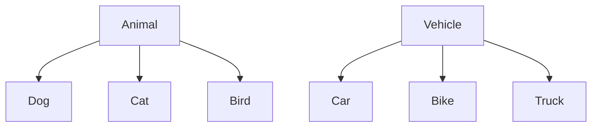
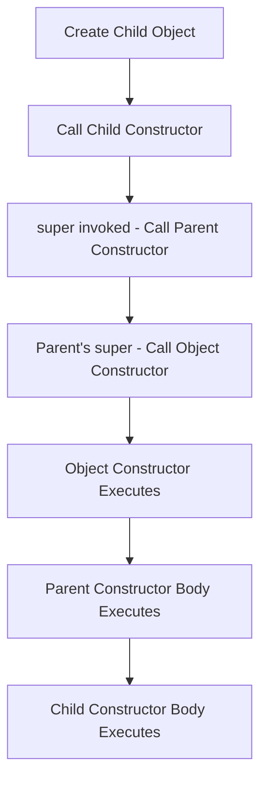

# 🧬 Inheritance Basics in Java

## Table of Contents
1. [What is Inheritance?](#what-is-inheritance)
2. [IS-A Relationship](#is-a-relationship)
3. [extends Keyword](#extends-keyword)
4. [Types of Inheritance](#types-of-inheritance)
5. [java.lang.Object Class](#javalangobject-class)
6. [super Keyword](#super-keyword)
7. [Constructor Chaining in Inheritance](#constructor-chaining-in-inheritance)
8. [What is NOT Inherited](#what-is-not-inherited)
9. [Code Examples](#code-examples)
10. [Interview Questions](#interview-questions)

---

## What is Inheritance?

**Inheritance** is the ability to create a new class from an existing class. The new class (child/subclass) inherits properties and behaviors from the existing class (parent/superclass).

### Key Benefits:
1. **Code Reusability** - No need to rewrite existing code
2. **Extensibility** - Add new features to existing class
3. **Polymorphism** - Enable runtime polymorphism
4. **Hierarchical Organization** - Model real-world relationships

### Terminology:

| Term | Also Called | Description |
|------|-------------|-------------|
| Parent Class | Super class, Base class | Class being inherited from |
| Child Class | Sub class, Derived class | Class that inherits |

---

## IS-A Relationship

Inheritance represents an **IS-A** relationship.

### Examples:

```
Dog IS-A Animal
Car IS-A Vehicle
Manager IS-A Employee
Circle IS-A Shape
```

### Visual Representation:



### When to Use Inheritance:

```
Use inheritance when:
  Child IS-A type of Parent

Don't use inheritance when:
  Child HAS-A Parent (use composition instead)

Example:
  ✓ Dog IS-A Animal        → Inheritance
  ✗ Car HAS-A Engine       → Composition
```

---

## extends Keyword

The `extends` keyword establishes inheritance relationship.

### Syntax:

```java
class ChildClass extends ParentClass {
    // Additional members
    // Overridden methods
}
```

### Example:

```java
// Parent class
class Animal {
    String name;
    
    void eat() {
        System.out.println("Animal is eating");
    }
    
    void sleep() {
        System.out.println("Animal is sleeping");
    }
}

// Child class inherits from Animal
class Dog extends Animal {
    String breed;
    
    void bark() {
        System.out.println("Dog is barking");
    }
}

// Usage
Dog dog = new Dog();
dog.name = "Buddy";      // Inherited from Animal
dog.breed = "Labrador";  // Defined in Dog
dog.eat();               // Inherited method
dog.bark();              // Dog's own method
```

---

## Types of Inheritance

### 1. Single Inheritance
One child inherits from one parent.

```java
class A { }
class B extends A { }
```

```
    A
    │
    ▼
    B
```

### 2. Multilevel Inheritance
Chain of inheritance.

```java
class A { }
class B extends A { }
class C extends B { }
```

```
    A
    │
    ▼
    B
    │
    ▼
    C
```

### 3. Hierarchical Inheritance
Multiple children inherit from one parent.

```java
class A { }
class B extends A { }
class C extends A { }
class D extends A { }
```

```
        A
      / | \
     ▼  ▼  ▼
     B  C  D
```

### 4. Multiple Inheritance (NOT Supported with Classes)

```java
// NOT ALLOWED in Java
class A { }
class B { }
class C extends A, B { }  // ERROR!
```

> ⚠️ **Java doesn't support multiple inheritance with classes** to avoid the "Diamond Problem". Use **interfaces** instead.

### Diamond Problem:

```
       A
      / \
     B   C
      \ /
       D

If A has method foo(), and B and C override it differently,
which version should D inherit?
```

---

## java.lang.Object Class

Every class in Java implicitly extends `java.lang.Object`.

### Object Class Hierarchy:

```java
// These two are equivalent:
class MyClass { }
class MyClass extends Object { }
```

### Methods Inherited from Object:

| Method | Description |
|--------|-------------|
| `toString()` | String representation of object |
| `equals(Object)` | Compare objects for equality |
| `hashCode()` | Hash code for object |
| `getClass()` | Runtime class information |
| `clone()` | Create copy of object |
| `finalize()` | Called before garbage collection |
| `wait()`, `notify()`, `notifyAll()` | Thread synchronization |

### Example:

```java
class Person {
    String name;
    
    Person(String name) {
        this.name = name;
    }
    
    @Override
    public String toString() {
        return "Person: " + name;
    }
}

Person p = new Person("John");
System.out.println(p.toString());  // Person: John
System.out.println(p);             // Same - toString() called automatically
```

---

## super Keyword

`super` is used to refer to the immediate parent class.

### Uses of super:

### 1. Access Parent's Variables

```java
class Parent {
    int num = 10;
}

class Child extends Parent {
    int num = 20;  // Hides parent's num
    
    void display() {
        System.out.println(num);        // 20 (child's)
        System.out.println(super.num);  // 10 (parent's)
    }
}
```

### 2. Call Parent's Methods

```java
class Parent {
    void show() {
        System.out.println("Parent's show");
    }
}

class Child extends Parent {
    @Override
    void show() {
        super.show();  // Call parent's show
        System.out.println("Child's show");
    }
}
```

### 3. Call Parent's Constructor

```java
class Parent {
    Parent(String msg) {
        System.out.println("Parent: " + msg);
    }
}

class Child extends Parent {
    Child() {
        super("Hello");  // MUST be first statement
        System.out.println("Child constructor");
    }
}
```

---

## Constructor Chaining in Inheritance

When you create a child object, parent constructor is ALWAYS called first.

### Implicit super() Call:

```java
class Parent {
    Parent() {
        System.out.println("Parent constructor");
    }
}

class Child extends Parent {
    Child() {
        // super(); ← Added by compiler if not present
        System.out.println("Child constructor");
    }
}

// Output when creating Child object:
// Parent constructor
// Child constructor
```

### Explicit super() Call:

```java
class Parent {
    String name;
    
    Parent(String name) {
        this.name = name;
        System.out.println("Parent: " + name);
    }
}

class Child extends Parent {
    int age;
    
    Child(String name, int age) {
        super(name);  // Call parent's parameterized constructor
        this.age = age;
        System.out.println("Child: " + age);
    }
}

Child c = new Child("John", 25);
// Output:
// Parent: John
// Child: 25
```

### Rules for super():
1. Must be the **first statement** in constructor
2. If not provided, compiler adds `super()` (no-arg)
3. If parent has no no-arg constructor, you MUST call `super(args)`

### Constructor Chain Execution Order:



---

## What is NOT Inherited

| Not Inherited | Reason |
|---------------|--------|
| **Constructors** | Constructors are not members |
| **Private Members** | Not visible to child class |
| **Static Members** | Belong to class, not inherited (but accessible) |

### Example:

```java
class Parent {
    private int secret = 100;         // NOT inherited
    protected int data = 200;         // Inherited
    
    Parent() {                        // NOT inherited
        System.out.println("Parent");
    }
    
    private void hidden() { }         // NOT inherited
    protected void visible() { }      // Inherited
}

class Child extends Parent {
    void test() {
        // System.out.println(secret);  // ERROR! Not accessible
        System.out.println(data);       // OK - inherited
        
        visible();                       // OK - inherited
        // hidden();                     // ERROR! Not accessible
    }
}
```

---

## Code Examples

### Complete Inheritance Example:

```java
// Parent class - FourWheeler
class FourWheeler {                                 // Line 1
    private String brand;                           // Line 2: Private - not inherited
    protected int wheels = 4;                       // Line 3: Protected - inherited
    
    FourWheeler() {                                 // Line 4: Constructor
        System.out.println("FourWheeler created"); 
    }
    
    FourWheeler(String brand) {                     // Line 5: Parameterized constructor
        this.brand = brand;
        System.out.println("FourWheeler: " + brand);
    }
    
    void drive() {                                  // Line 6: Method
        System.out.println("Driving a four-wheeler");
    }
    
    public String getBrand() {                      // Line 7: Getter for private field
        return brand;
    }
}

// Child class - Car extends FourWheeler
class Car extends FourWheeler {                     // Line 8: Inheritance
    private String model;                           // Line 9: Car's own field
    
    Car(String brand, String model) {               // Line 10: Constructor
        super(brand);                               // Line 11: Call parent constructor
        this.model = model;
        System.out.println("Car model: " + model);
    }
    
    void showDetails() {                            // Line 12: Car's method
        System.out.println("Brand: " + getBrand()); // Access via method
        System.out.println("Model: " + model);
        System.out.println("Wheels: " + wheels);    // Direct access - protected
    }
}

public class InheritanceDemo {                      // Line 13
    public static void main(String[] args) {        // Line 14
        Car car = new Car("Toyota", "Camry");       // Line 15
        car.drive();                                // Line 16: Inherited method
        car.showDetails();                          // Line 17: Car's method
    }
}
```

### Output:
```
FourWheeler: Toyota
Car model: Camry
Driving a four-wheeler
Brand: Toyota
Model: Camry
Wheels: 4
```

### Memory Diagram:

```
When Car object is created:

Heap:
┌────────────────────────────────────────────┐
│              Car Object                     │
├────────────────────────────────────────────┤
│  Inherited from FourWheeler:               │
│    brand: "Toyota" (private, via getter)   │
│    wheels: 4                               │
├────────────────────────────────────────────┤
│  Car's own:                                │
│    model: "Camry"                          │
└────────────────────────────────────────────┘
```

---

## Interview Questions

### Q1: What is inheritance?
**Answer**: Inheritance is a mechanism where a new class acquires properties and behaviors of an existing class. It represents an IS-A relationship.

### Q2: Why doesn't Java support multiple inheritance?
**Answer**: To avoid the "Diamond Problem" where ambiguity arises when a class inherits from two classes that have the same method.

### Q3: What is the difference between extends and implements?
**Answer**:
- `extends`: For class inheritance (single class only)
- `implements`: For implementing interfaces (multiple allowed)

### Q4: What is the role of super keyword?
**Answer**: `super` refers to the parent class. It's used to:
- Access parent's hidden variables
- Call parent's overridden methods
- Call parent's constructor

### Q5: Can constructor be inherited?
**Answer**: No. Constructors are not inherited but child constructor always calls parent constructor (explicitly or implicitly).

### Q6: What is java.lang.Object?
**Answer**: Object is the root class of all Java classes. Every class implicitly extends Object and inherits its methods.

### Q7: Can we inherit private members?
**Answer**: Private members are inherited in memory but not accessible in child class. They can be accessed through parent's public/protected methods.

### Q8: What is constructor chaining?
**Answer**: When a child object is created, constructors are called in chain from topmost parent (Object) down to the child class.

### Q9: When is super() call required?
**Answer**: When parent class has only parameterized constructor(s), child must explicitly call `super(args)` because default `super()` won't work.

### Q10: Can we override static methods?
**Answer**: No. Static methods belong to class, not objects. They can be hidden (redefined) in child class but not overridden.

---

## Quick Reference

### Inheritance Syntax

```java
// Single inheritance
class Child extends Parent { }

// Multilevel
class A { }
class B extends A { }
class C extends B { }

// Hierarchical
class Parent { }
class Child1 extends Parent { }
class Child2 extends Parent { }
```

### super Keyword Usage

```java
class Child extends Parent {
    Child() {
        super();           // Call parent constructor (first line)
    }
    
    void method() {
        super.variable;    // Access parent's variable
        super.method();    // Call parent's method
    }
}
```

---

*Previous: [14_Packages_and_JARs.md](./14_Packages_and_JARs.md)*  
*Next: [16_Polymorphism.md](./16_Polymorphism.md)*
