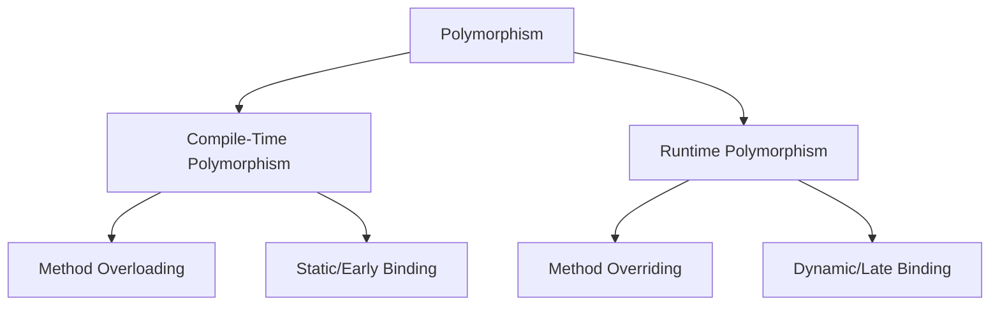

# 🎭 Polymorphism in Java

## Table of Contents
1. [What is Polymorphism?](#what-is-polymorphism)
2. [Types of Polymorphism](#types-of-polymorphism)
3. [Method Overriding](#method-overriding)
4. [Dynamic Method Dispatch](#dynamic-method-dispatch)
5. [Upcasting](#upcasting)
6. [Downcasting](#downcasting)
7. [instanceof Operator](#instanceof-operator)
8. [ClassCastException](#classcastexception)
9. [Code Examples](#code-examples)
10. [Interview Questions](#interview-questions)

---

## What is Polymorphism?

**Polymorphism** means "many forms". An object can take multiple forms and behave differently based on the context.

### Real-World Analogy:

```
A person can be:
- A student in college
- An employee at work
- A parent at home
- A customer in a shop

Same person, different roles/behaviors!
```

### Polymorphism in Java:

```java
// One reference type, multiple object types
Animal animal;

animal = new Dog();    // Animal behaves like Dog
animal.sound();        // "Bark!"

animal = new Cat();    // Animal behaves like Cat
animal.sound();        // "Meow!"
```

---

## Types of Polymorphism



| Type | Also Called | Resolution | Mechanism |
|------|-------------|------------|-----------|
| **Compile-Time** | Static, Early Binding | At compilation | Method Overloading |
| **Runtime** | Dynamic, Late Binding | At execution | Method Overriding |

---

## Method Overriding

**Overriding** means redefining a parent's method in the child class with the same signature.

### Rules for Overriding:

| Rule | Description |
|------|-------------|
| Same method name | Must match exactly |
| Same parameters | Number, type, and order |
| Same or covariant return type | Can return subtype |
| Cannot reduce access | Can increase visibility |
| Cannot override final methods | final prevents override |
| Cannot override static methods | Hiding, not overriding |
| Cannot override private methods | Not visible to child |

### Overriding Example:

```java
class Animal {                                      // Line 1: Parent class
    void sound() {                                  // Line 2: Method to be overridden
        System.out.println("Animal makes sound");
    }
}

class Dog extends Animal {                          // Line 3: Child class
    @Override                                       // Line 4: Annotation (optional but recommended)
    void sound() {                                  // Line 5: Override parent's method
        System.out.println("Dog barks");
    }
}

class Cat extends Animal {                          // Line 6: Another child
    @Override
    void sound() {
        System.out.println("Cat meows");
    }
}
```

### @Override Annotation:

```java
@Override
void sound() { }
```

- Tells compiler this method overrides parent's method
- Compiler error if no matching method in parent
- Optional but highly recommended

---

## Dynamic Method Dispatch

Also called **Runtime Polymorphism** or **Late Binding**.

### How It Works:

The method to call is determined at **runtime** based on the **actual object type**, not the reference type.

```java
class Animal {
    void sound() { System.out.println("Animal sound"); }
}

class Dog extends Animal {
    @Override
    void sound() { System.out.println("Dog barks"); }
}

class Cat extends Animal {
    @Override
    void sound() { System.out.println("Cat meows"); }
}

public class PolymorphismDemo {
    public static void main(String[] args) {
        Animal a;           // Reference type: Animal
        
        a = new Dog();      // Object type: Dog
        a.sound();          // Output: Dog barks (Dog's method called)
        
        a = new Cat();      // Object type: Cat
        a.sound();          // Output: Cat meows (Cat's method called)
    }
}
```

### Why "Dynamic"?

```
At COMPILE time:
  Compiler sees: Animal reference
  Compiler allows: Methods declared in Animal

At RUNTIME:
  JVM sees: Actual object (Dog or Cat)
  JVM calls: Overridden method of actual object
```

### Visual Representation:

```
┌─────────────────────────────────────────────────────────────────┐
│                     COMPILE TIME                                 │
├─────────────────────────────────────────────────────────────────┤
│  Animal a = new Dog();                                          │
│           │                                                      │
│           └─► Compiler checks: Does Animal have sound()?        │
│               Yes? ✓ Allow the call                             │
│               No?  ✗ Compilation error                          │
└─────────────────────────────────────────────────────────────────┘

┌─────────────────────────────────────────────────────────────────┐
│                       RUNTIME                                    │
├─────────────────────────────────────────────────────────────────┤
│  a.sound();                                                      │
│           │                                                      │
│           └─► JVM checks: What is actual object type?           │
│               Dog? Call Dog's sound()                           │
│               Cat? Call Cat's sound()                           │
└─────────────────────────────────────────────────────────────────┘
```

---

## Upcasting

**Upcasting** is assigning a child object to a parent reference.

### Characteristics:
- Implicit (automatic)
- Always safe
- Loses access to child-specific methods

```java
Animal a = new Dog();  // Upcasting: Dog → Animal
```

### What Can You Access?

```java
class Animal {
    void eat() { System.out.println("Eating"); }
}

class Dog extends Animal {
    void bark() { System.out.println("Barking"); }
}

Animal a = new Dog();   // Upcasting

a.eat();    // ✓ OK - Animal has eat()
// a.bark();   // ✗ ERROR - Animal doesn't have bark()
```

### Why Use Upcasting?

```java
// Method accepts any Animal
void feedAnimal(Animal animal) {
    animal.eat();
}

feedAnimal(new Dog());   // Works! Dog IS-A Animal
feedAnimal(new Cat());   // Works! Cat IS-A Animal
feedAnimal(new Bird());  // Works! Bird IS-A Animal
```

---

## Downcasting

**Downcasting** is casting a parent reference to a child type.

### Characteristics:
- Explicit (must use cast operator)
- Can throw ClassCastException
- Gains access to child-specific methods

```java
Animal a = new Dog();   // Upcasting (implicit)
Dog d = (Dog) a;        // Downcasting (explicit)
```

### Valid vs Invalid Downcasting:

```java
// VALID: Object is actually a Dog
Animal a = new Dog();
Dog d = (Dog) a;        // ✓ OK - Actual object is Dog
d.bark();               // ✓ Works!

// INVALID: Object is not a Dog
Animal a2 = new Cat();
Dog d2 = (Dog) a2;      // ✗ RUNTIME ERROR: ClassCastException
```

---

## instanceof Operator

`instanceof` checks if an object is an instance of a specific class.

### Syntax:

```java
object instanceof ClassName
```

### Returns:
- `true` if object is instance of class (or subclass)
- `false` otherwise

### Safe Downcasting Pattern:

```java
Animal a = new Dog();

if (a instanceof Dog) {
    Dog d = (Dog) a;    // Safe to cast
    d.bark();
}

if (a instanceof Cat) {
    Cat c = (Cat) a;    // Won't execute (a is not Cat)
    c.meow();
}
```

### instanceof Hierarchy:

```java
class Animal { }
class Dog extends Animal { }
class Labrador extends Dog { }

Labrador lab = new Labrador();

System.out.println(lab instanceof Labrador);  // true
System.out.println(lab instanceof Dog);       // true
System.out.println(lab instanceof Animal);    // true
System.out.println(lab instanceof Object);    // true
```

---

## ClassCastException

`ClassCastException` occurs when you try to cast an object to a class it's not an instance of.

### Example:

```java
Animal a = new Cat();
Dog d = (Dog) a;    // ClassCastException!
// Cat cannot be cast to Dog
```

### Prevention:

```java
Animal a = getAnimalFromSomewhere();

// WRONG: May throw ClassCastException
Dog d = (Dog) a;

// RIGHT: Check first with instanceof
if (a instanceof Dog) {
    Dog d = (Dog) a;
    d.bark();
} else {
    System.out.println("Not a dog!");
}
```

---

## Code Examples

### Complete Polymorphism Example:

```java
// Base class
class Shape {                                       // Line 1
    void draw() {                                   // Line 2
        System.out.println("Drawing Shape");
    }
    
    double area() {                                 // Line 3
        return 0;
    }
}

// Child classes
class Circle extends Shape {                        // Line 4
    double radius;
    
    Circle(double radius) {                         // Line 5
        this.radius = radius;
    }
    
    @Override
    void draw() {                                   // Line 6: Override
        System.out.println("Drawing Circle with radius " + radius);
    }
    
    @Override
    double area() {                                 // Line 7: Override
        return Math.PI * radius * radius;
    }
}

class Rectangle extends Shape {                     // Line 8
    double length, width;
    
    Rectangle(double length, double width) {        // Line 9
        this.length = length;
        this.width = width;
    }
    
    @Override
    void draw() {                                   // Line 10: Override
        System.out.println("Drawing Rectangle " + length + "x" + width);
    }
    
    @Override
    double area() {                                 // Line 11: Override
        return length * width;
    }
}

// Using polymorphism
public class PolymorphismDemo {                     // Line 12
    public static void main(String[] args) {        // Line 13
        
        // Array of parent type, holding different child objects
        Shape[] shapes = new Shape[3];              // Line 14
        shapes[0] = new Circle(5);                  // Line 15: Upcasting
        shapes[1] = new Rectangle(4, 6);            // Line 16: Upcasting
        shapes[2] = new Circle(3);                  // Line 17: Upcasting
        
        // Polymorphic behavior
        for (Shape s : shapes) {                    // Line 18
            s.draw();                               // Line 19: Calls appropriate override
            System.out.println("Area: " + s.area());
            System.out.println();
        }
        
        // Downcasting with instanceof
        for (Shape s : shapes) {                    // Line 20
            if (s instanceof Circle) {              // Line 21: Check type
                Circle c = (Circle) s;              // Line 22: Safe downcast
                System.out.println("Circle radius: " + c.radius);
            }
        }
    }
}
```

### Output:
```
Drawing Circle with radius 5.0
Area: 78.53981633974483

Drawing Rectangle 4.0x6.0
Area: 24.0

Drawing Circle with radius 3.0
Area: 28.274333882308138

Circle radius: 5.0
Circle radius: 3.0
```

### Binding Comparison:

```java
class Parent {
    static void staticMethod() {
        System.out.println("Parent static");
    }
    
    void instanceMethod() {
        System.out.println("Parent instance");
    }
}

class Child extends Parent {
    static void staticMethod() {        // Hiding, not overriding
        System.out.println("Child static");
    }
    
    @Override
    void instanceMethod() {             // Overriding
        System.out.println("Child instance");
    }
}

Parent p = new Child();

p.staticMethod();     // Parent static (early binding - reference type)
p.instanceMethod();   // Child instance (late binding - object type)
```

---

## Interview Questions

### Q1: What is polymorphism?
**Answer**: Polymorphism means "many forms". It allows objects to behave differently based on their actual type while being referenced by a parent type.

### Q2: What is the difference between compile-time and runtime polymorphism?
**Answer**:
- **Compile-time**: Method overloading, resolved at compilation
- **Runtime**: Method overriding, resolved at execution

### Q3: What is method overriding?
**Answer**: Redefining a parent's method in child class with the same signature. The child's version replaces the parent's version for child objects.

### Q4: What is dynamic method dispatch?
**Answer**: The mechanism by which a call to an overridden method is resolved at runtime based on the actual object type, not the reference type.

### Q5: What is the difference between upcasting and downcasting?
**Answer**:
- **Upcasting**: Child → Parent reference (implicit, safe)
- **Downcasting**: Parent → Child reference (explicit, may fail)

### Q6: What is instanceof operator?
**Answer**: An operator that checks if an object is an instance of a specific class or interface. Returns boolean true/false.

### Q7: When does ClassCastException occur?
**Answer**: When you try to cast an object to a class that it is not actually an instance of at runtime.

### Q8: Can static methods be overridden?
**Answer**: No. Static methods are hidden, not overridden. They are resolved at compile time based on reference type.

### Q9: What is the @Override annotation?
**Answer**: It's a marker that tells the compiler the method is intended to override a parent method. Helps catch errors if signature doesn't match.

### Q10: What is late binding?
**Answer**: Also called dynamic binding. The decision of which method implementation to call is made at runtime based on the actual object type.

---

## Quick Reference

### Polymorphism Summary

```java
// Upcasting (implicit)
Parent p = new Child();

// Downcasting (explicit)
Child c = (Child) p;

// Safe downcasting
if (p instanceof Child) {
    Child c = (Child) p;
}

// Overriding
class Child extends Parent {
    @Override
    void method() { }
}
```

### Overriding Rules

```
SAME: Name, Parameters
CAN:  Increase visibility, Return subtype
CANNOT: Reduce visibility, Override static/final/private
```

---

*Previous: [15_Inheritance_Basics.md](./15_Inheritance_Basics.md)*  
*Next: [17_Abstract_Classes_Interfaces.md](./17_Abstract_Classes_Interfaces.md)*
