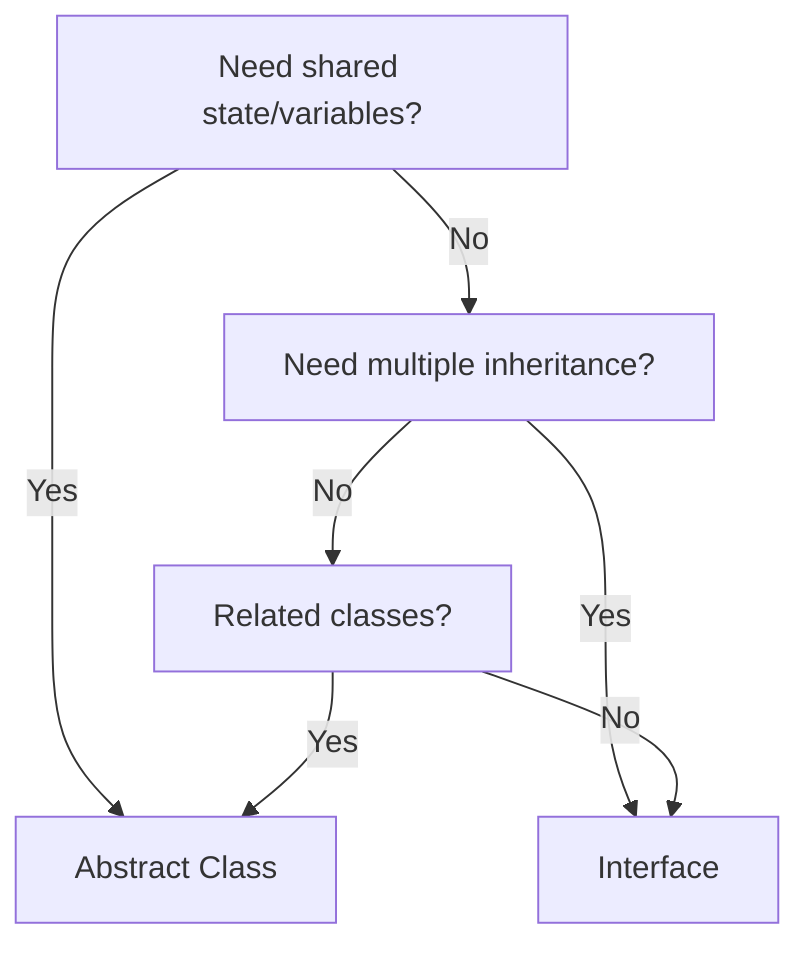

# 📐 Abstract Classes and Interfaces in Java

## Table of Contents
1. [Introduction to Abstraction](#introduction-to-abstraction)
2. [Abstract Classes](#abstract-classes)
3. [Abstract Methods](#abstract-methods)
4. [Interfaces](#interfaces)
5. [Abstract Class vs Interface](#abstract-class-vs-interface)
6. [When to Use What](#when-to-use-what)
7. [Java 8+ Interface Features](#java-8-interface-features)
8. [Code Examples](#code-examples)
9. [Interview Questions](#interview-questions)

---

## Introduction to Abstraction

**Abstraction** is hiding implementation details and showing only functionality.

### Real-World Examples:

| Object | What You See | What's Hidden |
|--------|--------------|---------------|
| ATM | Buttons, Screen | Card reader mechanism, vault |
| Car | Steering, Pedals | Engine, transmission logic |
| TV Remote | Power, Volume buttons | IR signal transmission |

### Abstraction in Java:

Achieved through:
1. **Abstract Classes** - Partial abstraction (0-100%)
2. **Interfaces** - Full abstraction (100%)

---

## Abstract Classes

An **abstract class** is a class that cannot be instantiated and may contain abstract methods.

### Characteristics:

| Feature | Description |
|---------|-------------|
| Uses `abstract` keyword | `abstract class ClassName` |
| Cannot be instantiated | Cannot use `new AbstractClass()` |
| Can have abstract methods | Methods without body |
| Can have concrete methods | Methods with body |
| Can have constructors | Called when child is created |
| Can have instance variables | With any access modifier |

### Syntax:

```java
abstract class Animal {
    String name;                      // Instance variable
    
    Animal(String name) {             // Constructor
        this.name = name;
    }
    
    abstract void sound();            // Abstract method (no body)
    
    void sleep() {                    // Concrete method (with body)
        System.out.println(name + " is sleeping");
    }
}
```

### Rules:

1. If class has abstract method → Class MUST be abstract
2. Abstract class MAY have zero abstract methods
3. Child class MUST override all abstract methods (or be abstract itself)
4. Cannot create object of abstract class

---

## Abstract Methods

An **abstract method** is a method declared without implementation.

### Syntax:

```java
abstract void methodName();  // No body, ends with semicolon
```

### Rules:

```java
abstract class Shape {
    // Abstract method - MUST be overridden by child
    abstract double area();
    abstract double perimeter();
    
    // Concrete method - optional to override
    void display() {
        System.out.println("This is a shape");
    }
}

class Circle extends Shape {
    double radius;
    
    Circle(double radius) {
        this.radius = radius;
    }
    
    @Override
    double area() {                   // MUST override
        return Math.PI * radius * radius;
    }
    
    @Override
    double perimeter() {              // MUST override
        return 2 * Math.PI * radius;
    }
}
```

---

## Interfaces

An **interface** is a completely abstract type that defines a contract.

### Characteristics (Traditional):

| Feature | Description |
|---------|-------------|
| All methods are abstract | Implicitly `public abstract` |
| All variables are constants | Implicitly `public static final` |
| No constructors | Cannot be instantiated |
| No instance variables | Only constants |
| Multiple inheritance | Class can implement multiple interfaces |

### Syntax:

```java
interface Drawable {
    // Constant (public static final)
    int MAX_SIZE = 100;
    
    // Abstract method (public abstract)
    void draw();
    
    // More methods
    double getArea();
}

class Circle implements Drawable {
    double radius;
    
    Circle(double radius) {
        this.radius = radius;
    }
    
    @Override
    public void draw() {              // MUST be public
        System.out.println("Drawing circle");
    }
    
    @Override
    public double getArea() {
        return Math.PI * radius * radius;
    }
}
```

### Multiple Interface Implementation:

```java
interface Runnable {
    void run();
}

interface Swimable {
    void swim();
}

interface Flyable {
    void fly();
}

// Class implementing multiple interfaces
class Duck implements Runnable, Swimable, Flyable {
    @Override
    public void run() { System.out.println("Duck running"); }
    
    @Override
    public void swim() { System.out.println("Duck swimming"); }
    
    @Override
    public void fly() { System.out.println("Duck flying"); }
}
```

### Interface Inheritance:

```java
interface A {
    void methodA();
}

interface B {
    void methodB();
}

// Interface can extend multiple interfaces
interface C extends A, B {
    void methodC();
}

class MyClass implements C {
    public void methodA() { }
    public void methodB() { }
    public void methodC() { }
}
```

---

## Abstract Class vs Interface

| Aspect | Abstract Class | Interface |
|--------|----------------|-----------|
| **Keyword** | `abstract class` | `interface` |
| **Methods** | Abstract + Concrete | Abstract only (before Java 8) |
| **Variables** | Any type | public static final only |
| **Constructor** | Can have | Cannot have |
| **Inheritance** | Single (extends) | Multiple (implements) |
| **Access Modifiers** | Any | public only (methods) |
| **Purpose** | Partial abstraction | Full abstraction |

### Visual Comparison:

```
Abstract Class:                    Interface:
┌──────────────────────┐          ┌──────────────────────┐
│  abstract class A    │          │  interface I         │
├──────────────────────┤          ├──────────────────────┤
│  - variables (any)   │          │  - constants only    │
│  - abstract methods  │          │  - abstract methods  │
│  - concrete methods  │          │                      │
│  - constructors      │          │                      │
└──────────────────────┘          └──────────────────────┘
         ▲                                 ▲
         │ extends                         │ implements
         │ (single only)                   │ (multiple allowed)
         │                                 │
┌──────────────────────┐          ┌──────────────────────┐
│    class Child       │          │    class Impl        │
└──────────────────────┘          └──────────────────────┘
```

---

## When to Use What

### Use Abstract Class When:
- You want to share code among closely related classes
- Classes need common state (instance variables)
- You want to provide some default behavior
- You need non-public methods

### Use Interface When:
- Unrelated classes need to implement your type
- You want to specify behavior, not implementation
- You need multiple inheritance
- You want to define a contract

### Decision Guide:



---

## Java 8+ Interface Features

### Default Methods (Java 8):

```java
interface Vehicle {
    void start();
    
    // Default method with implementation
    default void stop() {
        System.out.println("Vehicle stopping");
    }
}

class Car implements Vehicle {
    public void start() {
        System.out.println("Car starting");
    }
    // stop() is inherited with default implementation
}
```

### Static Methods (Java 8):

```java
interface Calculator {
    // Static method in interface
    static int add(int a, int b) {
        return a + b;
    }
}

// Call using interface name
int result = Calculator.add(5, 3);
```

### Private Methods (Java 9):

```java
interface Logger {
    default void logInfo(String msg) {
        log("INFO", msg);
    }
    
    default void logError(String msg) {
        log("ERROR", msg);
    }
    
    // Private helper method
    private void log(String level, String msg) {
        System.out.println("[" + level + "] " + msg);
    }
}
```

---

## Code Examples

### Complete Abstract Class Example:

```java
// Abstract base class
abstract class Employee {                           // Line 1
    protected String name;                          // Line 2
    protected int id;                               // Line 3
    
    public Employee(String name, int id) {          // Line 4: Constructor
        this.name = name;
        this.id = id;
    }
    
    // Abstract method - child must implement
    abstract double calculateSalary();              // Line 5
    
    // Concrete method - can be used as-is or overridden
    public void displayDetails() {                  // Line 6
        System.out.println("ID: " + id);
        System.out.println("Name: " + name);
        System.out.println("Salary: " + calculateSalary());
    }
}

// Concrete implementation
class FullTimeEmployee extends Employee {           // Line 7
    private double monthlySalary;
    
    public FullTimeEmployee(String name, int id, double salary) {  // Line 8
        super(name, id);                            // Call parent constructor
        this.monthlySalary = salary;
    }
    
    @Override
    double calculateSalary() {                      // Line 9: Must implement
        return monthlySalary;
    }
}

class ContractEmployee extends Employee {           // Line 10
    private double hourlyRate;
    private int hoursWorked;
    
    public ContractEmployee(String name, int id, double rate, int hours) {
        super(name, id);
        this.hourlyRate = rate;
        this.hoursWorked = hours;
    }
    
    @Override
    double calculateSalary() {                      // Line 11: Must implement
        return hourlyRate * hoursWorked;
    }
}

public class AbstractDemo {                         // Line 12
    public static void main(String[] args) {        // Line 13
        // Employee e = new Employee();  // ERROR! Cannot instantiate abstract
        
        Employee emp1 = new FullTimeEmployee("John", 101, 50000);
        Employee emp2 = new ContractEmployee("Jane", 102, 50, 160);
        
        emp1.displayDetails();
        System.out.println();
        emp2.displayDetails();
    }
}
```

### Output:
```
ID: 101
Name: John
Salary: 50000.0

ID: 102
Name: Jane
Salary: 8000.0
```

### Complete Interface Example:

```java
// Interface defining contract
interface Payable {                                 // Line 1
    double getPaymentAmount();                      // Line 2: Abstract
}

interface Taxable {                                 // Line 3
    double TAX_RATE = 0.1;                         // Line 4: Constant
    double calculateTax();                          // Line 5: Abstract
}

// Class implementing multiple interfaces
class Invoice implements Payable, Taxable {         // Line 6
    private String description;
    private double amount;
    
    public Invoice(String desc, double amount) {    // Line 7
        this.description = desc;
        this.amount = amount;
    }
    
    @Override
    public double getPaymentAmount() {              // Line 8: From Payable
        return amount;
    }
    
    @Override
    public double calculateTax() {                  // Line 9: From Taxable
        return amount * TAX_RATE;
    }
}

public class InterfaceDemo {                        // Line 10
    public static void main(String[] args) {        // Line 11
        Invoice inv = new Invoice("Consulting", 1000);
        
        System.out.println("Amount: " + inv.getPaymentAmount());
        System.out.println("Tax: " + inv.calculateTax());
        System.out.println("Total: " + (inv.getPaymentAmount() + inv.calculateTax()));
    }
}
```

### Output:
```
Amount: 1000.0
Tax: 100.0
Total: 1100.0
```

---

## Interview Questions

### Q1: What is an abstract class?
**Answer**: An abstract class is a class declared with `abstract` keyword that cannot be instantiated. It may contain both abstract and concrete methods.

### Q2: What is an interface?
**Answer**: An interface is a completely abstract type that defines a contract. It contains only abstract methods (before Java 8) and constants.

### Q3: Can abstract class have constructor?
**Answer**: Yes. Although you can't instantiate abstract class, its constructor is called when child class object is created via `super()`.

### Q4: Can interface have variables?
**Answer**: Only constants (public static final). Cannot have instance variables.

### Q5: Can abstract class have main method?
**Answer**: Yes. Abstract class can have static methods including main.

### Q6: What is difference between abstract class and interface?
**Answer**: Abstract class provides partial abstraction with state and behavior. Interface provides full abstraction with only behavior contracts (before Java 8).

### Q7: Can we have static methods in interface?
**Answer**: Yes, from Java 8. Called using InterfaceName.methodName().

### Q8: What are default methods in interface?
**Answer**: Methods with implementation in interface (Java 8+). Allows adding methods to interface without breaking implementations.

### Q9: Can a class extend abstract class and implement interface?
**Answer**: Yes. `class Child extends AbstractParent implements SomeInterface`

### Q10: Why can't interface have constructor?
**Answer**: Because all interface methods are abstract and there's no state to initialize. Objects are never created from interfaces directly.

---

## Quick Reference

### Abstract Class Syntax

```java
abstract class MyAbstract {
    // Variables (any type)
    protected int value;
    
    // Constructor
    MyAbstract() { }
    
    // Abstract method
    abstract void doSomething();
    
    // Concrete method
    void helper() { }
}

class Concrete extends MyAbstract {
    @Override
    void doSomething() { }
}
```

### Interface Syntax

```java
interface MyInterface {
    // Constant
    int MAX = 100;
    
    // Abstract method
    void method1();
    
    // Default method (Java 8+)
    default void method2() { }
    
    // Static method (Java 8+)
    static void method3() { }
}

class MyClass implements MyInterface {
    public void method1() { }
}
```

---

*Previous: [16_Polymorphism.md](./16_Polymorphism.md)*  
*Next: [18_Singleton_Pattern.md](./18_Singleton_Pattern.md)*
