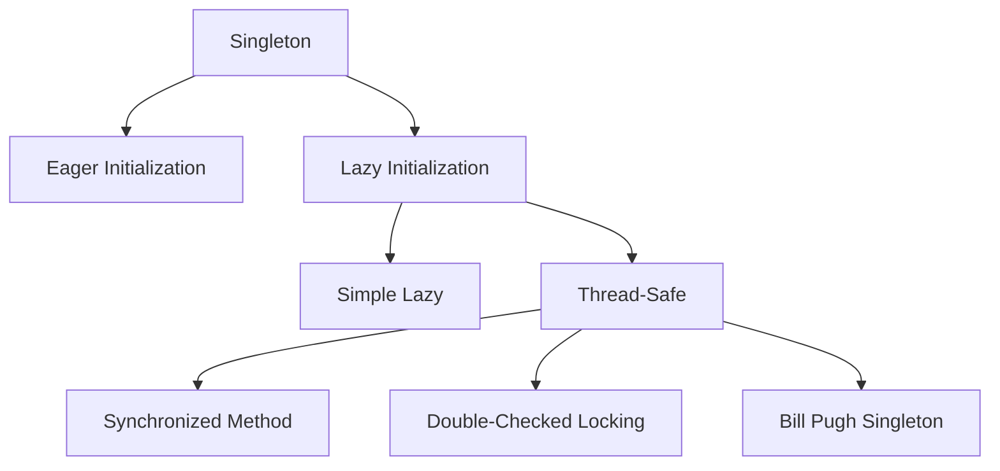

# 🎯 Singleton Design Pattern in Java

## Table of Contents
1. [What is Singleton Pattern?](#what-is-singleton-pattern)
2. [When to Use Singleton](#when-to-use-singleton)
3. [Implementation Steps](#implementation-steps)
4. [Types of Singleton](#types-of-singleton)
5. [Eager Initialization](#eager-initialization)
6. [Lazy Initialization](#lazy-initialization)
7. [Thread-Safe Singleton](#thread-safe-singleton)
8. [Breaking Singleton](#breaking-singleton)
9. [Code Examples](#code-examples)
10. [Interview Questions](#interview-questions)

---

## What is Singleton Pattern?

**Singleton** is a creational design pattern that ensures a class has only **ONE instance** and provides a **global access point** to it.

### Key Characteristics:
- Only one object exists throughout application
- Global access to that instance
- Controlled instantiation

### Visual Representation:

```
┌─────────────────────────────────────────────────────────────────┐
│                      APPLICATION                                 │
├─────────────────────────────────────────────────────────────────┤
│                                                                  │
│   Class A ──────┐                                               │
│                 │                                               │
│   Class B ──────┼───────► Singleton Instance                    │
│                 │         (Only ONE exists)                     │
│   Class C ──────┘                                               │
│                                                                  │
│   All classes get the SAME instance                              │
│                                                                  │
└─────────────────────────────────────────────────────────────────┘
```

---

## When to Use Singleton

### Use Cases:

| Use Case | Example |
|----------|---------|
| **Configuration** | Application settings |
| **Logging** | Logger instance |
| **Database Connection** | Connection pool manager |
| **Caching** | Cache manager |
| **Thread Pool** | Thread pool manager |
| **Hardware Access** | Printer spooler |

### Real-World Analogy:

```
President of a Country:
- Only ONE president at a time
- Everyone refers to the same president
- Cannot create multiple presidents
```

---

## Implementation Steps

### Three Essential Steps:

```java
class Singleton {
    // Step 1: Private static instance variable
    private static Singleton instance;
    
    // Step 2: Private constructor (prevent external instantiation)
    private Singleton() {
        // Initialization code
    }
    
    // Step 3: Public static method to get instance
    public static Singleton getInstance() {
        if (instance == null) {
            instance = new Singleton();
        }
        return instance;
    }
}
```

### Why Each Step:

| Step | Purpose |
|------|---------|
| Private static instance | Store the single instance |
| Private constructor | Prevent `new Singleton()` from outside |
| Public static getInstance() | Provide controlled access |

---

## Types of Singleton



---

## Eager Initialization

Instance is created when class is loaded, before it's needed.

```java
class EagerSingleton {
    // Instance created at class loading time
    private static final EagerSingleton instance = new EagerSingleton();
    
    private EagerSingleton() {
        System.out.println("Eager Singleton created");
    }
    
    public static EagerSingleton getInstance() {
        return instance;
    }
}
```

### Pros and Cons:

| Pros | Cons |
|------|------|
| Simple implementation | Instance created even if never used |
| Thread-safe by default | Cannot handle exceptions in constructor |
| No synchronization needed | Memory used from start |

---

## Lazy Initialization

Instance is created only when first requested.

```java
class LazySingleton {
    private static LazySingleton instance;
    
    private LazySingleton() {
        System.out.println("Lazy Singleton created");
    }
    
    public static LazySingleton getInstance() {
        // Create only when first called
        if (instance == null) {
            instance = new LazySingleton();
        }
        return instance;
    }
}
```

### Execution Flow:

```
First call to getInstance():
┌──────────────────────────────────────────┐
│ instance == null? → YES                  │
│ instance = new LazySingleton()           │
│ Return instance                          │
└──────────────────────────────────────────┘

Subsequent calls to getInstance():
┌──────────────────────────────────────────┐
│ instance == null? → NO                   │
│ Return existing instance                 │
└──────────────────────────────────────────┘
```

### Pros and Cons:

| Pros | Cons |
|------|------|
| Instance created only when needed | Not thread-safe! |
| Memory efficient | Multiple threads may create multiple instances |
| Can handle exceptions | Requires synchronization for thread safety |

---

## Thread-Safe Singleton

### Problem with Lazy Initialization:

```java
// Thread 1 checks: instance == null → true
// Thread 2 checks: instance == null → true (before Thread 1 creates)
// Both threads create instances! ❌
```

### Solution 1: Synchronized Method

```java
class ThreadSafeSingleton {
    private static ThreadSafeSingleton instance;
    
    private ThreadSafeSingleton() { }
    
    // Synchronized - only one thread can execute at a time
    public static synchronized ThreadSafeSingleton getInstance() {
        if (instance == null) {
            instance = new ThreadSafeSingleton();
        }
        return instance;
    }
}
```

**Drawback**: Synchronization overhead on every call.

### Solution 2: Double-Checked Locking

```java
class DoubleCheckedSingleton {
    private static volatile DoubleCheckedSingleton instance;
    
    private DoubleCheckedSingleton() { }
    
    public static DoubleCheckedSingleton getInstance() {
        // First check (without synchronization)
        if (instance == null) {
            synchronized (DoubleCheckedSingleton.class) {
                // Second check (with synchronization)
                if (instance == null) {
                    instance = new DoubleCheckedSingleton();
                }
            }
        }
        return instance;
    }
}
```

**Note**: `volatile` keyword ensures visibility across threads.

### Solution 3: Bill Pugh Singleton (Best Practice)

```java
class BillPughSingleton {
    
    private BillPughSingleton() { }
    
    // Inner static class - not loaded until getInstance() called
    private static class SingletonHelper {
        private static final BillPughSingleton INSTANCE = new BillPughSingleton();
    }
    
    public static BillPughSingleton getInstance() {
        return SingletonHelper.INSTANCE;
    }
}
```

**Why Best**: 
- Lazy initialized (inner class loaded only when accessed)
- Thread-safe without synchronization (JVM handles class loading)
- Simple and efficient

---

## Breaking Singleton

### Ways to Break Singleton:

1. **Reflection**
2. **Serialization**
3. **Cloning**

### Preventing Reflection Attack:

```java
class SecureSingleton {
    private static SecureSingleton instance;
    
    private SecureSingleton() {
        // Prevent reflection
        if (instance != null) {
            throw new RuntimeException("Use getInstance() method!");
        }
    }
    
    public static SecureSingleton getInstance() {
        if (instance == null) {
            instance = new SecureSingleton();
        }
        return instance;
    }
}
```

### Preventing Serialization Issues:

```java
class SerializableSingleton implements Serializable {
    private static final long serialVersionUID = 1L;
    private static SerializableSingleton instance;
    
    private SerializableSingleton() { }
    
    public static SerializableSingleton getInstance() {
        if (instance == null) {
            instance = new SerializableSingleton();
        }
        return instance;
    }
    
    // Prevent new instance during deserialization
    protected Object readResolve() {
        return getInstance();
    }
}
```

---

## Code Examples

### Complete Singleton Example from Day 2:

```java
// Singleton pattern - ensures only one instance
class Singleton {                                   // Line 1
    private static Singleton instance = null;       // Line 2: Static reference
    
    private Singleton() {                           // Line 3: Private constructor
        System.out.println("Singleton instance created");
    }
    
    // Static factory method
    public static Singleton getInstance() {         // Line 4: Access method
        if (instance == null) {                     // Line 5: Check if null
            instance = new Singleton();             // Line 6: Create if needed
        }
        return instance;                            // Line 7: Return instance
    }
    
    public void showMessage() {                     // Line 8: Instance method
        System.out.println("Hello from Singleton!");
    }
}

public class SingletonDemo {                        // Line 9
    public static void main(String args[]) {        // Line 10
        // Singleton s = new Singleton();  // ERROR! Constructor is private
        
        // Get instance through static method
        Singleton s1 = Singleton.getInstance();    // Line 11: First call creates
        Singleton s2 = Singleton.getInstance();    // Line 12: Returns same instance
        
        s1.showMessage();                          // Line 13
        
        // Verify both references point to same object
        System.out.println(s1 == s2);              // Line 14: true
        System.out.println(s1.hashCode());         // Line 15: Same hashcode
        System.out.println(s2.hashCode());         // Line 16: Same hashcode
    }
}
```

### Output:
```
Singleton instance created
Hello from Singleton!
true
1023892928
1023892928
```

### Database Connection Example:

```java
import java.sql.Connection;
import java.sql.DriverManager;

class DatabaseConnection {
    private static DatabaseConnection instance;
    private Connection connection;
    
    private DatabaseConnection() {
        try {
            String url = "jdbc:mysql://localhost:3306/mydb";
            String user = "root";
            String password = "password";
            connection = DriverManager.getConnection(url, user, password);
        } catch (Exception e) {
            throw new RuntimeException("Database connection failed", e);
        }
    }
    
    public static synchronized DatabaseConnection getInstance() {
        if (instance == null) {
            instance = new DatabaseConnection();
        }
        return instance;
    }
    
    public Connection getConnection() {
        return connection;
    }
}

// Usage
DatabaseConnection db1 = DatabaseConnection.getInstance();
DatabaseConnection db2 = DatabaseConnection.getInstance();
// db1 == db2 → true (same connection reused)
```

---

## Interview Questions

### Q1: What is Singleton pattern?
**Answer**: Singleton ensures a class has only one instance and provides global access to it through a static method.

### Q2: How to implement Singleton?
**Answer**: 
1. Private static instance variable
2. Private constructor
3. Public static getInstance() method

### Q3: What is lazy initialization?
**Answer**: Creating the instance only when it's first requested, rather than at class loading time.

### Q4: Why is simple lazy singleton not thread-safe?
**Answer**: Multiple threads checking `instance == null` simultaneously may each create their own instance before any assignment happens.

### Q5: What is double-checked locking?
**Answer**: A pattern that checks if instance is null twice - once without synchronization (fast path) and once with synchronization (safe creation).

### Q6: Why use volatile in double-checked locking?
**Answer**: To prevent instruction reordering and ensure all threads see the fully constructed object.

### Q7: What is Bill Pugh Singleton?
**Answer**: Uses a static inner class to hold the instance. Lazy, thread-safe without synchronization, because JVM guarantees class loading is thread-safe.

### Q8: How can Singleton be broken?
**Answer**: Through reflection (accessing private constructor), serialization (creating new instance on deserialize), or cloning.

### Q9: When should Singleton not be used?
**Answer**: When stateful behavior makes testing difficult, when multiple instances might be needed later, or when it creates tight coupling.

### Q10: What is the difference between eager and lazy initialization?
**Answer**: Eager creates instance at class loading; lazy creates only when first requested. Lazy saves memory if instance may never be used.

---

## Quick Reference

### Singleton Patterns Summary

```java
// Eager (simplest, always created)
private static final Singleton instance = new Singleton();

// Lazy (created when needed, not thread-safe)
public static Singleton getInstance() {
    if (instance == null) instance = new Singleton();
    return instance;
}

// Thread-safe synchronized
public static synchronized Singleton getInstance() { ... }

// Double-checked locking
if (instance == null) {
    synchronized(Singleton.class) {
        if (instance == null) instance = new Singleton();
    }
}

// Bill Pugh (best practice)
private static class Helper {
    static final Singleton INSTANCE = new Singleton();
}
public static Singleton getInstance() {
    return Helper.INSTANCE;
}
```

---

*Previous: [17_Abstract_Classes_Interfaces.md](./17_Abstract_Classes_Interfaces.md)*  
*Next: [19_VIVA_Questions.md](./19_VIVA_Questions.md)*
