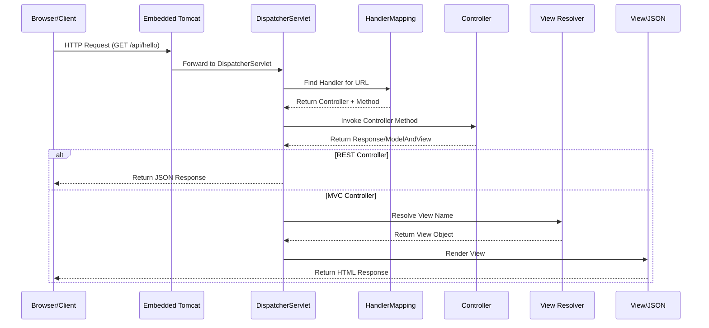
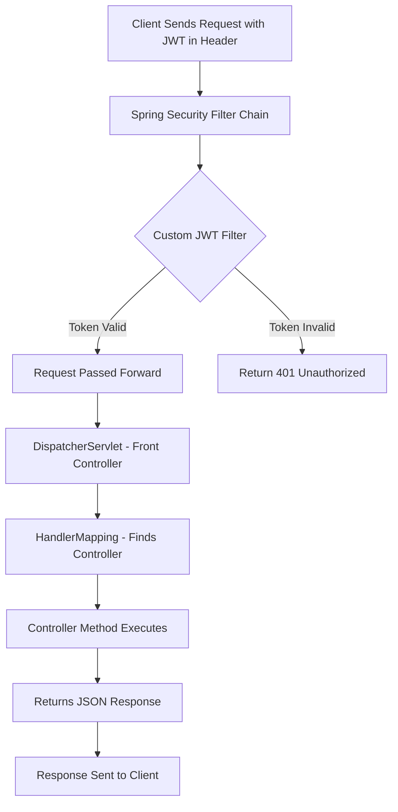

# 📘 DispatcherServlet and Request Flow in Spring Boot

## Table of Contents
1. [Introduction](#introduction)
2. [What is DispatcherServlet](#what-is-dispatcherservlet)
3. [Front Controller Design Pattern](#front-controller-design-pattern)
4. [Load on Startup](#load-on-startup)
5. [Complete Request Flow](#complete-request-flow)
6. [Request Flow with Spring Security](#request-flow-with-spring-security)
7. [Request Flow with JWT Authentication](#request-flow-with-jwt-authentication)
8. [Code Examples](#code-examples)
9. [Key Takeaways](#key-takeaways)
10. [Interview Questions](#interview-questions)

---

## Introduction

In Spring Boot applications, every HTTP request goes through a central component called **DispatcherServlet**. Understanding how requests flow through the application is fundamental to mastering Spring Boot development.

> [!NOTE]
> DispatcherServlet is the heart of Spring MVC and Spring Boot web applications. It acts as the central entry point for all HTTP requests.

---

## What is DispatcherServlet

### Definition

**DispatcherServlet** is a servlet that acts as the **Front Controller** in Spring MVC/Spring Boot applications. It is responsible for:

1. **Receiving all incoming HTTP requests**
2. **Delegating requests to appropriate handlers (Controllers)**
3. **Returning the response to the client**

### Key Characteristics

| Feature | Description |
|---------|-------------|
| **Type** | Servlet (extends HttpServlet) |
| **Role** | Front Controller |
| **Package** | `org.springframework.web.servlet.DispatcherServlet` |
| **Default Mapping** | `/` (all requests) |
| **Load Priority** | 1 (highest priority, loads at startup) |

---

## Front Controller Design Pattern

### What is Front Controller?

The **Front Controller** is a design pattern where a single controller handles all requests for a web application. Instead of having multiple entry points, all requests pass through one central component.

### Benefits

```
┌─────────────────────────────────────────────────────────────┐
│                    Without Front Controller                  │
├─────────────────────────────────────────────────────────────┤
│  Client → Servlet1 → Business Logic                        │
│  Client → Servlet2 → Business Logic                        │
│  Client → Servlet3 → Business Logic                        │
│  (Multiple entry points - difficult to manage)              │
└─────────────────────────────────────────────────────────────┘

┌─────────────────────────────────────────────────────────────┐
│                    With Front Controller                     │
├─────────────────────────────────────────────────────────────┤
│  Client → DispatcherServlet → Controller1                   │
│                              → Controller2                   │
│                              → Controller3                   │
│  (Single entry point - centralized control)                 │
└─────────────────────────────────────────────────────────────┘
```

### Advantages of Front Controller
1. **Centralized request handling** - All requests go through one point
2. **Common functionality** - Security, logging, etc. applied once
3. **Simplified maintenance** - Changes made in one place
4. **Consistent behavior** - Uniform request processing

---

## Load on Startup

### Traditional Spring (Manual Configuration)

In traditional Spring applications, you had to manually configure DispatcherServlet in `web.xml`:

```xml
<!-- web.xml (Traditional Spring) -->
<servlet>
    <servlet-name>dispatcher</servlet-name>
    <servlet-class>org.springframework.web.servlet.DispatcherServlet</servlet-class>
    <load-on-startup>1</load-on-startup>
</servlet>
<servlet-mapping>
    <servlet-name>dispatcher</servlet-name>
    <url-pattern>/</url-pattern>
</servlet-mapping>
```

### Spring Boot (Automatic Configuration)

In Spring Boot, **DispatcherServlet is automatically configured**:

```
┌────────────────────────────────────────────────────────────┐
│              Spring Boot Auto-Configuration                 │
├────────────────────────────────────────────────────────────┤
│  ✅ Registers DispatcherServlet automatically              │
│  ✅ Sets load-on-startup = 1 (loads at application start)  │
│  ✅ Maps to "/" (handles all requests)                     │
│  ✅ No web.xml required                                    │
└────────────────────────────────────────────────────────────┘
```

### What `load-on-startup=1` Means

| Value | Behavior |
|-------|----------|
| **Negative/Not Set** | Servlet loaded on first request (lazy loading) |
| **0 or Positive** | Servlet loaded at startup (eager loading) |
| **1** | Highest priority - loaded first |

> [!IMPORTANT]
> In Spring Boot, DispatcherServlet is **automatically** configured with `load-on-startup=1`. You don't need to configure it manually.

---

## Complete Request Flow

### Step-by-Step Flow Diagram



### Detailed Step Explanation

#### Step 1: Client Sends Request
```
Browser sends: GET http://localhost:8080/home/wish
```

#### Step 2: Embedded Server Receives Request
- Tomcat (or Jetty/Undertow) receives the HTTP request
- Request is passed to DispatcherServlet

#### Step 3: DispatcherServlet Consults HandlerMapping
```java
// HandlerMapping finds the matching controller and method
// For URL: /home/wish
// Finds: HomeController.normalUser()
```

#### Step 4: Controller Method Executes
```java
@RestController
@RequestMapping("/home")
public class HomeController {
    
    @GetMapping("/wish")
    public ResponseEntity<String> normalUser() {
        return ResponseEntity.ok("Hello from Spring Boot");
    }
}
```

#### Step 5: Response Returned to Client
- **@RestController**: Returns JSON/String directly
- **@Controller**: Returns view name (resolved by ViewResolver)

### Flow Summary

```
Client (Browser)
       ↓
Embedded Server (Tomcat)
       ↓
DispatcherServlet (Front Controller)
       ↓
HandlerMapping → Finds @Controller/@RestController
       ↓
Controller Method executes
       ↓
Returns Response (View or JSON)
       ↓
Back to Client
```

---

## Request Flow with Spring Security

When Spring Security is enabled, an additional layer is added BEFORE DispatcherServlet:

### Security Filter Chain Position

```
┌─────────────────────────────────────────────────────────────┐
│                    Request Flow with Security                │
├─────────────────────────────────────────────────────────────┤
│                                                             │
│   Client Request                                            │
│        ↓                                                    │
│   Embedded Server (Tomcat)                                  │
│        ↓                                                    │
│   ┌─────────────────────────────────┐                      │
│   │  Spring Security Filter Chain   │ ← Runs FIRST        │
│   │  - Authentication Filter        │                      │
│   │  - Authorization Filter         │                      │
│   │  - CSRF Filter                  │                      │
│   └─────────────────────────────────┘                      │
│        ↓ (only if security passes)                         │
│   DispatcherServlet                                         │
│        ↓                                                    │
│   HandlerMapping → Controller                               │
│        ↓                                                    │
│   Response                                                  │
│                                                             │
└─────────────────────────────────────────────────────────────┘
```

### Key Points

> [!IMPORTANT]
> - **Filters always run before Servlets** (including DispatcherServlet)
> - Spring Security is implemented as **Servlet Filters**
> - DispatcherServlet **never sees requests** until Security approves them

### Security Flow Example

```
User types: http://localhost:8080/home/admin

Step 1: Security filter sees no authentication → redirects to login
Step 2: User logs in → Spring Security authenticates
Step 3: Security filter checks authorization (does user have ROLE_ADMIN?)
Step 4: If yes → pass request to DispatcherServlet
Step 5: DispatcherServlet looks for /home/admin handler method
Step 6: Controller processes → returns view or data
Step 7: Response is sent back
```

---

## Request Flow with JWT Authentication

### JWT-Secured Request Flow



### Detailed JWT Flow

```
┌────────────────────────────────────────────────────────────┐
│              JWT Authentication Flow                        │
├────────────────────────────────────────────────────────────┤
│                                                            │
│  1. Client sends request:                                  │
│     GET /api/hello                                         │
│     Header: Authorization: Bearer <jwt-token>              │
│                                                            │
│  2. Spring Security Filter Chain intercepts                │
│                                                            │
│  3. JwtAuthFilter extracts token from header               │
│     - Validates signature                                  │
│     - Checks expiration                                    │
│     - Extracts username                                    │
│                                                            │
│  4. If valid:                                              │
│     - Sets SecurityContext with user details               │
│     - Forwards to DispatcherServlet                        │
│                                                            │
│  5. DispatcherServlet:                                     │
│     - Finds HelloController                                │
│     - Calls hello() method                                 │
│     - Returns JSON response                                │
│                                                            │
│  6. Response sent back to client                           │
│                                                            │
└────────────────────────────────────────────────────────────┘
```

---

## Code Examples

### Basic Spring Boot Application

```java
// SpringSecurity1Application.java
package com.example.demo;

import org.springframework.boot.SpringApplication;
import org.springframework.boot.autoconfigure.SpringBootApplication;
import org.springframework.context.annotation.ComponentScan;

@SpringBootApplication
@ComponentScan(basePackages="com.example.*")
public class SpringSecurity1Application {

    public static void main(String[] args) {
        // This starts embedded Tomcat and registers DispatcherServlet automatically
        SpringApplication.run(SpringSecurity1Application.class, args);
    }
}
```

**Line-by-Line Explanation:**

| Line | Code | Explanation |
|------|------|-------------|
| 1-2 | `package`, `import` | Package declaration and necessary imports |
| 6 | `@SpringBootApplication` | Enables auto-configuration, component scanning, and configuration |
| 7 | `@ComponentScan(basePackages="com.example.*")` | Scans all packages starting with `com.example` for Spring beans |
| 8-12 | `main()` method | Entry point that starts Spring Boot and embedded Tomcat |
| 11 | `SpringApplication.run(...)` | Bootstraps the application, registers DispatcherServlet |

### REST Controller Example

```java
// HomeController.java
package com.example.controllers;

import org.springframework.http.ResponseEntity;
import org.springframework.web.bind.annotation.GetMapping;
import org.springframework.web.bind.annotation.RequestMapping;
import org.springframework.web.bind.annotation.RestController;

@RestController
@RequestMapping("/home")
public class HomeController {
    
    @GetMapping("/wish")
    public ResponseEntity<String> normalUser() {
        return ResponseEntity.ok("Hello from Spring Boot");
    }
}
```

**Line-by-Line Explanation:**

| Line | Code | Explanation |
|------|------|-------------|
| 9 | `@RestController` | Marks class as REST controller (combines @Controller + @ResponseBody) |
| 10 | `@RequestMapping("/home")` | Base URL path for all methods in this controller |
| 13 | `@GetMapping("/wish")` | Maps GET requests to `/home/wish` to this method |
| 14 | `ResponseEntity<String>` | Wrapper for HTTP response with status code and body |
| 15 | `ResponseEntity.ok(...)` | Returns HTTP 200 OK with the message as body |

### Request Flow Verification

When you run the application:

1. **Console shows**: DispatcherServlet auto-registered
2. **Hit URL**: `http://localhost:8080/home/wish`
3. **Flow**:
   - Tomcat receives request
   - DispatcherServlet handles it
   - HandlerMapping finds `HomeController.normalUser()`
   - Method executes
   - Response: "Hello from Spring Boot"

---

## Key Takeaways

### Summary Box

```
┌────────────────────────────────────────────────────────────┐
│                    KEY TAKEAWAYS                            │
├────────────────────────────────────────────────────────────┤
│                                                            │
│  1. DispatcherServlet = Front Controller                   │
│     - Single entry point for all requests                  │
│     - Delegates to appropriate controllers                 │
│                                                            │
│  2. Spring Boot Auto-Configuration                         │
│     - No manual DispatcherServlet setup needed             │
│     - Automatically mapped to "/"                          │
│     - Load-on-startup = 1 (loads immediately)              │
│                                                            │
│  3. Request Flow Order                                     │
│     Client → Tomcat → Security Filters → DispatcherServlet │
│           → HandlerMapping → Controller → Response         │
│                                                            │
│  4. Security Filter Position                               │
│     - Filters run BEFORE DispatcherServlet                 │
│     - Security must approve before routing                 │
│                                                            │
│  5. DispatcherServlet's Role (After Security)              │
│     - Maps URL to Controller                               │
│     - Calls controller method                              │
│     - Handles view resolution or JSON conversion           │
│                                                            │
└────────────────────────────────────────────────────────────┘
```

---

## Interview Questions

### Q1: What is DispatcherServlet?
**Answer**: DispatcherServlet is a servlet that acts as the Front Controller in Spring MVC/Spring Boot applications. It receives all incoming HTTP requests and delegates them to appropriate handlers (controllers).

### Q2: What design pattern does DispatcherServlet implement?
**Answer**: DispatcherServlet implements the **Front Controller Design Pattern**, where a single controller handles all requests for a web application.

### Q3: Do you need to configure DispatcherServlet in Spring Boot?
**Answer**: No. In Spring Boot, DispatcherServlet is **automatically configured** with:
- `load-on-startup = 1`
- URL mapping to `/`
- No `web.xml` required

### Q4: What is the order of request processing when Spring Security is enabled?
**Answer**: 
1. Embedded Server (Tomcat) receives request
2. **Spring Security Filter Chain** (runs first)
3. DispatcherServlet (only if security passes)
4. HandlerMapping finds controller
5. Controller method executes
6. Response returned

### Q5: Why do Spring Security filters run before DispatcherServlet?
**Answer**: Because filters are part of the Servlet specification and **always run before servlets**. Spring Security is implemented as a chain of filters, so they execute before DispatcherServlet can handle the request. This ensures unauthorized requests never reach the application logic.

### Q6: What happens if HandlerMapping cannot find a controller for a URL?
**Answer**: DispatcherServlet returns a **404 Not Found** error to the client.

---

## Quick Reference

| Component | Role |
|-----------|------|
| **DispatcherServlet** | Front Controller - receives all requests |
| **HandlerMapping** | Maps URL to Controller method |
| **Controller** | Processes request and returns response |
| **ViewResolver** | Resolves view name to actual view (for MVC) |
| **MessageConverter** | Converts response to JSON (for REST) |
| **Security Filter Chain** | Authenticates/Authorizes before DispatcherServlet |

---

*Next: [02_Spring_Security_Introduction.md](./02_Spring_Security_Introduction.md)*
