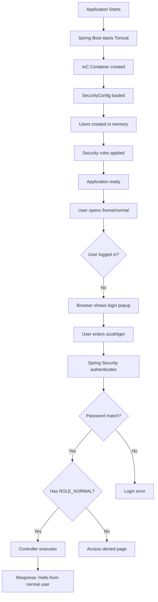

# 🔑 Spring Security - Basic Authentication (In-Memory)

## Table of Contents
1. [Introduction](#introduction)
2. [What is Basic Authentication](#what-is-basic-authentication)
3. [Project Setup](#project-setup)
4. [Complete Code Implementation](#complete-code-implementation)
5. [SecurityConfig Deep Dive](#securityconfig-deep-dive)
6. [Password Encoding with BCrypt](#password-encoding-with-bcrypt)
7. [Application Flow](#application-flow)
8. [Testing the Application](#testing-the-application)
9. [UserDetailsService and UserDetails](#userdetailsservice-and-userdetails)
10. [IoC Container and Bean Creation](#ioc-container-and-bean-creation)
11. [Interview Questions](#interview-questions)

---

## Introduction

This note covers implementing **Basic Authentication** with **In-Memory Users** in Spring Boot. We'll create multiple users with different roles and protect endpoints based on those roles.

### What We'll Build

```
┌─────────────────────────────────────────────────────────┐
│                    Endpoints & Roles                     │
├─────────────────────────────────────────────────────────┤
│  /home/public  → Requires ROLE_PUBLIC                   │
│  /home/normal  → Requires ROLE_NORMAL                   │
│  /home/admin   → Requires ROLE_ADMIN                    │
│  /home/access-denied → Access denied message            │
└─────────────────────────────────────────────────────────┘
```

---

## What is Basic Authentication

### How It Works

**Basic Authentication** sends credentials with every HTTP request in the `Authorization` header.

```
┌─────────────────────────────────────────────────────────┐
│                  Basic Auth Header                       │
├─────────────────────────────────────────────────────────┤
│                                                         │
│  Authorization: Basic dXNlcjpwYXNz                      │
│                       └─────┬─────┘                     │
│                             │                           │
│                   Base64("user:pass")                   │
│                                                         │
└─────────────────────────────────────────────────────────┘
```

### Key Characteristics

| Feature | Description |
|---------|-------------|
| **No Cookies** | Credentials sent with each request |
| **No Sessions** | Server doesn't maintain session state |
| **No Logout** | User logs in with every request |
| **Encoding** | Base64 encoded (NOT encrypted!) |

> [!WARNING]
> Basic Authentication should ONLY be used over HTTPS. Base64 encoding is NOT encryption - credentials can be easily decoded!

### Basic Auth vs Form-Based Auth

| Aspect | Basic Auth | Form-Based Auth |
|--------|-----------|-----------------|
| **Cookies** | Not used | Session cookie used |
| **Sessions** | Stateless | Session maintained |
| **Logout** | No concept | Logout available |
| **Use Case** | APIs, Testing | Web applications |
| **Default in Spring** | No | Yes |

---

## Project Setup

### Dependencies

Create a Spring Boot project with the following dependencies:

```xml
<dependencies>
    <!-- Spring Web -->
    <dependency>
        <groupId>org.springframework.boot</groupId>
        <artifactId>spring-boot-starter-web</artifactId>
    </dependency>
    
    <!-- Spring Security -->
    <dependency>
        <groupId>org.springframework.boot</groupId>
        <artifactId>spring-boot-starter-security</artifactId>
    </dependency>
    
    <!-- Spring Boot DevTools -->
    <dependency>
        <groupId>org.springframework.boot</groupId>
        <artifactId>spring-boot-devtools</artifactId>
        <scope>runtime</scope>
    </dependency>
</dependencies>
```

### Project Structure

```
src/main/java/
├── com/example/demo/
│   ├── BasicAuthApplication.java
│   └── ContextPrinter.java
├── com/example/config/
│   └── SecurityConfig.java
└── com/example/controllers/
    └── HomeController.java
```

---

## Complete Code Implementation

### 1. Main Application Class

```java
// BasicAuthApplication.java
package com.example.demo;

import org.springframework.boot.SpringApplication;
import org.springframework.boot.autoconfigure.SpringBootApplication;
import org.springframework.context.annotation.ComponentScan;

@SpringBootApplication
@ComponentScan(basePackages="com.example.*")
public class BasicAuthApplication {

    public static void main(String[] args) {
        SpringApplication.run(BasicAuthApplication.class, args);
    }
}
```

**Line-by-Line Explanation:**

| Line | Code | Explanation |
|------|------|-------------|
| 6 | `@SpringBootApplication` | Enables auto-configuration, component scanning |
| 7 | `@ComponentScan(basePackages="com.example.*")` | Scans all packages under `com.example` for Spring beans |
| 10 | `SpringApplication.run(...)` | Starts the Spring Boot application |

---

### 2. HomeController

```java
// HomeController.java
package com.example.controllers;

import org.springframework.http.ResponseEntity;
import org.springframework.web.bind.annotation.GetMapping;
import org.springframework.web.bind.annotation.RequestMapping;
import org.springframework.web.bind.annotation.RestController;

@RestController
@RequestMapping("/home")
public class HomeController {
    
    @GetMapping("/normal")
    public ResponseEntity<String> normalUser() {
        return ResponseEntity.ok("Hello from normal user");
    }
    
    @GetMapping("/public")
    public ResponseEntity<String> publicUser() {
        return ResponseEntity.ok("Hello from public user");
    }
    
    @GetMapping("/admin")
    public ResponseEntity<String> adminUser() {
        return ResponseEntity.ok("Hello from admin user");
    }
    
    @GetMapping("/access-denied")
    public ResponseEntity<String> accessDenied() {
        return ResponseEntity
            .status(403)
            .body("<h2 style='color:red;'>You do not have permission to access this page.</h2>");
    }
}
```

**Endpoint Summary:**

| Endpoint | Method | Description |
|----------|--------|-------------|
| `/home/normal` | GET | For users with ROLE_NORMAL |
| `/home/public` | GET | For users with ROLE_PUBLIC |
| `/home/admin` | GET | For users with ROLE_ADMIN |
| `/home/access-denied` | GET | Custom access denied page |

---

### 3. SecurityConfig (Most Important)

```java
// SecurityConfig.java
package com.example.config;

import org.springframework.beans.factory.annotation.Autowired;
import org.springframework.context.annotation.Bean;
import org.springframework.context.annotation.Configuration;
import org.springframework.security.config.annotation.web.builders.HttpSecurity;
import org.springframework.security.core.userdetails.User;
import org.springframework.security.core.userdetails.UserDetails;
import org.springframework.security.core.userdetails.UserDetailsService;
import org.springframework.security.crypto.bcrypt.BCryptPasswordEncoder;
import org.springframework.security.crypto.password.PasswordEncoder;
import org.springframework.security.provisioning.InMemoryUserDetailsManager;
import org.springframework.security.web.SecurityFilterChain;

@Configuration
public class SecurityConfig {

    // Bean 1: Password Encoder
    @Bean
    public PasswordEncoder passwordEncoder() {
        return new BCryptPasswordEncoder();
    }

    // Bean 2: User Definitions (In-Memory)
    @Bean
    public UserDetailsService userDetailsService(@Autowired PasswordEncoder pe) {
        
        // User 1: Normal User
        UserDetails normalUser = User
                .withUsername("scott")
                .password(pe.encode("tiger"))
                .roles("NORMAL")
                .build();
        System.out.println("Password for Normal user is\t" + passwordEncoder().encode("tiger"));

        // User 2: Public User
        UserDetails publicUser = User
                .withUsername("vita1")
                .password(pe.encode("vita1"))
                .roles("PUBLIC")
                .build();

        // User 3: Admin User
        UserDetails adminUser = User
                .withUsername("master")
                .password(pe.encode("blaster"))
                .roles("ADMIN")
                .build();

        // Store all users in memory
        return new InMemoryUserDetailsManager(normalUser, publicUser, adminUser);
    }

    // Bean 3: Security Filter Chain (Route Protection)
    @Bean
    public SecurityFilterChain securityFilterChain(HttpSecurity http) throws Exception {
        http
            .authorizeHttpRequests(auth -> auth
                .requestMatchers("/home/public").hasRole("PUBLIC")
                .requestMatchers("/home/normal").hasRole("NORMAL")
                .requestMatchers("/home/admin").hasRole("ADMIN")
                .anyRequest().authenticated()
            )
            .exceptionHandling(ex -> ex
                .accessDeniedPage("/home/access-denied")
            )
            .httpBasic(basic -> {});  // Enable Basic Authentication
        
        return http.build();
    }
}
```

---

## SecurityConfig Deep Dive

### Bean 1: PasswordEncoder

```java
@Bean
public PasswordEncoder passwordEncoder() {
    return new BCryptPasswordEncoder();
}
```

**What this does:**
- Creates a BCrypt password encoder
- BCrypt adds random salt to passwords
- Passwords stored as hashes, not plain text

---

### Bean 2: UserDetailsService

```java
@Bean
public UserDetailsService userDetailsService(@Autowired PasswordEncoder pe) {
    UserDetails normalUser = User
            .withUsername("scott")
            .password(pe.encode("tiger"))
            .roles("NORMAL")
            .build();
    // ... more users ...
    return new InMemoryUserDetailsManager(normalUser, publicUser, adminUser);
}
```

**Line-by-Line:**

| Code | Explanation |
|------|-------------|
| `@Autowired PasswordEncoder pe` | Injects the password encoder bean |
| `User.withUsername("scott")` | Builder pattern to create user |
| `.password(pe.encode("tiger"))` | Encodes password with BCrypt |
| `.roles("NORMAL")` | Assigns ROLE_NORMAL to user |
| `.build()` | Creates UserDetails object |
| `InMemoryUserDetailsManager` | Stores users in memory (not database) |

**Users Created:**

| Username | Password | Role |
|----------|----------|------|
| scott | tiger | ROLE_NORMAL |
| vita1 | vita1 | ROLE_PUBLIC |
| master | blaster | ROLE_ADMIN |

---

### Bean 3: SecurityFilterChain

```java
@Bean
public SecurityFilterChain securityFilterChain(HttpSecurity http) throws Exception {
    http
        .authorizeHttpRequests(auth -> auth
            .requestMatchers("/home/public").hasRole("PUBLIC")
            .requestMatchers("/home/normal").hasRole("NORMAL")
            .requestMatchers("/home/admin").hasRole("ADMIN")
            .anyRequest().authenticated()
        )
        .exceptionHandling(ex -> ex
            .accessDeniedPage("/home/access-denied")
        )
        .httpBasic(basic -> {});
    
    return http.build();
}
```

**Configuration Breakdown:**

| Method | Purpose |
|--------|---------|
| `.requestMatchers("/home/public").hasRole("PUBLIC")` | Only PUBLIC role can access |
| `.anyRequest().authenticated()` | All other URLs need login |
| `.accessDeniedPage("/home/access-denied")` | Custom 403 page |
| `.httpBasic(basic -> {})` | Enable HTTP Basic Authentication |

### Understanding hasRole()

```
┌─────────────────────────────────────────────────────────┐
│           What hasRole("NORMAL") Checks                  │
├─────────────────────────────────────────────────────────┤
│                                                         │
│  .requestMatchers("/home/normal").hasRole("NORMAL")     │
│                                                         │
│  Checks TWO things:                                     │
│  1. Is user authenticated (logged in)?                  │
│     → If NO → 401 Unauthorized                          │
│                                                         │
│  2. Does user have ROLE_NORMAL?                         │
│     → If YES → Access granted                           │
│     → If NO → 403 Forbidden (access denied)             │
│                                                         │
└─────────────────────────────────────────────────────────┘
```

### Understanding authenticated()

```java
.anyRequest().authenticated()
```

This means:
- Login is **compulsory** for any URL not listed above
- User must prove identity (username + password)
- Roles do NOT matter - only checks "Are you logged in?"

---

## Password Encoding with BCrypt

### What is BCrypt?

BCrypt is a password hashing algorithm that:
1. **Adds random salt** to each password
2. **Hash is one-way** (cannot be decrypted)
3. **Same password → Different hash** each time

### Salt Explained

```
┌─────────────────────────────────────────────────────────┐
│                 Why SALT is Needed                       │
├─────────────────────────────────────────────────────────┤
│                                                         │
│  Without Salt:                                          │
│  User A → password = "india123" → hash = XYZ           │
│  User B → password = "india123" → hash = XYZ           │
│  ⚠️ SAME password = SAME hash (dangerous!)              │
│                                                         │
│  With Salt:                                             │
│  User A → "india123" + "@9Kx" → hash = PQR             │
│  User B → "india123" + "#Lm2" → hash = STU             │
│  ✅ SAME password = DIFFERENT hash (secure!)            │
│                                                         │
└─────────────────────────────────────────────────────────┘
```

### BCrypt Hash Structure

```
$2a$10$BBwDRxh7hzPszYIKwk8fo.7.fDihHC2OEfHtoD59zHng/Em0N6mn6
│   │   │                 │
│   │   │                 └── Final hash
│   │   └── Salt (22 characters)
│   └── Cost factor (strength = 10)
└── Algorithm version ($2a = BCrypt)
```

### How Login Works with BCrypt

```
┌─────────────────────────────────────────────────────────┐
│                 BCrypt Login Process                     │
├─────────────────────────────────────────────────────────┤
│                                                         │
│  SIGN-UP TIME:                                          │
│  "tiger" + randomSalt1 → BCrypt → Hash1 → Store         │
│                                                         │
│  LOGIN TIME:                                            │
│  1. Fetch stored hash from memory                       │
│  2. Extract salt from stored hash                       │
│  3. Hash entered password with SAME salt               │
│  4. Compare: new hash == stored hash?                   │
│     → If equal: LOGIN SUCCESS ✅                        │
│     → If not: LOGIN FAILED ❌                           │
│                                                         │
└─────────────────────────────────────────────────────────┘
```

> [!IMPORTANT]
> BCrypt **never decrypts** the password. It extracts the salt from the stored hash and re-hashes the entered password using the same salt, then compares the results.

---

## Application Flow

### Step-by-Step Flow



### Detailed Steps

1. **Application starts**
   - `BasicAuthApplication` runs
   - Spring Boot starts embedded Tomcat
   - Spring creates IoC container

2. **SecurityConfig processed**
   - Three beans created: PasswordEncoder, UserDetailsService, SecurityFilterChain
   - Three users created in memory with BCrypt passwords

3. **User opens protected URL**
   - User hits `http://localhost:8080/home/normal`
   - Spring Security checks: "Is user logged in?"
   - Not logged in → browser shows login popup

4. **User enters credentials**
   - Username: `scott`
   - Password: `tiger`

5. **Authentication happens**
   - Spring Security calls UserDetailsService
   - Finds user `scott`
   - Hashes entered password
   - Compares with stored hash
   - ✅ Password matches, Role = NORMAL

6. **Authorization check**
   - Requested URL: `/home/normal`
   - Required role: NORMAL
   - User role: NORMAL
   - ✅ Access allowed

7. **Controller executes**
   - `HomeController.normalUser()` runs
   - Returns: "Hello from normal user"

---

## Testing the Application

### Testing with Browser

```
1. Open Microsoft Edge (InPrivate mode recommended)
2. Go to: http://localhost:8080/home/normal
3. Login popup appears
4. Enter: scott / tiger
5. See output: "Hello from normal user"
```

> [!TIP]
> Use **InPrivate/Incognito** window for each role test. Browsers cache Basic Auth credentials!

### Testing with Postman

```
URL: http://localhost:8080/home/normal
Method: GET

Authorization Tab:
  Type: Basic Auth
  Username: scott
  Password: tiger

Click Send → Response: "Hello from normal user"
```

### Test Scenarios

| URL | User | Expected Result |
|-----|------|-----------------|
| /home/normal | scott/tiger | ✅ Success |
| /home/admin | scott/tiger | ❌ Access denied |
| /home/admin | master/blaster | ✅ Success |
| /home/public | vita1/vita1 | ✅ Success |
| /home/normal | wrong/pass | ❌ 401 Unauthorized |

---

## UserDetailsService and UserDetails

### UserDetailsService Interface

```java
public interface UserDetailsService {
    UserDetails loadUserByUsername(String username) 
        throws UsernameNotFoundException;
}
```

**Purpose:**
- Loads user data based on username
- Returns UserDetails object containing:
  - Username
  - Password (hashed)
  - Authorities (roles)
  - Account status

### UserDetails Interface

```java
public interface UserDetails {
    Collection<? extends GrantedAuthority> getAuthorities();
    String getPassword();
    String getUsername();
    boolean isAccountNonExpired();
    boolean isAccountNonLocked();
    boolean isCredentialsNonExpired();
    boolean isEnabled();
}
```

### InMemoryUserDetailsManager

For this example, we use `InMemoryUserDetailsManager` which:
- Stores users in a HashMap in memory
- Implements UserDetailsService
- Good for testing and simple applications
- NOT for production (use database instead)

---

## IoC Container and Bean Creation

### ContextPrinter Class

```java
// ContextPrinter.java
package com.example.demo;

import org.springframework.beans.factory.annotation.Autowired;
import org.springframework.context.ApplicationContext;
import org.springframework.stereotype.Component;
import jakarta.annotation.PostConstruct;

@Component
public class ContextPrinter {

    @Autowired
    private ApplicationContext context;

    @PostConstruct
    public void printContextInfo() {
        System.out.println("IoC Container Class: " + context.getClass().getName());

        String[] beanNames = context.getBeanDefinitionNames();
        System.out.println("Total Beans: " + beanNames.length);
        
        for(String name : beanNames) {
            if(name.equalsIgnoreCase("securityfilterchain") || 
               name.equalsIgnoreCase("userdetailsservice") || 
               name.equalsIgnoreCase("PasswordEncoder")) {
                System.out.println(name);
            }
        }
    }
}
```

**What this shows:**
- IoC container type (AnnotationConfigServletWebServerApplicationContext)
- Total beans created
- Security beans: SecurityFilterChain, UserDetailsService, PasswordEncoder

### IoC Container's Role

```
┌─────────────────────────────────────────────────────────┐
│              IoC Container Responsibilities              │
├─────────────────────────────────────────────────────────┤
│                                                         │
│  1. Detects @Configuration classes                      │
│  2. Calls all @Bean methods                             │
│  3. Creates the objects (beans)                         │
│  4. Manages their lifecycle (singleton, etc.)           │
│  5. Injects them wherever needed (@Autowired)           │
│                                                         │
└─────────────────────────────────────────────────────────┘
```

---

## Interview Questions

### Q1: What is Basic Authentication?
**Answer**: Basic Authentication is a simple authentication scheme where the client sends username and password with every HTTP request. Credentials are Base64 encoded (not encrypted) and sent in the Authorization header.

### Q2: How does BCrypt handle password verification without decryption?
**Answer**: BCrypt extracts the salt from the stored hash and re-hashes the entered password using the same salt. It then compares the new hash with the stored hash. If they match, authentication succeeds. The password is never decrypted.

### Q3: What's the difference between hasRole() and authenticated()?
**Answer**:
- `hasRole("ADMIN")`: User must be authenticated AND have the specified role
- `authenticated()`: User just needs to be logged in, no specific role required

### Q4: Why use InMemoryUserDetailsManager?
**Answer**: InMemoryUserDetailsManager stores users in memory, useful for:
- Testing
- Development
- Simple applications
NOT recommended for production (use database instead).

### Q5: What is the purpose of @Configuration annotation?
**Answer**: @Configuration tells Spring IoC container that the class contains bean definitions. It's a blueprint class for creating Spring beans using @Bean methods.

### Q6: Why different BCrypt hashes for same password?
**Answer**: BCrypt adds random salt to each hash. Same password + different salt = different hash. During login, BCrypt extracts the stored salt and uses it to verify, so it still works correctly.

---

## Quick Reference

```
┌─────────────────────────────────────────────────────────┐
│              Basic Auth Quick Reference                  │
├─────────────────────────────────────────────────────────┤
│                                                         │
│  Password Encoder: BCrypt (with random salt)            │
│  User Storage: InMemoryUserDetailsManager               │
│  Auth Type: HTTP Basic                                  │
│                                                         │
│  Key Beans:                                             │
│  - PasswordEncoder                                      │
│  - UserDetailsService                                   │
│  - SecurityFilterChain                                  │
│                                                         │
│  Authorization:                                         │
│  .hasRole("ADMIN") → needs role + login                │
│  .authenticated() → needs login only                   │
│  .permitAll() → no auth needed                         │
│                                                         │
└─────────────────────────────────────────────────────────┘
```

---

*Next: [04_Spring_Security_Form_Login.md](./04_Spring_Security_Form_Login.md)*
