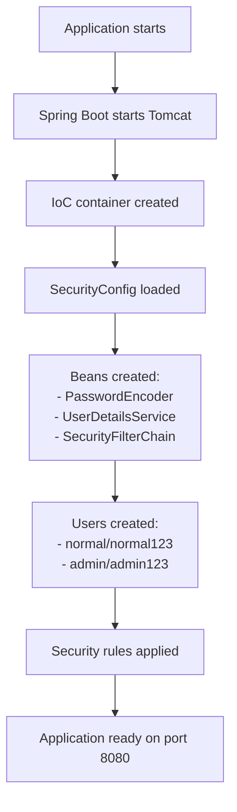
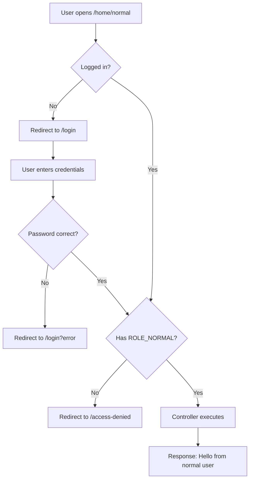

# 📝 Spring Security - Form-Based Login (In-Memory)

## Table of Contents
1. [Introduction](#introduction)
2. [Form Login vs Basic Auth](#form-login-vs-basic-auth)
3. [Project Setup](#project-setup)
4. [Complete Code Implementation](#complete-code-implementation)
5. [SecurityConfig Deep Dive](#securityconfig-deep-dive)
6. [Application Flow](#application-flow)
7. [Custom Login Page](#custom-login-page)
8. [Key Configurations Explained](#key-configurations-explained)
9. [Testing the Application](#testing-the-application)
10. [Interview Questions](#interview-questions)

---

## Introduction

This note covers implementing **Form-Based Login** with **In-Memory Users** in Spring Boot. Form login is the traditional way of authenticating users through a login form with session management.

### What We'll Build

```
┌─────────────────────────────────────────────────────────┐
│                    Endpoints & Roles                     │
├─────────────────────────────────────────────────────────┤
│  /home/public  → permitAll() (no login needed)          │
│  /home/normal  → hasRole("NORMAL")                      │
│  /home/admin   → hasRole("ADMIN")                       │
│  /home/access-denied → Custom 403 page                  │
└─────────────────────────────────────────────────────────┘
```

---

## Form Login vs Basic Auth

### Key Differences

| Feature | Form Login | Basic Auth |
|---------|-----------|------------|
| **Login UI** | HTML form page | Browser popup |
| **Sessions** | ✅ Creates session | ❌ No sessions |
| **Cookies** | ✅ Uses JSESSIONID | ❌ No cookies |
| **Logout** | ✅ Available | ❌ Not possible |
| **Stateful** | Yes | No (stateless) |
| **Use Case** | Web applications | APIs, Testing |

### Visual Comparison

```
┌─────────────────────────────────────────────────────────┐
│                    Form Login Flow                       │
├─────────────────────────────────────────────────────────┤
│                                                         │
│  1. User visits /home/admin                             │
│  2. Not logged in → Redirect to /login                  │
│  3. User sees login FORM                                │
│  4. Enters credentials → Submits form                   │
│  5. Server creates SESSION                              │
│  6. Server sends JSESSIONID cookie                      │
│  7. Redirect to original URL (/home/admin)              │
│  8. Subsequent requests use cookie (no re-login)        │
│                                                         │
└─────────────────────────────────────────────────────────┘

┌─────────────────────────────────────────────────────────┐
│                   Basic Auth Flow                        │
├─────────────────────────────────────────────────────────┤
│                                                         │
│  1. User visits /home/admin                             │
│  2. Browser shows POPUP for credentials                 │
│  3. Credentials sent in EVERY request                   │
│  4. No session, no cookies                              │
│  5. Browser caches credentials until closed             │
│                                                         │
└─────────────────────────────────────────────────────────┘
```

> [!NOTE]
> Spring Boot **by default supports Form-Based Authentication**. It's the most common approach for traditional web applications.

---

## Project Setup

### Dependencies

```xml
<dependencies>
    <!-- Spring Web -->
    <dependency>
        <groupId>org.springframework.boot</groupId>
        <artifactId>spring-boot-starter-web</artifactId>
    </dependency>
    
    <!-- Spring Security -->
    <dependency>
        <groupId>org.springframework.boot</groupId>
        <artifactId>spring-boot-starter-security</artifactId>
    </dependency>
    
    <!-- Spring Boot DevTools -->
    <dependency>
        <groupId>org.springframework.boot</groupId>
        <artifactId>spring-boot-devtools</artifactId>
        <scope>runtime</scope>
    </dependency>
</dependencies>
```

### Spring Boot Version Note

> [!WARNING]
> Use Spring Boot **3.0.8** or later. Some versions have security configuration issues.

### Project Structure

```
src/main/java/
├── com/example/demo/
│   └── SpringSecurity2Application.java
├── com/example/config/
│   └── SecurityConfig.java
└── com/example/controllers/
    └── HomeController.java
```

---

## Complete Code Implementation

### 1. Main Application Class

```java
// SpringSecurity2Application.java
package com.example.demo;

import org.springframework.boot.SpringApplication;
import org.springframework.boot.autoconfigure.SpringBootApplication;
import org.springframework.context.annotation.ComponentScan;

@SpringBootApplication
@ComponentScan(basePackages="com.example.*")
public class SpringSecurity2Application {

    public static void main(String[] args) {
        SpringApplication.run(SpringSecurity2Application.class, args);
    }
}
```

---

### 2. HomeController

```java
// HomeController.java
package com.example.controllers;

import org.springframework.http.ResponseEntity;
import org.springframework.web.bind.annotation.GetMapping;
import org.springframework.web.bind.annotation.RequestMapping;
import org.springframework.web.bind.annotation.RestController;

@RestController
@RequestMapping("/home")
public class HomeController {
    
    @GetMapping("/normal")
    public ResponseEntity<String> normalUser() {
        return ResponseEntity.ok("Hello from normal user");
    }
    
    @GetMapping("/public")
    public ResponseEntity<String> publicUser() {
        return ResponseEntity.ok("Hello from public user");
    }
    
    @GetMapping("/admin")
    public ResponseEntity<String> adminUser() {
        return ResponseEntity.ok("Hello from admin user");
    }
    
    @GetMapping("/access-denied")
    public ResponseEntity<String> accessDenied() {
        return ResponseEntity
            .status(403)
            .body("<h2 style='color:red;'>You do not have permission to access this page.</h2>");
    }
}
```

---

### 3. SecurityConfig (Form Login)

```java
// SecurityConfig.java
package com.example.config;

import org.springframework.context.annotation.Bean;
import org.springframework.context.annotation.Configuration;
import org.springframework.security.config.annotation.web.builders.HttpSecurity;
import org.springframework.security.core.userdetails.User;
import org.springframework.security.core.userdetails.UserDetails;
import org.springframework.security.core.userdetails.UserDetailsService;
import org.springframework.security.crypto.bcrypt.BCryptPasswordEncoder;
import org.springframework.security.crypto.password.PasswordEncoder;
import org.springframework.security.provisioning.InMemoryUserDetailsManager;
import org.springframework.security.web.SecurityFilterChain;
import static org.springframework.security.config.Customizer.withDefaults;

import org.springframework.beans.factory.annotation.Autowired;

@Configuration
public class SecurityConfig {
    
    @Bean
    public PasswordEncoder passwordEncoder() {
        return new BCryptPasswordEncoder();
    }
    
    @Bean
    public UserDetailsService userDetailsService(@Autowired PasswordEncoder pe) {
        // User 1: Normal User
        UserDetails normalUser = User.withUsername("normal")
            .password(passwordEncoder().encode("normal123"))
            .roles("NORMAL")
            .build();

        // User 2: Admin User
        UserDetails adminUser = User.withUsername("admin")
            .password(passwordEncoder().encode("admin123"))
            .roles("ADMIN")
            .build();

        return new InMemoryUserDetailsManager(normalUser, adminUser);
    }
    
    // Using HttpSecurity we can configure which API can 
    // be accessed by whom, whether we want 'form-based' or 
    // 'basic' authentication
    @Bean
    public SecurityFilterChain filterChain(HttpSecurity hs) throws Exception {
        hs.csrf(csrf -> csrf.disable())
          .authorizeHttpRequests(auth -> auth
              .requestMatchers("/home/public").permitAll()
              .requestMatchers("/home/normal").hasRole("NORMAL")
              .requestMatchers("/home/admin").hasRole("ADMIN")
              .anyRequest().authenticated()
          )
          .formLogin(withDefaults())  // Enable Form-Based Login
          .exceptionHandling(ex -> ex.accessDeniedPage("/home/access-denied"));

        return hs.build();
    }
}
```

---

## SecurityConfig Deep Dive

### Understanding Each Configuration

#### 1. CSRF Disable

```java
.csrf(csrf -> csrf.disable())
```

**What is CSRF?**
- Cross-Site Request Forgery protection
- Prevents malicious sites from submitting forms on behalf of users

**Why disable it?**
- For REST APIs (stateless, no form submissions)
- For testing purposes
- When using other protection mechanisms

> [!CAUTION]
> Only disable CSRF for REST APIs. Keep it enabled for traditional web applications with forms!

---

#### 2. Authorization Rules

```java
.authorizeHttpRequests(auth -> auth
    .requestMatchers("/home/public").permitAll()
    .requestMatchers("/home/normal").hasRole("NORMAL")
    .requestMatchers("/home/admin").hasRole("ADMIN")
    .anyRequest().authenticated()
)
```

**What Each Rule Means:**

| Rule | Meaning |
|------|---------|
| `.requestMatchers("/home/public").permitAll()` | Anyone can access, no login required |
| `.requestMatchers("/home/normal").hasRole("NORMAL")` | Must be logged in WITH role NORMAL |
| `.requestMatchers("/home/admin").hasRole("ADMIN")` | Must be logged in WITH role ADMIN |
| `.anyRequest().authenticated()` | Any other URL requires login (no specific role) |

---

#### 3. Form Login

```java
.formLogin(withDefaults())
```

**What this does:**
- Enables form-based login
- Uses Spring Security's **default login page**
- Default login URL: `/login`
- Default processing URL: `/login` (POST)
- No custom configuration needed

**withDefaults() Method:**

```
┌─────────────────────────────────────────────────────────┐
│           formLogin(withDefaults()) Includes             │
├─────────────────────────────────────────────────────────┤
│                                                         │
│  ✓ Default login page at /login                         │
│  ✓ Default processing URL at /login (POST)              │
│  ✓ Username field name = "username"                     │
│  ✓ Password field name = "password"                     │
│  ✓ Redirect to /login?error on failure                  │
│  ✓ Redirect to original URL on success                  │
│                                                         │
└─────────────────────────────────────────────────────────┘
```

---

#### 4. Exception Handling

```java
.exceptionHandling(ex -> ex.accessDeniedPage("/home/access-denied"))
```

**What this does:**
- When user is authenticated but lacks required role → 403 Forbidden
- Redirects to custom access denied page instead of default error

---

## Application Flow

### Startup Flow



### Request Flow

#### Case 1: Public URL (No Login Required)

```
URL: http://localhost:8080/home/public

Flow:
1. Request comes to Spring Security filter
2. Rule says → permitAll()
3. No login required ✓
4. Controller method executes
5. Response: "Hello from public user"
```

#### Case 2: Protected URL (Login Required)

```
URL: http://localhost:8080/home/normal

Flow:
1. Spring Security checks → login required
2. Login form is shown (default Spring form)
3. User enters: normal / normal123
4. Password is hashed and compared ✓
5. Role NORMAL is verified ✓
6. Request is allowed
7. Controller executes
8. Response: "Hello from normal user"
```

#### Case 3: Access Denied (Wrong Role)

```
URL: http://localhost:8080/home/admin
User: Already logged in as "normal"

Flow:
1. User is already logged in ✓
2. Spring checks role
3. User has NORMAL role
4. ADMIN role required
5. Access denied!
6. Redirect to /home/access-denied
7. Response: "You do not have permission..."
```

### Complete Flow Diagram



---

## Custom Login Page

### When You Want Custom Login

To use your own login page instead of Spring's default:

#### 1. Add Thymeleaf Dependency

```xml
<dependency>
    <groupId>org.springframework.boot</groupId>
    <artifactId>spring-boot-starter-thymeleaf</artifactId>
</dependency>
```

#### 2. Create LoginController

```java
// LoginController.java
@Controller
public class LoginController {
    
    @GetMapping("/login")
    public String loginPage() {
        return "login"; // loads login.html from templates
    }
}
```

#### 3. Create Custom Login HTML

```html
<!-- src/main/resources/templates/login.html -->
<!DOCTYPE html>
<html xmlns:th="http://www.thymeleaf.org">
<head>
    <title>Custom Login Page</title>
</head>
<body>
    <h2>Please log in</h2>
    <form th:action="@{/login}" method="post">
        <div>
            <label>Username:</label>
            <input type="text" name="username" />
        </div>
        <div>
            <label>Password:</label>
            <input type="password" name="password" />
        </div>
        <div>
            <button type="submit">Login</button>
        </div>
        <div th:if="${param.error}">
            <p style="color: red;">Invalid username or password</p>
        </div>
        <div th:if="${param.logout}">
            <p style="color: green;">You have been logged out</p>
        </div>
    </form>
</body>
</html>
```

#### 4. Update SecurityConfig

```java
@Bean
public SecurityFilterChain securityFilterChain(HttpSecurity http) throws Exception {
    http.csrf(csrf -> csrf.disable())
        .authorizeHttpRequests(auth -> auth
            .requestMatchers("/home/public", "/login", "/css/**").permitAll()
            .requestMatchers("/home/admin").hasRole("ADMIN")
            .requestMatchers("/home/normal").hasRole("NORMAL")
            .anyRequest().authenticated()
        )
        .formLogin(form -> form
            .loginPage("/login")              // Custom login URL
            .defaultSuccessUrl("/home/public", true)
            .permitAll()
        )
        .logout(logout -> logout
            .logoutSuccessUrl("/login?logout")
            .permitAll()
        );

    return http.build();
}
```

### Custom Login Configuration Options

| Method | Purpose |
|--------|---------|
| `.loginPage("/login")` | Custom login page URL |
| `.defaultSuccessUrl("/home")` | Redirect after successful login |
| `.failureUrl("/login?error")` | Redirect on login failure |
| `.usernameParameter("user")` | Custom username field name |
| `.passwordParameter("pass")` | Custom password field name |
| `.logoutSuccessUrl("/login?logout")` | Redirect after logout |

---

## Key Configurations Explained

### SecurityFilterChain

**SecurityFilterChain** is a key concept representing a chain of filters responsible for processing incoming requests to enforce security policies.

```
Request → Filter1 → Filter2 → ... → FilterN → Controller
```

Each filter handles specific security tasks:
- Authentication
- Authorization
- CSRF protection
- Session management
- Exception handling

### @Configuration Annotation

```java
@Configuration
public class SecurityConfig { ... }
```

**What @Configuration tells IoC Container:**

1. "This class is a configuration class"
2. "Scan this class for @Bean methods"
3. "Execute @Bean methods and register returned objects"
4. "Manage bean lifecycle (singleton by default)"

**Without @Configuration:**
- IoC container will NOT process @Bean methods
- No beans will be registered
- @Autowired will fail

---

## Testing the Application

### Browser Testing

1. **Open Microsoft Edge** (or use InPrivate mode)

2. **Test Public URL:**
   ```
   http://localhost:8080/home/public
   → Output: "Hello from public user" (no login needed)
   ```

3. **Test Protected URL:**
   ```
   http://localhost:8080/home/normal
   → Spring Security login form appears
   → Enter: normal / normal123
   → Output: "Hello from normal user"
   ```

4. **Test Access Denied:**
   ```
   Same browser session, try:
   http://localhost:8080/home/admin
   → Output: "You do not have permission..." (403)
   ```

5. **Test Admin Role (new InPrivate window):**
   ```
   http://localhost:8080/home/admin
   → Enter: admin / admin123
   → Output: "Hello from admin user"
   ```

### Test Case Matrix

| URL | User | Expected |
|-----|------|----------|
| /home/public | Anyone | ✅ No login required |
| /home/normal | normal/normal123 | ✅ Success |
| /home/normal | admin/admin123 | ❌ Access denied |
| /home/admin | admin/admin123 | ✅ Success |
| /home/admin | normal/normal123 | ❌ Access denied |

---

## Interview Questions

### Q1: What is Form-Based Authentication?
**Answer**: Form-based authentication uses an HTML login form where users enter credentials. After successful login, the server creates a session and sends a session cookie (JSESSIONID). Subsequent requests use this cookie, eliminating the need to re-enter credentials.

### Q2: What is the difference between formLogin(withDefaults()) and formLogin(form -> ...)?
**Answer**:
- `formLogin(withDefaults())`: Uses Spring Security's default login page with default settings
- `formLogin(form -> ...)`: Allows customization of login URL, success/failure URLs, and field names

### Q3: What is SecurityFilterChain?
**Answer**: SecurityFilterChain represents a chain of security filters that process every HTTP request. Each filter handles specific security concerns like authentication, authorization, CSRF protection, etc.

### Q4: Why disable CSRF for some applications?
**Answer**: CSRF protection should be disabled for:
- REST APIs (stateless, no sessions)
- Applications using JWT tokens
- Mobile app backends

Keep CSRF enabled for traditional web applications with form submissions.

### Q5: What does .anyRequest().authenticated() mean?
**Answer**: It means any URL not explicitly configured requires the user to be authenticated (logged in). No specific role is required - just proof of identity.

### Q6: What is the default login URL in Spring Security?
**Answer**: The default login page is at `/login`. Spring Security provides a basic login form automatically when formLogin is enabled.

---

## Summary

```
┌─────────────────────────────────────────────────────────┐
│              Form Login Quick Reference                  │
├─────────────────────────────────────────────────────────┤
│                                                         │
│  Enable Form Login:                                     │
│    .formLogin(withDefaults())                           │
│                                                         │
│  Default Login URL: /login                              │
│  Session Cookie: JSESSIONID                             │
│                                                         │
│  Authorization Rules:                                   │
│    .permitAll() → No auth needed                        │
│    .hasRole("ADMIN") → Need role + login                │
│    .authenticated() → Need login only                   │
│                                                         │
│  Error Handling:                                        │
│    .accessDeniedPage("/error") → Custom 403 page        │
│                                                         │
│  CSRF:                                                  │
│    Enable for web apps                                  │
│    Disable for REST APIs                                │
│                                                         │
└─────────────────────────────────────────────────────────┘
```

---

*Next: [05_Spring_Security_Database_Authentication.md](./05_Spring_Security_Database_Authentication.md)*
