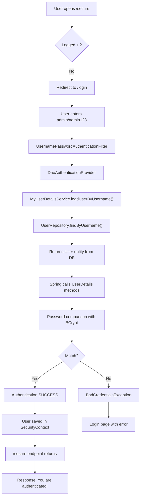

# 🗄️ Spring Security - Database Authentication

## Table of Contents
1. [Introduction](#introduction)
2. [Why Database Authentication](#why-database-authentication)
3. [Project Setup](#project-setup)
4. [Database Configuration](#database-configuration)
5. [Complete Code Implementation](#complete-code-implementation)
6. [UserDetails Interface Deep Dive](#userdetails-interface-deep-dive)
7. [MyUserDetailsService Explained](#myuserdetailsservice-explained)
8. [BCrypt Password Flow](#bcrypt-password-flow)
9. [Application Flow](#application-flow)
10. [Interview Questions](#interview-questions)

---

## Introduction

This note covers implementing **Database-backed Authentication** in Spring Boot. Instead of storing users in memory, we store them in a MySQL database with encrypted passwords.

### What We'll Build

```
┌─────────────────────────────────────────────────────────┐
│                 Database Authentication                  │
├─────────────────────────────────────────────────────────┤
│                                                         │
│  Database: MySQL (hiber schema)                         │
│  Table: user (id, username, password)                   │
│  Password: BCrypt encrypted                             │
│                                                         │
│  Endpoints:                                             │
│    /public  → No login required                         │
│    /secure  → Login required                            │
│                                                         │
└─────────────────────────────────────────────────────────┘
```

---

## Why Database Authentication

### In-Memory vs Database

| Aspect | In-Memory | Database |
|--------|-----------|----------|
| **Storage** | Application code | MySQL/PostgreSQL |
| **Persistence** | Lost on restart | Permanent |
| **Dynamic Users** | Requires code change | Add via SQL/UI |
| **Scalability** | Not scalable | Scalable |
| **Use Case** | Testing, demos | Production apps |

### When to Use Database Authentication

- Production applications
- User registration required
- Dynamic user management
- Enterprise applications
- Applications with user roles/permissions

---

## Project Setup

### Dependencies

```xml
<dependencies>
    <!-- Spring Web -->
    <dependency>
        <groupId>org.springframework.boot</groupId>
        <artifactId>spring-boot-starter-web</artifactId>
    </dependency>
    
    <!-- Spring Security -->
    <dependency>
        <groupId>org.springframework.boot</groupId>
        <artifactId>spring-boot-starter-security</artifactId>
    </dependency>
    
    <!-- Spring Data JPA -->
    <dependency>
        <groupId>org.springframework.boot</groupId>
        <artifactId>spring-boot-starter-data-jpa</artifactId>
    </dependency>
    
    <!-- MySQL Driver -->
    <dependency>
        <groupId>mysql</groupId>
        <artifactId>mysql-connector-java</artifactId>
        <scope>runtime</scope>
    </dependency>
    
    <!-- Spring Boot DevTools -->
    <dependency>
        <groupId>org.springframework.boot</groupId>
        <artifactId>spring-boot-devtools</artifactId>
        <scope>runtime</scope>
    </dependency>
</dependencies>
```

### Project Structure

```
src/main/java/
└── com/example/demo/
    ├── SpringDatabaseSecurityApplication.java
    ├── User.java                    (Entity)
    ├── UserRepository.java          (Repository)
    ├── MyUserDetailsService.java    (Service)
    ├── SecurityConfig.java          (Configuration)
    └── DemoController.java          (Controller)
```

---

## Database Configuration

### application.properties

```properties
spring.application.name=springDatabaseSecurity
spring.datasource.url=jdbc:mysql://localhost:3306/hiber
spring.datasource.username=root
spring.datasource.password=root
spring.datasource.driver-class-name=com.mysql.cj.jdbc.Driver
spring.jpa.properties.hibernate.dialect=org.hibernate.dialect.MySQLDialect
#spring.jpa.hibernate.ddl-auto=update
spring.jpa.show-sql=true
```

### Database Table Creation

```sql
-- Create user table
CREATE TABLE user(
    id BIGINT PRIMARY KEY AUTO_INCREMENT,
    username VARCHAR(255),
    password VARCHAR(255)
);

-- Insert user with BCrypt encrypted password
INSERT INTO user(username, password) 
VALUES('admin', '$2a$10$cwGJN733AiwS48raMOLLUeGsdXkr8VsUGS8abGtO9Ej7dpLy9q5Ee');
```

### How to Generate BCrypt Password

```java
// Run this code to generate encrypted password
System.out.println(new BCryptPasswordEncoder().encode("admin123"));

// Output (will be different each time due to random salt):
// $2a$10$BBwDRxh7hzPszYIKwk8fo.7.fDihHC2OEfHtoD59zHng/Em0N6mn6
// $2a$10$cwGJN733AiwS48raMOLLUeGsdXkr8VsUGS8abGtO9Ej7dpLy9q5Ee
```

> [!IMPORTANT]
> Password must be **encrypted before storing** in database. Store the BCrypt hash, NOT the plain password!

---

## Complete Code Implementation

### 1. Main Application

```java
// SpringDatabaseSecurityApplication.java
package com.example.demo;

import org.springframework.boot.SpringApplication;
import org.springframework.boot.autoconfigure.SpringBootApplication;
import org.springframework.security.crypto.bcrypt.BCryptPasswordEncoder;

@SpringBootApplication
public class SpringDatabaseSecurityApplication {

    public static void main(String[] args) {
        SpringApplication.run(SpringDatabaseSecurityApplication.class, args);
    
        /*  Run this before you enter a record in database table
         *  to get the encrypted password
         */
        // System.out.println(new BCryptPasswordEncoder().encode("admin123"));
    }
}
```

---

### 2. User Entity (Implements UserDetails)

```java
// User.java
package com.example.demo;

import jakarta.persistence.*;
import java.util.Collection;
import java.util.Collections;

import org.springframework.security.core.GrantedAuthority;
import org.springframework.security.core.userdetails.UserDetails;

@Entity
public class User implements UserDetails {

    @Id
    @GeneratedValue(strategy = GenerationType.IDENTITY)
    private Long id;

    private String username;
    private String password;

    // You can extend this with role/authorities

    // Constructors, Getters, Setters

    @Override
    public Collection<? extends GrantedAuthority> getAuthorities() {
        return Collections.emptyList(); // No roles for simplicity
    }

    public Long getId() {
        return id;
    }

    public void setId(Long id) {
        this.id = id;
    }

    public void setUsername(String username) {
        this.username = username;
    }

    public void setPassword(String password) {
        this.password = password;
    }

    @Override 
    public String getPassword() { 
        return password; 
    }
    
    @Override 
    public String getUsername() { 
        return username; 
    }
    
    @Override 
    public boolean isAccountNonExpired() { 
        return true; 
    }
    
    @Override 
    public boolean isAccountNonLocked() { 
        return true; 
    }
    
    @Override 
    public boolean isCredentialsNonExpired() { 
        return true; 
    }
    
    @Override 
    public boolean isEnabled() { 
        return true; 
    }
}
```

---

### 3. UserRepository

```java
// UserRepository.java
package com.example.demo;

import org.springframework.data.jpa.repository.JpaRepository;
import java.util.Optional;

public interface UserRepository extends JpaRepository<User, Long> {
    Optional<User> findByUsername(String username);
}
```

---

### 4. MyUserDetailsService

```java
// MyUserDetailsService.java
package com.example.demo;

import org.springframework.beans.factory.annotation.Autowired;
import org.springframework.security.core.userdetails.*;
import org.springframework.stereotype.Service;

@Service
public class MyUserDetailsService implements UserDetailsService {

    @Autowired
    private UserRepository repo;

    @Override
    public UserDetails loadUserByUsername(String username) 
            throws UsernameNotFoundException {
        return repo.findByUsername(username)
                .orElseThrow(() -> new UsernameNotFoundException("User not found"));
    }
}
```

---

### 5. SecurityConfig

```java
// SecurityConfig.java
package com.example.demo;

import org.springframework.context.annotation.Bean;
import org.springframework.context.annotation.Configuration;
import org.springframework.security.authentication.*;
import org.springframework.security.config.Customizer;
import org.springframework.security.config.annotation.authentication.configuration.AuthenticationConfiguration;
import org.springframework.security.config.annotation.web.builders.HttpSecurity;
import org.springframework.security.web.SecurityFilterChain;
import org.springframework.security.crypto.bcrypt.BCryptPasswordEncoder;
import org.springframework.security.crypto.password.PasswordEncoder;

@Configuration
public class SecurityConfig {

    @Bean
    public SecurityFilterChain filterChain(HttpSecurity http) throws Exception {
        http
            .authorizeHttpRequests(auth -> auth
                .requestMatchers("/public", "/login").permitAll()
                .anyRequest().authenticated()
            )
            .formLogin(Customizer.withDefaults()); // modern & non-deprecated

        return http.build();
    }

    @Bean
    public AuthenticationManager authenticationManager(
            AuthenticationConfiguration config) throws Exception {
        return config.getAuthenticationManager();
    }

    @Bean
    public PasswordEncoder passwordEncoder() {
        return new BCryptPasswordEncoder();
    }
}
```

---

### 6. DemoController

```java
// DemoController.java
package com.example.demo;

import org.springframework.web.bind.annotation.GetMapping;
import org.springframework.web.bind.annotation.RestController;

@RestController
public class DemoController {

    @GetMapping("/public")
    public String publicPage() {
        return "This is a public page!";
    }

    @GetMapping("/secure")
    public String securePage() {
        return "You are authenticated!";
    }
}
```

---

## UserDetails Interface Deep Dive

### Why Entity Implements UserDetails?

```java
@Entity
public class User implements UserDetails { ... }
```

Spring Security needs to know:
- Username
- Password
- Account status (expired, locked, enabled)
- Roles/authorities

By implementing `UserDetails`, our entity provides this info directly!

### UserDetails Methods Explained

```java
public interface UserDetails {
    // Returns roles/permissions
    Collection<? extends GrantedAuthority> getAuthorities();
    
    // Returns hashed password
    String getPassword();
    
    // Returns login name
    String getUsername();
    
    // Account status checks
    boolean isAccountNonExpired();
    boolean isAccountNonLocked();
    boolean isCredentialsNonExpired();
    boolean isEnabled();
}
```

### Method Purposes

| Method | Purpose | If Returns false |
|--------|---------|------------------|
| `getAuthorities()` | Returns roles (ADMIN, USER) | Cannot access role-protected URLs |
| `isAccountNonExpired()` | Is account valid? | AccountExpiredException |
| `isAccountNonLocked()` | Is account unlocked? | LockedException |
| `isCredentialsNonExpired()` | Is password valid? | CredentialsExpiredException |
| `isEnabled()` | Is account active? | DisabledException |

### When Methods Are Called

```
┌─────────────────────────────────────────────────────────┐
│           Method Call Sequence During Login              │
├─────────────────────────────────────────────────────────┤
│                                                         │
│  User submits login form                                │
│          ↓                                              │
│  UsernamePasswordAuthenticationFilter                   │
│          ↓                                              │
│  DaoAuthenticationProvider                              │
│          ↓                                              │
│  loadUserByUsername() → fetches User from DB            │
│          ↓                                              │
│  UserDetails methods called:                            │
│    → getUsername()                                      │
│    → getPassword()                                      │
│    → isAccountNonExpired()                              │
│    → isAccountNonLocked()                               │
│    → isCredentialsNonExpired()                          │
│    → isEnabled()                                        │
│    → getAuthorities() (after success)                   │
│          ↓                                              │
│  Password comparison                                    │
│          ↓                                              │
│  Authentication success or failure                      │
│                                                         │
└─────────────────────────────────────────────────────────┘
```

### Why Return true from Status Methods?

```java
@Override public boolean isAccountNonExpired() { return true; }
@Override public boolean isAccountNonLocked() { return true; }
@Override public boolean isCredentialsNonExpired() { return true; }
@Override public boolean isEnabled() { return true; }
```

Returning `true` means:
- "This account is valid, allow login"
- Good for learning and simple applications

In production, you would:
- Store these as database columns
- Implement actual business logic
- Example: Lock after 5 failed attempts

---

## MyUserDetailsService Explained

### Purpose

`MyUserDetailsService` connects **Spring Security** with your **database**.

```
┌─────────────────────────────────────────────────────────┐
│              MyUserDetailsService Role                   │
├─────────────────────────────────────────────────────────┤
│                                                         │
│  Spring Security does NOT know:                         │
│    - Where users are stored                             │
│    - Whether they are in MySQL, MongoDB, LDAP           │
│                                                         │
│  So it defines an interface:                            │
│    UserDetailsService                                   │
│                                                         │
│  We provide the implementation:                         │
│    MyUserDetailsService                                 │
│    → Fetches users from the database                    │
│                                                         │
└─────────────────────────────────────────────────────────┘
```

### Who Calls loadUserByUsername()?

**You never call it manually.** Spring Security calls it automatically!

```
Login request
     ↓
UsernamePasswordAuthenticationFilter
     ↓
AuthenticationManager
     ↓
DaoAuthenticationProvider         ← The actual caller
     ↓
UserDetailsService.loadUserByUsername()   ← Your method
```

### Implementation Details

```java
@Service
public class MyUserDetailsService implements UserDetailsService {

    @Autowired
    private UserRepository repo;

    @Override
    public UserDetails loadUserByUsername(String username) 
            throws UsernameNotFoundException {
        return repo.findByUsername(username)
                .orElseThrow(() -> new UsernameNotFoundException("User not found"));
    }
}
```

**Line-by-Line:**

| Line | Explanation |
|------|-------------|
| `@Service` | Marks as Spring service bean |
| `implements UserDetailsService` | Contract with Spring Security |
| `@Autowired UserRepository` | Inject repository for DB access |
| `loadUserByUsername(String username)` | Spring Security calls this |
| `repo.findByUsername(username)` | Query database for user |
| `.orElseThrow(...)` | If not found, throw exception |
| `return User` | User entity implements UserDetails |

---

## BCrypt Password Flow

### What Happens When You Call encode()

```java
System.out.println(new BCryptPasswordEncoder().encode("admin123"));
```

You see different outputs each time:
- `$2a$10$BBwDRxh7hzPszYIKwk8fo...`
- `$2a$10$cwGJN733AiwS48raMOLLU...`

This is **correct behavior** - BCrypt adds **random salt** every time!

### BCrypt Hash Structure

```
$2a$10$0n6hqwNhA5UNGt/YoMkygOpxwhqG1WNiPh5.LRu8HjGnETRYwSRyy
 │   │   │                                    │
 │   │   │                                    └── Final hash
 │   │   └── Salt (22 characters)
 │   └── Cost factor (10)
 └── Algorithm version ($2a = BCrypt)
```

### Login Flow with BCrypt

```
┌─────────────────────────────────────────────────────────┐
│                  BCrypt Login Flow                       │
├─────────────────────────────────────────────────────────┤
│                                                         │
│  Step 1: User enters password                           │
│          admin123                                       │
│                                                         │
│  Step 2: Fetch stored hash from DB                      │
│          $2a$10$0n6hqwNhA5UNGt.../Em0N6mn6              │
│                                                         │
│  Step 3: Spring Security internally does:               │
│          passwordEncoder.matches("admin123", storedHash)│
│                                                         │
│  Step 4: matches() method:                              │
│          - Extracts salt from stored hash               │
│          - Extracts cost factor (10)                    │
│          - Re-hashes entered password with SAME salt    │
│          - Compares result with stored hash             │
│                                                         │
│  Step 5: Result                                         │
│          → If equal: LOGIN SUCCESS ✓                    │
│          → If not: LOGIN FAILURE ✗                      │
│                                                         │
└─────────────────────────────────────────────────────────┘
```

### What BCrypt Does NOT Do

```
❌ Does NOT generate new salt during login
❌ Does NOT decrypt the password
❌ Does NOT compare plain text
```

> [!IMPORTANT]
> BCrypt stores the salt **inside the hash itself**. During login, it extracts that salt and re-hashes the entered password using the same salt and cost factor, then compares the hashes.

---

## Application Flow

### Complete Flow Diagram



### Step-by-Step

1. **User opens** `http://localhost:8080/secure`
2. **Spring Security checks**: Is user logged in?
3. **Not logged in** → Redirect to login page
4. **User enters** username: `admin`, password: `admin123`
5. **Spring Security calls** `MyUserDetailsService.loadUserByUsername("admin")`
6. **Service queries** database via `UserRepository.findByUsername("admin")`
7. **User entity returned** (implements UserDetails)
8. **Spring Security checks** password using BCryptPasswordEncoder.matches()
9. **If matched** → Authentication successful
10. **User saved** in SecurityContext
11. **/secure endpoint** returns: "You are authenticated!"

---

## Interview Questions

### Q1: Why does User entity implement UserDetails?
**Answer**: Spring Security needs to know username, password, roles, and account status. By implementing UserDetails, our entity provides this information directly, allowing Spring Security to authenticate and authorize users.

### Q2: What is the purpose of MyUserDetailsService?
**Answer**: MyUserDetailsService connects Spring Security with the database. It implements UserDetailsService interface and provides loadUserByUsername() method that Spring Security calls during authentication to fetch user details from the database.

### Q3: Who calls loadUserByUsername() method?
**Answer**: Spring Security's DaoAuthenticationProvider calls it automatically during login. We never call it manually. The call chain is:
```
UsernamePasswordAuthenticationFilter → AuthenticationManager → 
DaoAuthenticationProvider → UserDetailsService.loadUserByUsername()
```

### Q4: Why do different BCrypt calls produce different hashes for same password?
**Answer**: BCrypt adds a random salt to each hash. Same password + different salt = different hash. This is a security feature - even if two users have the same password, their hashes will be different.

### Q5: How does password verification work if the hash is different each time?
**Answer**: The salt is stored INSIDE the hash. During login, BCrypt:
1. Extracts the salt from the stored hash
2. Re-hashes the entered password with that same salt
3. Compares the new hash with the stored hash
4. If equal, authentication succeeds

### Q6: What happens if isAccountNonLocked() returns false?
**Answer**: Spring Security throws LockedException and denies login. This is used to implement account locking after failed attempts.

---

## Summary

```
┌─────────────────────────────────────────────────────────┐
│          Database Authentication Summary                 │
├─────────────────────────────────────────────────────────┤
│                                                         │
│  Key Components:                                        │
│    1. User entity implements UserDetails                │
│    2. UserRepository with findByUsername()              │
│    3. MyUserDetailsService implements UserDetailsService│
│    4. SecurityConfig with PasswordEncoder               │
│                                                         │
│  Password Storage:                                      │
│    - Use BCryptPasswordEncoder.encode()                 │
│    - Store hash in database, NOT plain password         │
│                                                         │
│  Authentication Flow:                                   │
│    Login → DaoAuthenticationProvider →                  │
│    loadUserByUsername() → BCrypt.matches() →            │
│    Success/Failure                                      │
│                                                         │
│  UserDetails Methods:                                   │
│    - Return true for simple apps                        │
│    - Implement logic for production                     │
│                                                         │
└─────────────────────────────────────────────────────────┘
```

---

*Next: [06_JWT_Fundamentals.md](./06_JWT_Fundamentals.md)*
