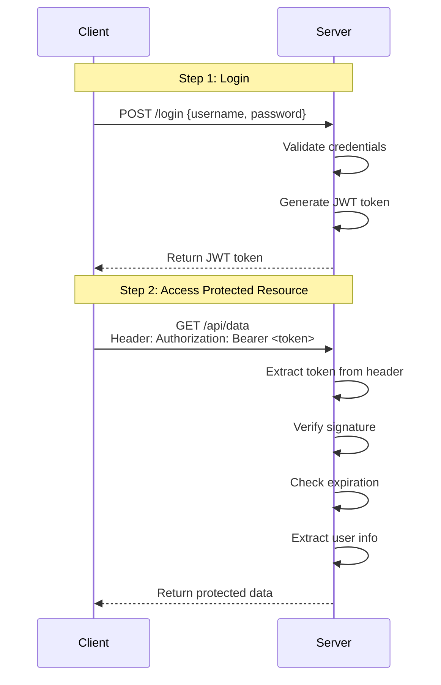

# 🎫 JWT Fundamentals - JSON Web Token

## Table of Contents
1. [Introduction to JWT](#introduction-to-jwt)
2. [Why JWT is Needed](#why-jwt-is-needed)
3. [JWT Structure](#jwt-structure)
4. [How JWT Works](#how-jwt-works)
5. [JWT Generation Process](#jwt-generation-process)
6. [JWT Validation Process](#jwt-validation-process)
7. [JWT vs Session-Based Authentication](#jwt-vs-session-based-authentication)
8. [JWT Claims](#jwt-claims)
9. [Stateless Nature of JWT](#stateless-nature-of-jwt)
10. [JWT Security Considerations](#jwt-security-considerations)
11. [Interview Questions](#interview-questions)

---

## Introduction to JWT

### What is JWT?

**JWT (JSON Web Token)** is a compact, URL-safe token format used for securely transmitting information between parties as a JSON object.

```
┌─────────────────────────────────────────────────────────┐
│                    What is JWT?                          │
├─────────────────────────────────────────────────────────┤
│                                                         │
│  JWT = JSON Web Token                                   │
│                                                         │
│  A secure, self-contained token that carries:           │
│    • User identity                                      │
│    • Claims/permissions                                 │
│    • Expiration time                                    │
│    • Digital signature                                  │
│                                                         │
│  Format: xxxxx.yyyyy.zzzzz                              │
│          (Header.Payload.Signature)                     │
│                                                         │
└─────────────────────────────────────────────────────────┘
```

### Real-World Analogy: Movie Ticket 🎬

```
┌─────────────────────────────────────────────────────────┐
│              JWT = Movie Ticket Analogy                  │
├─────────────────────────────────────────────────────────┤
│                                                         │
│  At the ticket counter (Login):                         │
│    • You show ID (username/password)                    │
│    • You receive a TICKET (JWT token)                   │
│                                                         │
│  The ticket contains:                                   │
│    • Your seat number (user info)                       │
│    • Movie name (permissions)                           │
│    • Show time (expiration)                             │
│    • Hologram/watermark (signature)                     │
│                                                         │
│  At the theater entrance:                               │
│    • You show the TICKET (not your ID again!)           │
│    • Guard checks if ticket is genuine                  │
│    • Guard doesn't need to call the counter             │
│    • You get access to your movie                       │
│                                                         │
│  This is EXACTLY how JWT works!                         │
│                                                         │
└─────────────────────────────────────────────────────────┘
```

---

## Why JWT is Needed

### Problems with Traditional Session-Based Auth

```
┌─────────────────────────────────────────────────────────┐
│            Session-Based Authentication                  │
├─────────────────────────────────────────────────────────┤
│                                                         │
│  1. User logs in                                        │
│  2. Server creates SESSION in memory                    │
│  3. Server sends SESSION ID to client (cookie)          │
│  4. Every request: client sends session ID              │
│  5. Server looks up session from memory                 │
│                                                         │
│  Problems:                                              │
│  ❌ Server must store all sessions (memory usage)       │
│  ❌ Scaling issues (load balancer, sticky sessions)     │
│  ❌ Not good for microservices                          │
│  ❌ Not mobile-friendly                                 │
│                                                         │
└─────────────────────────────────────────────────────────┘
```

### How JWT Solves These Problems

```
┌─────────────────────────────────────────────────────────┐
│                 JWT Authentication                       │
├─────────────────────────────────────────────────────────┤
│                                                         │
│  1. User logs in                                        │
│  2. Server creates JWT TOKEN (not stored on server!)    │
│  3. Server sends token to client                        │
│  4. Every request: client sends token in header         │
│  5. Server VERIFIES token (no memory lookup!)           │
│                                                         │
│  Benefits:                                              │
│  ✅ Server doesn't store anything (stateless)           │
│  ✅ Easy scaling (any server can verify)                │
│  ✅ Perfect for microservices                           │
│  ✅ Mobile and SPA friendly                             │
│                                                         │
└─────────────────────────────────────────────────────────┘
```

### When to Use JWT

| Use Case | Recommended |
|----------|-------------|
| REST APIs | ✅ Yes |
| Mobile apps | ✅ Yes |
| Single Page Apps (React/Angular) | ✅ Yes |
| Microservices | ✅ Yes |
| Traditional web apps (with pages) | ⚠️ Sessions may be better |

---

## JWT Structure

### Three Parts of JWT

A JWT token consists of **three parts** separated by dots (`.`):

```
eyJhbGciOiJIUzI1NiJ9.eyJzdWIiOiJhZG1pbiIsImlzcyI6Ik5pdGluQXV0aFNlcnZlciJ9.abc123...
└────────┬────────┘ └──────────────────────┬──────────────────────┘ └─────┬─────┘
       Header                           Payload                       Signature
```

### 1. Header

```json
{
  "alg": "HS256",
  "typ": "JWT"
}
```

| Field | Description |
|-------|-------------|
| `alg` | Signing algorithm (HS256, RS256) |
| `typ` | Token type (JWT) |

After Base64 encoding: `eyJhbGciOiJIUzI1NiIsInR5cCI6IkpXVCJ9`

---

### 2. Payload

```json
{
  "sub": "1234567890",
  "name": "John Doe",
  "iat": 1516239022,
  "exp": 1516242622
}
```

| Field | Full Name | Description |
|-------|-----------|-------------|
| `sub` | Subject | User identifier |
| `iss` | Issuer | Token issuer |
| `iat` | Issued At | Token creation time |
| `exp` | Expiration | Token expiry time |
| `name` | Custom | Custom claim |

After Base64 encoding: `eyJzdWIiOiIxMjM0NTY3ODkwIiwibmFtZSI6IkpvaG4gRG9lIiwiaWF0IjoxNTE2MjM5MDIyfQ`

> [!WARNING]
> Payload is **Base64 encoded, NOT encrypted**! Anyone can decode and read it. Never put sensitive data like passwords in the payload!

---

### 3. Signature

```
HMACSHA256(
  base64UrlEncode(header) + "." + base64UrlEncode(payload),
  secret
)
```

The signature:
- Ensures the token wasn't tampered with
- Proves the token was issued by a trusted server
- Uses a **secret key** known only to the server

```
┌─────────────────────────────────────────────────────────┐
│                  Signature Purpose                       │
├─────────────────────────────────────────────────────────┤
│                                                         │
│  The signature DOES NOT:                                │
│    ❌ Encrypt the token                                 │
│    ❌ Hide the payload                                  │
│                                                         │
│  The signature DOES:                                    │
│    ✅ Verify integrity (not tampered)                   │
│    ✅ Verify authenticity (from trusted source)         │
│                                                         │
└─────────────────────────────────────────────────────────┘
```

---

## How JWT Works

### Complete Flow Diagram



### Step-by-Step Flow

```
┌─────────────────────────────────────────────────────────┐
│                    JWT Flow                              │
├─────────────────────────────────────────────────────────┤
│                                                         │
│  STEP 1 — LOGIN (Get Token)                             │
│  ─────────────────────────                              │
│  Client sends: POST /auth/login                         │
│  Body: { "username": "admin", "password": "123" }       │
│                                                         │
│  Server validates credentials                           │
│  Server generates JWT with:                             │
│    - Header (algorithm)                                 │
│    - Payload (user info, expiry)                        │
│    - Signature (using secret key)                       │
│                                                         │
│  Server returns: "eyJhbGci..."                          │
│                                                         │
│  STEP 2 — ACCESS PROTECTED API                          │
│  ──────────────────────────────                         │
│  Client sends: GET /api/hello                           │
│  Header: Authorization: Bearer eyJhbGci...              │
│                                                         │
│  Server extracts token from header                      │
│  Server verifies signature using secret key             │
│  Server checks if token expired                         │
│  If valid → returns data                                │
│  If invalid → returns 401 Unauthorized                  │
│                                                         │
└─────────────────────────────────────────────────────────┘
```

---

## JWT Generation Process

### Step-by-Step Generation

```
┌─────────────────────────────────────────────────────────┐
│           How JWT is Generated (HMAC-SHA256)             │
├─────────────────────────────────────────────────────────┤
│                                                         │
│  STEP 1 — Create the Header                             │
│  ─────────────────────────                              │
│  {                                                      │
│    "alg": "HS256",                                      │
│    "typ": "JWT"                                         │
│  }                                                      │
│  → Base64 encode → eyJhbGciOiJIUzI1NiIsInR5cCI6IkpXVCJ9│
│                                                         │
│  STEP 2 — Create the Payload                            │
│  ────────────────────────                               │
│  {                                                      │
│    "sub": "admin",                                      │
│    "iss": "NitinAuthServer",                            │
│    "iat": 1716239022,                                   │
│    "exp": 1716242622                                    │
│  }                                                      │
│  → Base64 encode → eyJzdWIiOiJhZG1pbiIsImlz...          │
│                                                         │
│  STEP 3 — Create the Signature                          │
│  ─────────────────────────────                          │
│  signature = HMAC-SHA256(                               │
│    headerBase64 + "." + payloadBase64,                  │
│    "MySecretKeyForJwt123456789012345"                   │
│  )                                                      │
│  → SflKxwRJSMeKKF2QT4fwpMeJf36POk6yJV_adQssw5c         │
│                                                         │
│  STEP 4 — Combine All Parts                             │
│  ──────────────────────────                             │
│  JWT = header + "." + payload + "." + signature         │
│                                                         │
│  eyJhbGci...eyJzdWIi...SflKxw...                        │
│                                                         │
└─────────────────────────────────────────────────────────┘
```

---

## JWT Validation Process

### How Server Validates Token

```
┌─────────────────────────────────────────────────────────┐
│              How Server Validates JWT                    │
├─────────────────────────────────────────────────────────┤
│                                                         │
│  STEP 1 — Split the JWT into 3 parts                    │
│  ────────────────────────────────                       │
│  Token: eyJhbGci.eyJzdWIi.SflKxw                        │
│  Split: [header] [payload] [receivedSignature]          │
│                                                         │
│  STEP 2 — Re-calculate Signature                        │
│  ────────────────────────────                           │
│  newSignature = HMAC-SHA256(                            │
│    headerFromToken + "." + payloadFromToken,            │
│    "MySecretKeyForJwt123456789012345"  ← SAME key!      │
│  )                                                      │
│                                                         │
│  STEP 3 — Compare Signatures                            │
│  ──────────────────────────                             │
│  if (newSignature == receivedSignature) {               │
│    → Token is VALID ✅                                  │
│    → Check expiration (exp claim)                       │
│    → Extract user info from payload                     │
│  } else {                                               │
│    → Token is INVALID ❌                                │
│    → Someone modified it!                               │
│  }                                                      │
│                                                         │
└─────────────────────────────────────────────────────────┘
```

### Why Tampering Doesn't Work

```
┌─────────────────────────────────────────────────────────┐
│              Why JWT is Tamper-Proof                     │
├─────────────────────────────────────────────────────────┤
│                                                         │
│  Attacker tries to modify payload:                      │
│  Original: { "sub": "user" }                            │
│  Modified: { "sub": "admin" }                           │
│                                                         │
│  But attacker doesn't know the SECRET KEY!              │
│                                                         │
│  Server recalculates signature with original key:       │
│  newSignature = HMAC-SHA256(                            │
│    modified_payload,                                    │
│    "MySecretKeyForJwt..."  ← Only server knows!         │
│  )                                                      │
│                                                         │
│  newSignature ≠ receivedSignature                       │
│  → TAMPERING DETECTED! ❌                               │
│                                                         │
└─────────────────────────────────────────────────────────┘
```

---

## JWT vs Session-Based Authentication

### Comparison Table

| Feature | Session-Based | JWT |
|---------|--------------|-----|
| **Storage** | Server stores sessions | Server stores nothing |
| **Scalability** | Hard (sticky sessions) | Easy (any server) |
| **State** | Stateful | Stateless |
| **Memory Usage** | High (stores all sessions) | Low |
| **Mobile Friendly** | No (cookies) | Yes (tokens) |
| **Microservices** | Difficult | Perfect fit |
| **Logout** | Easy (destroy session) | Harder (token blacklist) |
| **Size** | Small (session ID) | Larger (contains data) |

### Visual Comparison

```
┌─────────────────────────────────────────────────────────┐
│              Session-Based (Stateful)                    │
├─────────────────────────────────────────────────────────┤
│                                                         │
│  Server Memory:                                         │
│  ┌────────────────────────────┐                        │
│  │ Session ID → User Data     │                        │
│  │ ABC123    → {user: "john"} │                        │
│  │ DEF456    → {user: "jane"} │                        │
│  │ GHI789    → {user: "bob"}  │                        │
│  │ ... millions of sessions   │                        │
│  └────────────────────────────┘                        │
│                                                         │
│  Every request: Server looks up session                 │
│                                                         │
└─────────────────────────────────────────────────────────┘

┌─────────────────────────────────────────────────────────┐
│                 JWT (Stateless)                          │
├─────────────────────────────────────────────────────────┤
│                                                         │
│  Server Memory:                                         │
│  ┌────────────────────────────┐                        │
│  │ Nothing stored!            │                        │
│  └────────────────────────────┘                        │
│                                                         │
│  Every request: Server verifies token signature         │
│                 All user info is IN the token!          │
│                                                         │
└─────────────────────────────────────────────────────────┘
```

---

## JWT Claims

### Types of Claims

```
┌─────────────────────────────────────────────────────────┐
│                   Types of Claims                        │
├─────────────────────────────────────────────────────────┤
│                                                         │
│  1. REGISTERED CLAIMS (Standard)                        │
│     • sub (subject) - User identifier                   │
│     • iss (issuer) - Who created the token              │
│     • exp (expiration) - When token expires             │
│     • iat (issued at) - When token was created          │
│     • aud (audience) - Intended recipient               │
│     • nbf (not before) - Token not valid before         │
│                                                         │
│  2. PUBLIC CLAIMS (Collision-resistant)                 │
│     • Defined in IANA JSON Web Token Registry           │
│     • Should be registered to avoid collision           │
│                                                         │
│  3. PRIVATE CLAIMS (Custom)                             │
│     • Custom claims for your application                │
│     • Examples: roles, permissions, department          │
│                                                         │
└─────────────────────────────────────────────────────────┘
```

### Example Payload with Claims

```json
{
  // Registered claims
  "sub": "user123",
  "iss": "MyAuthServer",
  "iat": 1716239022,
  "exp": 1716242622,
  
  // Private/Custom claims
  "name": "John Doe",
  "email": "john@example.com",
  "roles": ["ADMIN", "USER"],
  "department": "Engineering"
}
```

---

## Stateless Nature of JWT

### What Does Stateless Mean?

```
┌─────────────────────────────────────────────────────────┐
│              Stateless Authentication                    │
├─────────────────────────────────────────────────────────┤
│                                                         │
│  "Stateless means the server doesn't remember who       │
│   you are — instead, every request carries all the      │
│   info needed to identify and authorize you.            │
│   That's exactly what a JWT does."                      │
│                                                         │
│  The token ITSELF contains:                             │
│    ✓ Who the user is (sub)                              │
│    ✓ What they can do (roles)                           │
│    ✓ When access expires (exp)                          │
│    ✓ Proof of authenticity (signature)                  │
│                                                         │
│  Server doesn't need to:                                │
│    ✗ Store session in memory                            │
│    ✗ Query database for every request                   │
│    ✗ Maintain sticky sessions                           │
│                                                         │
└─────────────────────────────────────────────────────────┘
```

### Benefits of Statelessness

```
┌─────────────────────────────────────────────────────────┐
│            Benefits of Stateless JWT                     │
├─────────────────────────────────────────────────────────┤
│                                                         │
│  🚀 SCALABILITY                                         │
│     Add more servers easily                             │
│     Any server can verify any token                     │
│                                                         │
│  💾 REDUCED SERVER LOAD                                 │
│     No session storage                                  │
│     No database lookups per request                     │
│                                                         │
│  🔄 HORIZONTAL SCALING                                  │
│     Works perfectly with load balancers                 │
│     No sticky sessions needed                           │
│                                                         │
│  📱 CROSS-DOMAIN / CROSS-PLATFORM                       │
│     Same token works on:                                │
│       - Web browser                                     │
│       - Mobile app                                      │
│       - Desktop app                                     │
│       - Different microservices                         │
│                                                         │
└─────────────────────────────────────────────────────────┘
```

---

## JWT Security Considerations

### Common Risks and Fixes

| Risk | Description | Fix |
|------|-------------|-----|
| **Token Theft** | Attacker steals token from browser | Use HTTPS, HttpOnly cookies, short expiry |
| **Replay Attack** | Attacker reuses stolen token | Short expiry, token rotation |
| **Key Leakage** | Secret key exposed | Secure key storage, rotation |
| **Weak Algorithm** | Using "none" algorithm | Always specify strong algorithm |
| **Long Expiry** | Token valid too long | Use short-lived access tokens + refresh tokens |

### Best Practices

```
┌─────────────────────────────────────────────────────────┐
│              JWT Security Best Practices                 │
├─────────────────────────────────────────────────────────┤
│                                                         │
│  ✓ Use HTTPS only                                       │
│  ✓ Keep tokens short-lived (15-60 minutes)              │
│  ✓ Use strong secret keys (256 bits minimum)            │
│  ✓ Validate all claims (exp, iss, aud)                  │
│  ✓ Use RS256 for microservices                          │
│  ✓ Implement token refresh mechanism                    │
│  ✓ Consider token blacklisting for logout               │
│  ✓ Don't store sensitive data in payload                │
│                                                         │
└─────────────────────────────────────────────────────────┘
```

### What If Server Shuts Down?

```
┌─────────────────────────────────────────────────────────┐
│          JWT Expiry and Server Downtime                  │
├─────────────────────────────────────────────────────────┤
│                                                         │
│  Q: If server shuts down for 10 mins, does             │
│     the token expiry extend?                            │
│                                                         │
│  A: NO! The expiry is INSIDE the token!                 │
│                                                         │
│  Token created at: 10:00 AM                             │
│  Token expires at: 10:20 AM (20 min validity)           │
│  Server down: 10:05 - 10:15 (10 min)                    │
│  Token still expires at: 10:20 AM                       │
│                                                         │
│  JWT expiry does NOT depend on server uptime.           │
│  The expiry time is embedded and signed in the token.   │
│                                                         │
└─────────────────────────────────────────────────────────┘
```

---

## Interview Questions

### Q1: What is JWT?
**Answer**: JWT (JSON Web Token) is a compact, URL-safe token format used for securely transmitting information between parties. It consists of three parts: Header, Payload, and Signature. It's commonly used for stateless authentication in REST APIs.

### Q2: What are the three parts of JWT?
**Answer**:
1. **Header**: Contains algorithm (HS256) and token type (JWT)
2. **Payload**: Contains claims (user info, expiry, etc.)
3. **Signature**: HMAC-SHA256 hash of header + payload using secret key

### Q3: Is JWT encrypted?
**Answer**: No! JWT is **Base64 encoded**, not encrypted. Anyone can decode and read the payload. The signature only ensures the token wasn't tampered with. Never put sensitive data like passwords in the payload.

### Q4: What makes JWT stateless?
**Answer**: JWT is stateless because:
- Server doesn't store any session information
- All user data is inside the token itself
- Server only needs the secret key to verify
- Any server with the key can verify any token

### Q5: What is the purpose of the signature?
**Answer**: The signature:
- Ensures token integrity (not tampered)
- Proves authenticity (from trusted source)
- Uses secret key known only to server
- Does NOT encrypt the token

### Q6: What happens if someone modifies the JWT payload?
**Answer**: Server will reject it. The signature is calculated using the original payload + secret key. If payload is modified, the recalculated signature won't match the token's signature. Tampering is detected and request is rejected.

### Q7: JWT vs Session - Which is better?
**Answer**: Depends on use case:
- **JWT**: Better for REST APIs, mobile apps, microservices, scalability
- **Sessions**: Better for traditional web apps with simple logout needs

---

## Summary

```
┌─────────────────────────────────────────────────────────┐
│                 JWT Quick Reference                      │
├─────────────────────────────────────────────────────────┤
│                                                         │
│  Structure: Header.Payload.Signature                    │
│                                                         │
│  Key Properties:                                        │
│    • Stateless (no server storage)                      │
│    • Self-contained (all info in token)                 │
│    • Tamper-proof (signature verification)              │
│    • NOT encrypted (Base64 encoded)                     │
│                                                         │
│  Common Claims:                                         │
│    sub (subject), iss (issuer), exp (expiry),          │
│    iat (issued at), roles (custom)                      │
│                                                         │
│  Use Cases:                                             │
│    REST APIs, Mobile apps, SPAs, Microservices          │
│                                                         │
│  Security:                                              │
│    Use HTTPS, short expiry, strong keys                 │
│    Don't store sensitive data in payload                │
│                                                         │
└─────────────────────────────────────────────────────────┘
```

---

*Next: [07_JWT_Implementation_Basic.md](./07_JWT_Implementation_Basic.md)*
