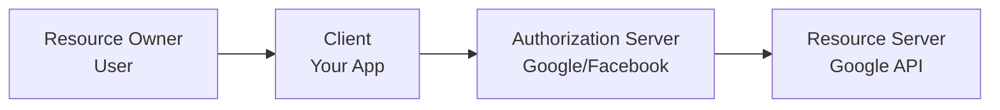
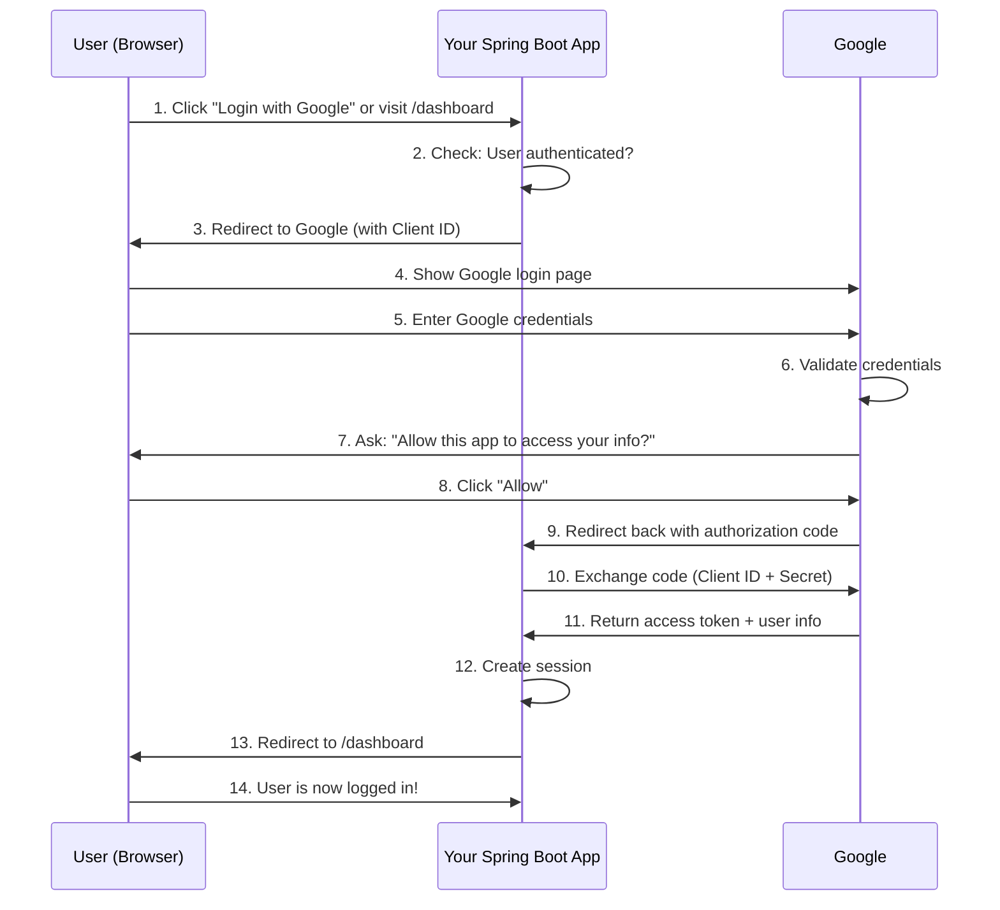

# 🔓 SSO and OAuth2 Introduction

## Table of Contents
1. [What is SSO](#what-is-sso)
2. [What is OAuth2](#what-is-oauth2)
3. [OAuth2 in SSO Context](#oauth2-in-sso-context)
4. [Client ID and Client Secret](#client-id-and-client-secret)
5. [OAuth2 Flow Explained](#oauth2-flow-explained)
6. [Google SSO Implementation](#google-sso-implementation)
7. [Complete Code Implementation](#complete-code-implementation)
8. [Application Flow Deep Dive](#application-flow-deep-dive)
9. [Facebook SSO Integration](#facebook-sso-integration)
10. [Interview Questions](#interview-questions)

---

## What is SSO

### Definition

**SSO (Single Sign-On)** allows a user to log in once and access multiple applications without logging in again.

```
┌─────────────────────────────────────────────────────────┐
│                    What is SSO?                          │
├─────────────────────────────────────────────────────────┤
│                                                         │
│  Example: Login with Google                             │
│                                                         │
│  User logs into:                                        │
│    ✓ Gmail                                              │
│    ✓ YouTube (no login needed!)                         │
│    ✓ Google Drive (no login needed!)                    │
│    ✓ Google Calendar (no login needed!)                 │
│                                                         │
│  One login = Access to all Google services              │
│                                                         │
│  For Third-Party Apps:                                  │
│    ✓ Login to our Spring Boot app using Google          │
│    ✓ No separate username/password needed               │
│    ✓ User trusts Google with their credentials          │
│                                                         │
└─────────────────────────────────────────────────────────┘
```

### Benefits of SSO

| Benefit | Description |
|---------|-------------|
| **User Experience** | No need to remember multiple passwords |
| **Security** | Fewer passwords = fewer attack vectors |
| **Trust** | Users trust Google/Facebook authentication |
| **No Password Storage** | Your app never handles passwords |
| **Quick Implementation** | Leverage existing auth infrastructure |

---

## What is OAuth2

### Definition

**OAuth2** is the security protocol that enables Single Sign-On by allowing applications to trust identity providers (Google, Facebook, etc.) without handling user passwords.

```
┌─────────────────────────────────────────────────────────┐
│                    OAuth2 Explained                      │
├─────────────────────────────────────────────────────────┤
│                                                         │
│  OAuth2 lets an app ask Google/Facebook:                │
│    "Is this user logged in?"                            │
│  instead of checking the password itself.               │
│                                                         │
│  Key Points:                                            │
│    • OAuth2 = The mechanism                             │
│    • SSO = The idea                                     │
│    • OAuth2 makes SSO possible                          │
│                                                         │
│  Relationship:                                          │
│    SSO → One login, many applications                   │
│    OAuth2 → The secure process enabling that login      │
│                                                         │
└─────────────────────────────────────────────────────────┘
```

### OAuth2 Roles



| Role | Description | Example |
|------|-------------|---------|
| **Resource Owner** | The user who owns the data | You (your Google account) |
| **Client** | The application requesting access | Your Spring Boot app |
| **Authorization Server** | Authenticates user, issues tokens | Google OAuth2 |
| **Resource Server** | Holds protected resources | Google Profile API |

---

## OAuth2 in SSO Context

### How OAuth2 Helps SSO

```
┌─────────────────────────────────────────────────────────┐
│           OAuth2 Enabling SSO                            │
├─────────────────────────────────────────────────────────┤
│                                                         │
│  Step 1: User clicks "Login with Google"                │
│                                                         │
│  Step 2: Application redirects user to Google           │
│                                                         │
│  Step 3: User logs in at Google                         │
│          (credentials NEVER seen by your app!)          │
│                                                         │
│  Step 4: Google confirms user identity                  │
│                                                         │
│  Step 5: Application trusts Google and allows access    │
│                                                         │
│  Key Insight:                                           │
│    Password is NEVER shared with the application        │
│    Google acts as the trusted identity provider         │
│                                                         │
└─────────────────────────────────────────────────────────┘
```

---

## Client ID and Client Secret

### Understanding the Confusion

```
┌─────────────────────────────────────────────────────────┐
│           Common Misconception                           │
├─────────────────────────────────────────────────────────┤
│                                                         │
│  ❌ WRONG understanding:                                │
│     Client ID = Gmail ID                                │
│     Client Secret = Gmail password                      │
│                                                         │
│  ✅ CORRECT understanding:                              │
│     Client ID = Application's identity for Google       │
│     Client Secret = Application's password for Google   │
│                                                         │
│  These belong to YOUR APPLICATION, not the user!        │
│                                                         │
└─────────────────────────────────────────────────────────┘
```

### Client ID

**Client ID** is the public identifier of your application registered with the OAuth provider.

```
┌─────────────────────────────────────────────────────────┐
│                    Client ID                             │
├─────────────────────────────────────────────────────────┤
│                                                         │
│  What it is:                                            │
│    • Unique public identifier for your app              │
│    • Like an "application username"                     │
│                                                         │
│  Properties:                                            │
│    • Can be public (sent in browser)                    │
│    • Safe to share                                      │
│    • Used to identify which app is requesting login     │
│                                                         │
│  Example:                                               │
│    154965323588-61p4g834vtl534mt1re950cvvb06gvsm        │
│    .apps.googleusercontent.com                          │
│                                                         │
└─────────────────────────────────────────────────────────┘
```

### Client Secret

**Client Secret** is the confidential key used by your application to prove it is genuine.

```
┌─────────────────────────────────────────────────────────┐
│                   Client Secret                          │
├─────────────────────────────────────────────────────────┤
│                                                         │
│  What it is:                                            │
│    • Private key for your application                   │
│    • Like an "application password"                     │
│                                                         │
│  Properties:                                            │
│    • Must be PRIVATE (only on server)                   │
│    • NEVER share or expose                              │
│    • Used in backend-to-backend communication           │
│                                                         │
│  Example:                                               │
│    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                  │
│                                                         │
│  ⚠️ Never commit to Git!                               │
│  ⚠️ Never send to browser!                             │
│                                                         │
└─────────────────────────────────────────────────────────┘
```

### Comparison Table

| Property | Client ID | Client Secret |
|----------|-----------|---------------|
| **Visibility** | Can be public | Must be private |
| **Location** | Browser + Backend | Backend only |
| **Sharing** | Safe to share | NEVER share |
| **Like** | Application's public name | Application's password |

### Who Creates These?

```
┌─────────────────────────────────────────────────────────┐
│           Client ID/Secret Creation                      │
├─────────────────────────────────────────────────────────┤
│                                                         │
│  NOT generated by Spring Boot!                          │
│  Issued by OAuth Provider (Google/Facebook)             │
│                                                         │
│  Steps:                                                 │
│    1. Go to Google Cloud Console                        │
│    2. Create a Project                                  │
│    3. Configure OAuth Consent Screen                    │
│    4. Create OAuth Client ID                            │
│    5. Google generates Client ID + Secret               │
│    6. Add them to your application.yml                  │
│                                                         │
└─────────────────────────────────────────────────────────┘
```

---

## OAuth2 Flow Explained

### Complete Flow Diagram



### Step-by-Step Breakdown

```
┌─────────────────────────────────────────────────────────┐
│           OAuth2 Flow Steps                              │
├─────────────────────────────────────────────────────────┤
│                                                         │
│  STEP 1: User opens protected page (/dashboard)         │
│                                                         │
│  STEP 2: Spring Security checks authorization rules     │
│          → User NOT logged in                           │
│          → oauth2Login() configured                     │
│                                                         │
│  STEP 3: Spring redirects browser to Google with:       │
│          - Client ID (public)                           │
│          - Redirect URI                                 │
│          - Requested scopes (profile, email)            │
│                                                         │
│  STEP 4: Google validates YOUR application              │
│          - Is Client ID registered?                     │
│          - Does redirect URI match?                     │
│                                                         │
│  STEP 5: User logs in at Google                         │
│          (Password NEVER seen by your app!)             │
│                                                         │
│  STEP 6: Google asks user for consent                   │
│          "Allow this app to access your info?"          │
│                                                         │
│  STEP 7: User clicks "Allow"                            │
│                                                         │
│  STEP 8: Google redirects back with authorization code  │
│          /login/oauth2/code/google?code=abc123          │
│                                                         │
│  STEP 9: Backend-to-backend communication               │
│          Spring Boot sends to Google:                   │
│          - Authorization code                           │
│          - Client ID                                    │
│          - Client Secret (NOW used!)                    │
│                                                         │
│  STEP 10: Google verifies everything                    │
│           Returns: Access token + User info             │
│                                                         │
│  STEP 11: Spring Security creates session               │
│           User is authenticated!                        │
│                                                         │
│  STEP 12: Redirect to original URL (/dashboard)         │
│                                                         │
└─────────────────────────────────────────────────────────┘
```

---

## Google SSO Implementation

### Step 1: Create Google OAuth Credentials

```
┌─────────────────────────────────────────────────────────┐
│           Google Cloud Console Setup                     │
├─────────────────────────────────────────────────────────┤
│                                                         │
│  1. Go to https://console.cloud.google.com              │
│                                                         │
│  2. Create New Project: "For-Spring-boot"               │
│                                                         │
│  3. APIs & Services → OAuth consent screen              │
│     - User type: External                               │
│     - App name: Demo SSO App                            │
│     - Email: your email                                 │
│                                                         │
│  4. Credentials → Create OAuth Client ID                │
│     - Application type: Web application                 │
│     - Name: For-Spring-boot                             │
│     - Authorized redirect URI:                          │
│       http://localhost:8080/login/oauth2/code/google    │
│                                                         │
│  5. Copy Client ID and Client Secret                    │
│                                                         │
└─────────────────────────────────────────────────────────┘
```

### Step 2: Project Setup

**Dependencies:**
```xml
<dependency>
    <groupId>org.springframework.boot</groupId>
    <artifactId>spring-boot-starter-web</artifactId>
</dependency>
<dependency>
    <groupId>org.springframework.boot</groupId>
    <artifactId>spring-boot-starter-security</artifactId>
</dependency>
<dependency>
    <groupId>org.springframework.boot</groupId>
    <artifactId>spring-boot-starter-oauth2-client</artifactId>
</dependency>
```

### Step 3: application.yml

```yaml
spring:
  security:
    oauth2:
      client:
        registration:
          google:
            client-id: YOUR_CLIENT_ID
            client-secret: YOUR_CLIENT_SECRET
            scope:
              - email
              - profile
```

---

## Complete Code Implementation

### SecurityConfig

```java
// SecurityConfig.java
package com.example.demo;

import org.springframework.context.annotation.Bean;
import org.springframework.context.annotation.Configuration;
import org.springframework.security.config.annotation.web.builders.HttpSecurity;
import org.springframework.security.web.SecurityFilterChain;
import static org.springframework.security.config.Customizer.withDefaults;

@Configuration
public class SecurityConfig {

    @Bean
    SecurityFilterChain securityFilterChain(HttpSecurity http) throws Exception {
        http
            .authorizeHttpRequests(auth -> auth
                .requestMatchers("/", "/public").permitAll()  // Public pages
                .anyRequest().authenticated()                  // Protected pages
            )
            .oauth2Login(withDefaults());  // THIS ENABLES SSO!

        return http.build();
    }
}
```

**Line-by-Line:**

| Line | Explanation |
|------|-------------|
| `.requestMatchers("/", "/public").permitAll()` | No login needed for these URLs |
| `.anyRequest().authenticated()` | All other URLs need login |
| `.oauth2Login(withDefaults())` | Enable OAuth2 login with default settings |

---

### HomeController

```java
// HomeController.java
package com.example.demo;

import org.springframework.security.core.annotation.AuthenticationPrincipal;
import org.springframework.security.oauth2.core.user.OAuth2User;
import org.springframework.web.bind.annotation.GetMapping;
import org.springframework.web.bind.annotation.RestController;

@RestController
public class HomeController {

    @GetMapping("/")
    public String home() {
        return "Public Page";
    }

    @GetMapping("/dashboard")
    public String dashboard(@AuthenticationPrincipal OAuth2User user) {
        return "Welcome " + user.getAttribute("name") +
               " | Email: " + user.getAttribute("email");
    }
}
```

**Key Annotations:**

| Annotation | Purpose |
|------------|---------|
| `@AuthenticationPrincipal` | Injects the current authenticated user |
| `OAuth2User` | Type representing OAuth2 authenticated user |
| `user.getAttribute("name")` | Gets user's name from Google profile |
| `user.getAttribute("email")` | Gets user's email from Google profile |

---

### Understanding OAuth2User

```
┌─────────────────────────────────────────────────────────┐
│           OAuth2User Object                              │
├─────────────────────────────────────────────────────────┤
│                                                         │
│  Who creates it?                                        │
│    Spring Security - automatically after Google login   │
│                                                         │
│  When?                                                  │
│    After Google sends back user information             │
│                                                         │
│  What it contains:                                      │
│    • name - User's display name                         │
│    • email - User's email                               │
│    • sub - Google's unique user ID                      │
│    • picture - Profile picture URL                      │
│                                                         │
│  How to access:                                         │
│    @AuthenticationPrincipal OAuth2User user             │
│    user.getAttribute("name")                            │
│    user.getAttribute("email")                           │
│                                                         │
│  If user not logged in:                                 │
│    OAuth2User will be null                              │
│                                                         │
└─────────────────────────────────────────────────────────┘
```

---

## Application Flow Deep Dive

### Testing the Flow

```
1. Start application
2. Open: http://localhost:8080/dashboard
3. Not logged in → Redirected to Google
4. Log in with Google account
5. Click "Allow" on consent screen
6. Redirected back to /dashboard
7. See: "Welcome John Doe | Email: john@gmail.com"
```

### What Happens Internally

```
┌─────────────────────────────────────────────────────────┐
│           Redirect URI Purpose                           │
├─────────────────────────────────────────────────────────┤
│                                                         │
│  Redirect URI:                                          │
│    http://localhost:8080/login/oauth2/code/google       │
│                                                         │
│  This is Spring Security's internal callback URL        │
│                                                         │
│  Why this URL?                                          │
│    1. Google sends authorization code here              │
│    2. Spring Security handles this endpoint             │
│    3. Spring exchanges code for token                   │
│    4. Spring fetches user profile                       │
│    5. Spring creates authenticated session              │
│                                                         │
│  IMPORTANT:                                             │
│    Redirect URI sent to Google MUST MATCH               │
│    Redirect URI registered in Google Console!           │
│                                                         │
└─────────────────────────────────────────────────────────┘
```

---

## Facebook SSO Integration

### Adding Facebook Login

**application.yml with Both Providers:**

```yaml
spring:
  security:
    oauth2:
      client:
        registration:
          google:
            client-id: YOUR_GOOGLE_CLIENT_ID
            client-secret: YOUR_GOOGLE_CLIENT_SECRET
            scope:
              - email
              - profile
          facebook:
            client-id: YOUR_FACEBOOK_APP_ID
            client-secret: YOUR_FACEBOOK_APP_SECRET
            scope:
              - public_profile
              - email
```

### Getting Facebook Credentials

```
┌─────────────────────────────────────────────────────────┐
│           Facebook Developer Setup                       │
├─────────────────────────────────────────────────────────┤
│                                                         │
│  1. Go to https://developers.facebook.com/              │
│  2. Click "My Apps" → "Create App"                      │
│  3. App name: My_App_For_Spring_Boot                    │
│  4. Select: Consumer → Other                            │
│  5. Click "Create App"                                  │
│  6. Go to Settings → Basic                              │
│  7. App ID = Client ID                                  │
│  8. Click "Show" on App Secret                          │
│     (requires Facebook password)                        │
│  9. App Secret = Client Secret                          │
│                                                         │
│  Note: Facebook calls it App ID/Secret, not Client      │
│        ID/Secret, but they're the same concept!         │
│                                                         │
└─────────────────────────────────────────────────────────┘
```

---

## Interview Questions

### Q1: What is SSO?
**Answer**: SSO (Single Sign-On) allows a user to log in once and access multiple applications without logging in again. Example: Login with Google to access multiple apps.

### Q2: What is the relationship between OAuth2 and SSO?
**Answer**:
- **SSO** is the concept (one login, many apps)
- **OAuth2** is the protocol that makes SSO possible

OAuth2 enables applications to trust identity providers like Google without handling passwords.

### Q3: What is Client ID and Client Secret?
**Answer**:
- **Client ID**: Public identifier of your application with OAuth provider
- **Client Secret**: Private password for your application

They identify YOUR APPLICATION to Google, NOT the user!

### Q4: Who creates Client ID and Secret?
**Answer**: The OAuth provider (Google, Facebook) creates them when you register your application in their developer console. Spring Boot doesn't create them.

### Q5: Does the user share their Google password with our app?
**Answer**: NO! The user enters their password ONLY on Google's page. Our application never sees or handles the user's password. This is a key security benefit of OAuth2.

### Q6: What is the Redirect URI?
**Answer**: The URL where Google redirects after authentication. For Spring Security, the default is:
```
http://localhost:8080/login/oauth2/code/google
```
This MUST match what's registered in Google Console.

### Q7: When is Client Secret used?
**Answer**: Client Secret is used ONLY in backend-to-backend communication. After Google sends the authorization code, Spring Boot sends Client ID + Client Secret to Google to exchange the code for an access token.

---

## Summary

```
┌─────────────────────────────────────────────────────────┐
│           SSO/OAuth2 Summary                             │
├─────────────────────────────────────────────────────────┤
│                                                         │
│  Key Concepts:                                          │
│    SSO = One login for multiple apps                    │
│    OAuth2 = Protocol enabling SSO                       │
│                                                         │
│  Client ID/Secret:                                      │
│    Identify YOUR APPLICATION to Google                  │
│    NOT related to user credentials                      │
│                                                         │
│  Flow:                                                  │
│    1. User visits protected page                        │
│    2. Redirect to Google                                │
│    3. User logs in at Google                            │
│    4. Google sends authorization code                   │
│    5. Backend exchanges code for token                  │
│    6. User is authenticated in your app                 │
│                                                         │
│  Key Files:                                             │
│    SecurityConfig → .oauth2Login(withDefaults())        │
│    application.yml → client-id, client-secret           │
│    Controller → @AuthenticationPrincipal OAuth2User    │
│                                                         │
│  Security:                                              │
│    User password NEVER seen by your app                 │
│    Client Secret stays on backend only                  │
│                                                         │
└─────────────────────────────────────────────────────────┘
```

---

*Next: [11_Logging_Log4j.md](./11_Logging_Log4j.md)*
