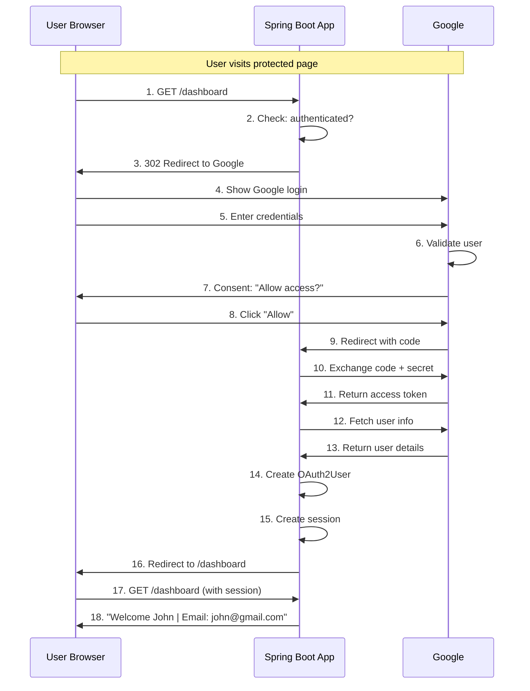

# 🔐 SSO Google Login Implementation

## Table of Contents
1. [Introduction](#introduction)
2. [Google Cloud Console Setup](#google-cloud-console-setup)
3. [Project Setup](#project-setup)
4. [SecurityConfig Implementation](#securityconfig-implementation)
5. [HomeController with OAuth2User](#homecontroller-with-oauth2user)
6. [Application Flow Deep Dive](#application-flow-deep-dive)
7. [Facebook SSO Integration](#facebook-sso-integration)
8. [Complete Multi-Provider Setup](#complete-multi-provider-setup)
9. [Authentication Principal Explained](#authentication-principal-explained)
10. [Interview Questions](#interview-questions)

---

## Introduction

### What We're Building

This note covers the complete implementation of Google SSO (Single Sign-On) using Spring Boot and OAuth2.

```
┌─────────────────────────────────────────────────────────────┐
│             Google SSO Implementation Goals                  │
├─────────────────────────────────────────────────────────────┤
│                                                             │
│  ✅ User clicks "Login with Google"                         │
│  ✅ Redirected to Google login page                         │
│  ✅ After Google login → Redirected back to our app         │
│  ✅ User's name and email displayed                         │
│  ✅ No password stored in our application                   │
│                                                             │
│  Dependencies Required:                                     │
│    • spring-boot-starter-web                                │
│    • spring-boot-starter-security                           │
│    • spring-boot-starter-oauth2-client                      │
│                                                             │
└─────────────────────────────────────────────────────────────┘
```

---

## Google Cloud Console Setup

### Step-by-Step Guide

```
┌─────────────────────────────────────────────────────────────┐
│           Google Developer Console Setup                     │
├─────────────────────────────────────────────────────────────┤
│                                                             │
│  Step 1: Go to Google Cloud Console                         │
│  ────────────────────────────────────                       │
│    URL: https://console.cloud.google.com                    │
│                                                             │
│  Step 2: Create a New Project                               │
│  ────────────────────────────────                           │
│    • Click "Select a Project" (top-left)                    │
│    • Click "New Project"                                    │
│    • Name: For-Spring-boot                                  │
│    • Location: No organization (OK)                         │
│    • Click "Create"                                         │
│                                                             │
│  Step 3: Configure OAuth Consent Screen                     │
│  ───────────────────────────────────────                    │
│    • Select your project                                    │
│    • Go to: API and Services → OAuth consent screen         │
│    • Click "Get Started"                                    │
│    • App name: Demo SSO App                                 │
│    • User email: your.email@gmail.com                       │
│    • User type: External                                    │
│    • Click through → I agree → Create                       │
│                                                             │
│  Step 4: Create OAuth Client ID                             │
│  ──────────────────────────────                             │
│    • Click: Create OAuth Client                             │
│    • Application Type: Web Application                      │
│    • Name: For-Spring-boot                                  │
│    • Authorized redirect URI:                               │
│      http://localhost:8080/login/oauth2/code/google         │
│    • Click "Create"                                         │
│                                                             │
│  Step 5: Save Credentials                                   │
│  ───────────────────────                                    │
│    Client ID: xxx.apps.googleusercontent.com                │
│    Client Secret: GOCSPX-xxxxxxxxx                          │
│                                                             │
│  ⚠️ If secret not visible:                                 │
│     • Open OAuth Client ID                                  │
│     • Click "Add secret" or "Reset secret"                  │
│     • Copy immediately - hidden after leaving page          │
│                                                             │
└─────────────────────────────────────────────────────────────┘
```

### Important: Redirect URI

```
┌─────────────────────────────────────────────────────────────┐
│           Why This Exact Redirect URI?                       │
├─────────────────────────────────────────────────────────────┤
│                                                             │
│  URI: http://localhost:8080/login/oauth2/code/google        │
│                                                             │
│  Breakdown:                                                 │
│    /login/oauth2/code  → Spring Security OAuth2 endpoint    │
│    /google             → Provider name (matches YAML)       │
│                                                             │
│  This is a STANDARD Spring Security endpoint!               │
│  Spring automatically handles this callback.                │
│                                                             │
│  MUST match exactly in:                                     │
│    ✓ Google Console configuration                           │
│    ✓ Spring Security expects this pattern                   │
│                                                             │
│  For Facebook: /login/oauth2/code/facebook                  │
│  For GitHub:   /login/oauth2/code/github                    │
│                                                             │
└─────────────────────────────────────────────────────────────┘
```

---

## Project Setup

### Dependencies (pom.xml)

```xml
<dependencies>
    <!-- Web Starter -->
    <dependency>
        <groupId>org.springframework.boot</groupId>
        <artifactId>spring-boot-starter-web</artifactId>
    </dependency>
    
    <!-- Security Starter -->
    <dependency>
        <groupId>org.springframework.boot</groupId>
        <artifactId>spring-boot-starter-security</artifactId>
    </dependency>
    
    <!-- OAuth2 Client - THIS ENABLES SSO -->
    <dependency>
        <groupId>org.springframework.boot</groupId>
        <artifactId>spring-boot-starter-oauth2-client</artifactId>
    </dependency>
</dependencies>
```

### application.yml Configuration

```yaml
spring:
  security:
    oauth2:
      client:
        registration:
          google:
            client-id: 237462967238-a10d9qs0q8urg0754qj6ggjdlneeaicf.apps.googleusercontent.com
            client-secret: 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
            scope:
              - email
              - profile
```

### Line-by-Line YAML Explanation

| Line | Property | Explanation |
|------|----------|-------------|
| `spring.security.oauth2.client` | Root config | Spring Security OAuth2 client configuration |
| `registration.google` | Provider ID | The name "google" is a built-in provider |
| `client-id` | Your App's ID | From Google Console, identifies your app |
| `client-secret` | Your App's Secret | From Google Console, authenticates your app |
| `scope: email, profile` | Permissions | What info to request from Google |

### Common OAuth2 Scopes

| Scope | What You Get |
|-------|--------------|
| `email` | User's email address |
| `profile` | User's name, picture, locale |
| `openid` | User's unique identifier (sub) |

---

## SecurityConfig Implementation

```java
package com.example.demo;

import org.springframework.context.annotation.Bean;
import org.springframework.context.annotation.Configuration;
import org.springframework.security.config.annotation.web.builders.HttpSecurity;
import org.springframework.security.web.SecurityFilterChain;
import static org.springframework.security.config.Customizer.withDefaults;

@Configuration
public class SecurityConfig {

    @Bean
    SecurityFilterChain securityFilterChain(HttpSecurity http) throws Exception {

        http
            .authorizeHttpRequests(auth -> auth
                .requestMatchers("/", "/public").permitAll()
                .anyRequest().authenticated()
            )
            .oauth2Login(withDefaults()); //  THIS IS SSO

        return http.build();
    }
}
```

### Line-by-Line Code Explanation

| Line | Code | Explanation |
|------|------|-------------|
| 1 | `@Configuration` | Marks class as Spring configuration |
| 2 | `SecurityFilterChain` | Spring Security 6 style configuration |
| 3 | `.authorizeHttpRequests()` | Define URL access rules |
| 4 | `requestMatchers("/", "/public")` | Match these URLs |
| 5 | `.permitAll()` | No authentication needed |
| 6 | `.anyRequest().authenticated()` | All other URLs need login |
| 7 | `.oauth2Login(withDefaults())` | **ENABLE OAuth2/SSO LOGIN** |
| 8 | `withDefaults()` | Use Spring's default configuration |

### What oauth2Login() Does

```
┌─────────────────────────────────────────────────────────────┐
│           .oauth2Login(withDefaults()) Magic                 │
├─────────────────────────────────────────────────────────────┤
│                                                             │
│  When you add this single line, Spring Security:            │
│                                                             │
│  1. Creates /oauth2/authorization/google endpoint           │
│     → Redirects user to Google login page                   │
│                                                             │
│  2. Creates /login/oauth2/code/google endpoint              │
│     → Handles callback from Google                          │
│                                                             │
│  3. Automatically:                                          │
│     → Exchanges authorization code for access token         │
│     → Fetches user info from Google                         │
│     → Creates OAuth2User principal                          │
│     → Establishes session                                   │
│                                                             │
│  You write ONE LINE, Spring does everything else!           │
│                                                             │
└─────────────────────────────────────────────────────────────┘
```

---

## HomeController with OAuth2User

```java
/*
Why is the type OAuth2User?

Ans:-
    You are using OAuth2 / SSO login
    Google / Facebook returns user details
    Spring Security wraps those details into an OAuth2User

    So:
    OAuth2User user
    represents:
        Logged-in Google/Facebook user
        With attributes like name, email, picture
*/

/*
@AuthenticationPrincipal OAuth2User user  
    above line means

Apply @AuthenticationPrincipal to the parameter user of type OAuth2User.
*/

package com.example.demo;

import org.springframework.security.core.annotation.AuthenticationPrincipal;
import org.springframework.security.oauth2.core.user.OAuth2User;
import org.springframework.web.bind.annotation.GetMapping;
import org.springframework.web.bind.annotation.RestController;

@RestController
public class HomeController {

    @GetMapping("/")
    public String home() {
        return "Public Page";
    }

    @GetMapping("/dashboard")
    public String dashboard(@AuthenticationPrincipal OAuth2User user) {
        return "Welcome " + user.getAttribute("name") +
               " | Email: " + user.getAttribute("email");
    }
}
```

### Code Breakdown

| Line | Code | Purpose |
|------|------|---------|
| `@RestController` | Class annotation | Returns JSON/String directly |
| `@GetMapping("/")` | Public endpoint | No login required |
| `@GetMapping("/dashboard")` | Protected endpoint | Requires authentication |
| `@AuthenticationPrincipal` | Parameter annotation | Injects current logged-in user |
| `OAuth2User user` | Parameter type | Represents OAuth2 authenticated user |
| `user.getAttribute("name")` | Get user info | Access Google profile data |

### OAuth2User Attributes

```
┌─────────────────────────────────────────────────────────────┐
│           OAuth2User Attributes from Google                  │
├─────────────────────────────────────────────────────────────┤
│                                                             │
│  Method                      │ Returns                      │
│  ────────────────────────────┼──────────────────            │
│  user.getAttribute("sub")    │ Google's unique user ID      │
│  user.getAttribute("name")   │ Full name (e.g., "John Doe") │
│  user.getAttribute("email")  │ Email address                │
│  user.getAttribute("picture")│ Profile picture URL          │
│  user.getAttribute("locale") │ User's locale (e.g., "en")   │
│                                                             │
│  If user not logged in:                                     │
│    OAuth2User will be NULL                                  │
│                                                             │
│  Who creates OAuth2User?                                    │
│    Spring Security - automatically after Google login       │
│                                                             │
│  When?                                                      │
│    After Google sends back user information                 │
│                                                             │
└─────────────────────────────────────────────────────────────┘
```

---

## Application Flow Deep Dive

### Complete OAuth2 Login Flow



### Step-by-Step Explanation

```
┌─────────────────────────────────────────────────────────────┐
│           Detailed Flow Steps                                │
├─────────────────────────────────────────────────────────────┤
│                                                             │
│  STEP 1: User opens http://localhost:8080/dashboard         │
│          → Browser sends GET /dashboard                     │
│                                                             │
│  STEP 2: Spring Security intercepts                         │
│          → .anyRequest().authenticated() matches            │
│          → User has NO session/cookie                       │
│                                                             │
│  STEP 3: Redirect to Google                                 │
│          → Spring creates Google authorization URL          │
│          → URL includes: client_id, redirect_uri, scopes    │
│                                                             │
│  STEP 4-6: Google Authentication                            │
│          → User sees Google's login page                    │
│          → User enters Google credentials                   │
│          → Google validates the credentials                 │
│                                                             │
│  STEP 7-8: Consent                                          │
│          → Google shows: "Demo SSO App wants access"        │
│          → User clicks "Allow"                              │
│                                                             │
│  STEP 9: Authorization Code                                 │
│          → Google redirects to:                             │
│            /login/oauth2/code/google?code=xxx               │
│          → This code is SHORT-LIVED (seconds)               │
│                                                             │
│  STEP 10-11: Token Exchange (Backend)                       │
│          → Spring sends to Google:                          │
│            - Authorization code                             │
│            - Client ID                                      │
│            - Client Secret                                  │
│          → Google returns: Access Token                     │
│                                                             │
│  STEP 12-13: User Info Fetch (Backend)                      │
│          → Spring uses Access Token                         │
│          → Fetches user profile from Google User Info API   │
│                                                             │
│  STEP 14-15: Session Creation                               │
│          → Spring creates OAuth2User object                 │
│          → Stores in SecurityContext                        │
│          → Creates HTTP session                             │
│                                                             │
│  STEP 16-18: Final Response                                 │
│          → Redirect back to original URL (/dashboard)       │
│          → User now authenticated                           │
│          → @AuthenticationPrincipal works!                  │
│                                                             │
└─────────────────────────────────────────────────────────────┘
```

---

## Facebook SSO Integration

### How to Get Facebook Credentials

```
┌─────────────────────────────────────────────────────────────┐
│           Facebook Developer Setup                           │
├─────────────────────────────────────────────────────────────┤
│                                                             │
│  Step 1: Go to https://developers.facebook.com/             │
│                                                             │
│  Step 2: Click "Developer tools" → "My Apps"                │
│                                                             │
│  Step 3: Click "Create App"                                 │
│          • App name: My_App_For_Spring_Boot                 │
│          • App contact email: your.email@gmail.com          │
│                                                             │
│  Step 4: Click "Next" → "Others" → "Other" → "Next"         │
│                                                             │
│  Step 5: Select app type: "Consumer"                        │
│                                                             │
│  Step 6: Click "Create app"                                 │
│          → Enter Facebook password when prompted            │
│                                                             │
│  Step 7: Get App ID (shown immediately)                     │
│          Example: 3260424047468919                          │
│                                                             │
│  Step 8: Get App Secret (hidden by default)                 │
│          • Go to Settings → Basic                           │
│          • Scroll to "App Secret"                           │
│          • Click "Show"                                     │
│          • Enter Facebook password OR OTP                   │
│          • Copy: 1bf53d6741f9afecc5dffb2863152b58          │
│                                                             │
│  ⚠️ App Secret is hidden for security!                     │
│  ⚠️ Copy immediately - hidden after leaving page           │
│                                                             │
│  Terminology Mapping:                                       │
│    Facebook "App ID" = OAuth2 "Client ID"                   │
│    Facebook "App Secret" = OAuth2 "Client Secret"           │
│                                                             │
└─────────────────────────────────────────────────────────────┘
```

---

## Complete Multi-Provider Setup

### application.yml with Google AND Facebook

```yaml
spring:
  security:
    oauth2:
      client:
        registration:
          google:
            client-id: 154965323588-61p4g834vtl534mt1re950cvvb06gvsm.apps.googleusercontent.com
            client-secret: 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
            scope:
              - email
              - profile
          facebook:
            client-id: 3260424047468919
            client-secret: 1bf53d6741f9afecc5dffb2863152b58
            scope:
              - public_profile
              - email
```

### What Happens with Multiple Providers

```
┌─────────────────────────────────────────────────────────────┐
│           Multi-Provider OAuth2 Login                        │
├─────────────────────────────────────────────────────────────┤
│                                                             │
│  When you have multiple providers configured:               │
│                                                             │
│  Spring Security automatically creates:                     │
│    • /oauth2/authorization/google                           │
│    • /oauth2/authorization/facebook                         │
│                                                             │
│  Default login page shows:                                  │
│    ┌─────────────────────────┐                              │
│    │     Login with:        │                               │
│    │                        │                               │
│    │  [G] Google            │                               │
│    │  [F] Facebook          │                               │
│    │                        │                               │
│    └─────────────────────────┘                              │
│                                                             │
│  User clicks one → Redirected to that provider              │
│                                                             │
│  OAuth2User works for BOTH providers!                       │
│  Same @AuthenticationPrincipal annotation                   │
│                                                             │
└─────────────────────────────────────────────────────────────┘
```

### Facebook Scopes vs Google Scopes

| Provider | Scope | What You Get |
|----------|-------|--------------|
| Google | `email` | User's email |
| Google | `profile` | Name, picture, locale |
| Facebook | `email` | User's email |
| Facebook | `public_profile` | Name, picture, gender |

---

## Authentication Principal Explained

### @AuthenticationPrincipal Deep Dive

```
┌─────────────────────────────────────────────────────────────┐
│           @AuthenticationPrincipal Annotation                │
├─────────────────────────────────────────────────────────────┤
│                                                             │
│  What it does:                                              │
│    Injects the currently logged-in user into your method    │
│                                                             │
│  For OAuth2 login:                                          │
│    @AuthenticationPrincipal OAuth2User user                 │
│                                                             │
│  For form/database login:                                   │
│    @AuthenticationPrincipal UserDetails user                │
│                                                             │
│  Behind the scenes:                                         │
│    SecurityContextHolder                                    │
│        ↓                                                    │
│    SecurityContext                                          │
│        ↓                                                    │
│    Authentication                                           │
│        ↓                                                    │
│    getPrincipal() → OAuth2User                              │
│                                                             │
│  If not logged in:                                          │
│    user = null (or throw exception if required=true)        │
│                                                             │
└─────────────────────────────────────────────────────────────┘
```

### Alternative Ways to Get User

```java
// Method 1: @AuthenticationPrincipal (Recommended)
@GetMapping("/dashboard")
public String dashboard(@AuthenticationPrincipal OAuth2User user) {
    return user.getAttribute("name");
}

// Method 2: Authentication parameter
@GetMapping("/dashboard")
public String dashboard(Authentication auth) {
    OAuth2User user = (OAuth2User) auth.getPrincipal();
    return user.getAttribute("name");
}

// Method 3: SecurityContextHolder (Anywhere in code)
public String getUsername() {
    Authentication auth = SecurityContextHolder.getContext().getAuthentication();
    OAuth2User user = (OAuth2User) auth.getPrincipal();
    return user.getAttribute("name");
}
```

---

## Interview Questions

### Q1: What is the difference between OAuth2 and SSO?
**Answer**:
- **SSO** (Single Sign-On) is a concept - login once, access multiple apps
- **OAuth2** is the protocol that implements SSO
- OAuth2 is the "how", SSO is the "what"

### Q2: What is Client ID and Client Secret?
**Answer**:
- **Client ID**: Public identifier for your application with OAuth provider
- **Client Secret**: Private password for your application
- Both identify YOUR APPLICATION to Google, NOT the user!
- Created by the OAuth provider (Google/Facebook), not Spring Boot

### Q3: Why does the user never share their password with our app?
**Answer**:
User enters credentials ONLY on Google's page. Our app never sees the password. We only receive:
1. Authorization code (temporary)
2. Access token (after backend exchange)
3. User profile information

### Q4: What is the redirect URI and why is it important?
**Answer**:
- `http://localhost:8080/login/oauth2/code/google`
- This is where Google sends the user after authentication
- MUST match exactly in Google Console configuration
- Spring Security automatically handles this endpoint

### Q5: When is Client Secret used?
**Answer**:
Client Secret is used ONLY in backend-to-backend communication:
- After Google sends authorization code to callback URL
- Spring Boot sends: code + client_id + client_secret to Google
- This exchange happens on the server, never in browser

### Q6: How do you add multiple OAuth2 providers?
**Answer**:
Add multiple registrations in application.yml:
```yaml
spring.security.oauth2.client.registration:
  google:
    client-id: xxx
    client-secret: xxx
  facebook:
    client-id: xxx
    client-secret: xxx
```
Spring Security creates login options for each automatically.

### Q7: What is OAuth2User?
**Answer**:
- Interface representing authenticated OAuth2 user
- Created by Spring Security after successful OAuth2 login
- Contains attributes from the OAuth provider (name, email, picture)
- Injected using `@AuthenticationPrincipal OAuth2User user`

---

## Summary

```
┌─────────────────────────────────────────────────────────────┐
│           Google SSO Implementation Summary                  │
├─────────────────────────────────────────────────────────────┤
│                                                             │
│  Setup Steps:                                               │
│    1. Create Google Cloud project                           │
│    2. Get Client ID and Client Secret                       │
│    3. Add spring-boot-starter-oauth2-client                 │
│    4. Configure application.yml                             │
│    5. Add .oauth2Login(withDefaults()) in SecurityConfig    │
│                                                             │
│  Key Files:                                                 │
│    SecurityConfig → .oauth2Login(withDefaults())            │
│    application.yml → client-id, client-secret, scopes       │
│    Controller → @AuthenticationPrincipal OAuth2User        │
│                                                             │
│  Important URLs:                                            │
│    /oauth2/authorization/google → Starts OAuth2 flow        │
│    /login/oauth2/code/google → Callback from Google         │
│                                                             │
│  Remember:                                                  │
│    • User password NEVER seen by your app                   │
│    • Client Secret stays on backend only                    │
│    • Redirect URI must match exactly                        │
│    • OAuth2User contains user profile attributes            │
│                                                             │
└─────────────────────────────────────────────────────────────┘
```

---

*Next: [12_Log4j_Fundamentals.md](./12_Log4j_Fundamentals.md)*
