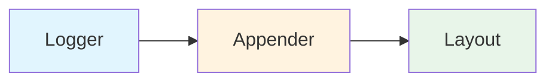

# 📝 Logging with Log4j - Fundamentals

## Table of Contents
1. [What is Logging](#what-is-logging)
2. [Log4j Introduction](#log4j-introduction)
3. [Log4j Architecture](#log4j-architecture)
4. [Log Level Hierarchy](#log-level-hierarchy)
5. [Configuration File](#configuration-file)
6. [Basic Logging Example](#basic-logging-example)
7. [Appenders Explained](#appenders-explained)
8. [Pattern Layout Format](#pattern-layout-format)
9. [File Appender with Rolling](#file-appender-with-rolling)
10. [Interview Questions](#interview-questions)

---

## What is Logging

### Definition

**Logging** is the process of recording application events, errors, and activities during runtime for debugging, monitoring, and auditing purposes.

```
┌─────────────────────────────────────────────────────────────┐
│           Why Do We Need Logging?                            │
├─────────────────────────────────────────────────────────────┤
│                                                             │
│  Without Logging (Using System.out.println):                │
│    ✗ Messages go ONLY to console                            │
│    ✗ Lost when application restarts                         │
│    ✗ No categorization (error vs info)                      │
│    ✗ No timestamps                                          │
│    ✗ Cannot configure on/off                                │
│                                                             │
│  With Logging (Using Log4j):                                │
│    ✓ Messages saved to files                                │
│    ✓ Persisted for later analysis                           │
│    ✓ Categorized by severity (DEBUG, INFO, WARN, ERROR)     │
│    ✓ Automatic timestamps                                   │
│    ✓ Configurable without code changes                      │
│    ✓ Can send to console, file, database, email             │
│                                                             │
└─────────────────────────────────────────────────────────────┘
```

### Logging Use Cases

| Use Case | Description |
|----------|-------------|
| **Debugging** | Track variable values, method calls |
| **Error Tracking** | Record exceptions with stack traces |
| **Monitoring** | Watch application health in production |
| **Auditing** | Record user actions for compliance |
| **Performance** | Measure method execution times |

---

## Log4j Introduction

### What is Log4j?

**Log4j** is a popular Java-based logging framework developed by Apache. It allows developers to control which log statements are output and where they go.

```
┌─────────────────────────────────────────────────────────────┐
│           Log4j Overview                                     │
├─────────────────────────────────────────────────────────────┤
│                                                             │
│  Full Name: Apache Log4j                                    │
│  Purpose: Java Logging Framework                            │
│                                                             │
│  Versions:                                                  │
│    Log4j 1.x → Legacy (still widely used)                   │
│    Log4j 2.x → Modern version with improvements             │
│                                                             │
│  Key Features:                                              │
│    • Configurable via properties/XML file                   │
│    • Multiple output destinations (appenders)               │
│    • Different log levels                                   │
│    • Custom message formatting                              │
│    • No code changes needed to modify behavior              │
│                                                             │
└─────────────────────────────────────────────────────────────┘
```

### Maven Dependencies

```xml
<!-- Log4j 1.x -->
<dependency>
    <groupId>log4j</groupId>
    <artifactId>log4j</artifactId>
    <version>1.2.17</version>
</dependency>
```

---

## Log4j Architecture

### Three Main Components



```
┌─────────────────────────────────────────────────────────────┐
│           Log4j Core Components                              │
├─────────────────────────────────────────────────────────────┤
│                                                             │
│  1. LOGGER (Capture)                                        │
│     ─────────────────                                       │
│     • Entry point for logging                               │
│     • Created in your Java class                            │
│     • Decides what level to log at                          │
│     • Example: Logger.getLogger(MyClass.class)              │
│                                                             │
│  2. APPENDER (Where to send)                                │
│     ──────────────────────────                              │
│     • Controls destination of log messages                  │
│     • Console, File, Database, Email, etc.                  │
│     • Multiple appenders can be attached                    │
│     • Example: ConsoleAppender, FileAppender                │
│                                                             │
│  3. LAYOUT (How to format)                                  │
│     ───────────────────────                                 │
│     • Formats the log message                               │
│     • Adds timestamp, level, class name                     │
│     • Most common: PatternLayout                            │
│     • Example: %d{yyyy-MM-dd} %-5p %c - %m%n                │
│                                                             │
│  Flow:                                                      │
│    Logger → captures message                                │
│    Appender → sends to destination                          │
│    Layout → formats before output                           │
│                                                             │
└─────────────────────────────────────────────────────────────┘
```

### Component Relationships

| Component | Responsibility | Examples |
|-----------|----------------|----------|
| **Logger** | Capture log messages | root logger, class-specific |
| **Appender** | Send to destination | Console, File, JDBC, SMTP |
| **Layout** | Format output | PatternLayout, HTMLLayout |

---

## Log Level Hierarchy

### The Five Log Levels

```
┌─────────────────────────────────────────────────────────────┐
│           Log Level Hierarchy (Top = Most Severe)            │
├─────────────────────────────────────────────────────────────┤
│                                                             │
│  FATAL  ← Highest priority (severe errors)                  │
│    ↑                                                        │
│  ERROR  ← Errors that need attention                        │
│    ↑                                                        │
│  WARN   ← Warnings (suspicious situations)                  │
│    ↑                                                        │
│  INFO   ← General information                               │
│    ↑                                                        │
│  DEBUG  ← Detailed debugging info (lowest priority)         │
│                                                             │
│  Rule: Setting a level enables that level AND above         │
│                                                             │
│  Example:                                                   │
│    log4j.rootLogger=WARN                                    │
│    → Shows: WARN, ERROR, FATAL                              │
│    → Hides: DEBUG, INFO                                     │
│                                                             │
└─────────────────────────────────────────────────────────────┘
```

### Log Level Behavior Table

| Level Set | DEBUG | INFO | WARN | ERROR | FATAL |
|-----------|-------|------|------|-------|-------|
| **DEBUG** | ✓ | ✓ | ✓ | ✓ | ✓ |
| **INFO** | ✗ | ✓ | ✓ | ✓ | ✓ |
| **WARN** | ✗ | ✗ | ✓ | ✓ | ✓ |
| **ERROR** | ✗ | ✗ | ✗ | ✓ | ✓ |
| **FATAL** | ✗ | ✗ | ✗ | ✗ | ✓ |

### When to Use Each Level

| Level | When to Use | Example |
|-------|-------------|---------|
| **FATAL** | Application cannot continue | Database connection lost |
| **ERROR** | Operation failed but app can continue | File not found |
| **WARN** | Suspicious situation | Deprecated API usage |
| **INFO** | General operational messages | User logged in |
| **DEBUG** | Detailed debugging during development | Method entry/exit |

---

## Configuration File

### log4j.properties

```properties
# Root logger option
log4j.rootLogger=Warn, stdout, file

# Redirect log messages to console
log4j.appender.stdout=org.apache.log4j.ConsoleAppender
log4j.appender.stdout.Target=System.out
log4j.appender.stdout.layout=org.apache.log4j.PatternLayout
log4j.appender.stdout.layout.ConversionPattern=%d{yyyy-MM-dd HH:mm:ss} %-5p %c{1}:%L - %m%n

# Redirect log messages to a log file, support file rolling.
log4j.appender.file=org.apache.log4j.RollingFileAppender
log4j.appender.file.File=d:\\log4j-application.log
log4j.appender.file.MaxFileSize=5MB
log4j.appender.file.MaxBackupIndex=10
log4j.appender.file.layout=org.apache.log4j.PatternLayout
log4j.appender.file.layout.ConversionPattern=%d{yyyy-MM-dd HH:mm:ss} %-5p %c{1}:%L - %m%n
```

### Line-by-Line Explanation

| Line | Property | Explanation |
|------|----------|-------------|
| `log4j.rootLogger=Warn, stdout, file` | Root config | Level=WARN, send to console & file |
| `log4j.appender.stdout` | Console name | Appender identifier |
| `ConsoleAppender` | Type | Output to console |
| `Target=System.out` | Stream | Standard output (not error) |
| `PatternLayout` | Formatter | Custom format pattern |
| `ConversionPattern=%d{...}` | Format | Timestamp, level, class, line, message |
| `RollingFileAppender` | File type | Auto-rotates when size limit reached |
| `MaxFileSize=5MB` | Size limit | Create new file after 5MB |
| `MaxBackupIndex=10` | Backup count | Keep 10 old files |

### Where to Place log4j.properties

```
project/
├── src/
│   └── main/
│       └── resources/
│           └── log4j.properties  ← HERE (auto-detected)
└── pom.xml
```

---

## Basic Logging Example

### HelloExample.java

```java
package mypack;

import org.apache.log4j.Logger;

public class HelloExample {

    // Create logger instance for this class
    final static Logger logger = Logger.getLogger(HelloExample.class);

    public static void main(String[] args) {
        HelloExample obj = new HelloExample();
        obj.disp("Master");
    }

    private void disp(String parameter) {

        // Check if debug is enabled (performance optimization)
        if(logger.isDebugEnabled()) {
            logger.debug("This is debug : " + parameter);
        }

        if(logger.isInfoEnabled()) {
            logger.info("This is info : " + parameter);
        }

        logger.warn("This is warn : " + parameter);
        logger.error("This is error : " + parameter);
        logger.fatal("This is fatal : " + parameter);
    }
}
```

### Code Explanation

| Line | Code | Purpose |
|------|------|---------|
| `Logger.getLogger(HelloExample.class)` | Create logger | Associates logger with this class |
| `logger.isDebugEnabled()` | Check level | Performance: avoid String concat if debug disabled |
| `logger.debug(...)` | Debug message | Only shown if level is DEBUG |
| `logger.info(...)` | Info message | Only shown if level is INFO or lower |
| `logger.warn(...)` | Warning | Shown for WARN level and below |
| `logger.error(...)` | Error | Shown for ERROR level and below |
| `logger.fatal(...)` | Fatal error | Always shown (except if OFF) |

### Output Example (with WARN level)

```
2024-01-15 10:30:45 WARN  HelloExample:26 - This is warn : Master
2024-01-15 10:30:45 ERROR HelloExample:27 - This is error : Master
2024-01-15 10:30:45 FATAL HelloExample:28 - This is fatal : Master
```

Notice: DEBUG and INFO messages are NOT shown because level is WARN.

---

## Appenders Explained

### Types of Appenders

```
┌─────────────────────────────────────────────────────────────┐
│           Log4j Appender Types                               │
├─────────────────────────────────────────────────────────────┤
│                                                             │
│  1. ConsoleAppender                                         │
│     → Outputs to System.out or System.err                   │
│     → Good for development                                  │
│                                                             │
│  2. FileAppender                                            │
│     → Outputs to a single file                              │
│     → File keeps growing                                    │
│                                                             │
│  3. RollingFileAppender                                     │
│     → Creates new file when size limit reached              │
│     → Configurable max size and backup count                │
│     → Best for production                                   │
│                                                             │
│  4. DailyRollingFileAppender                                │
│     → Creates new file daily                                │
│     → Named with date pattern                               │
│                                                             │
│  5. JDBCAppender                                            │
│     → Stores logs in database                               │
│     → Good for log analysis                                 │
│                                                             │
│  6. SMTPAppender                                            │
│     → Sends email for specific log events                   │
│     → Usually for ERROR/FATAL                               │
│                                                             │
└─────────────────────────────────────────────────────────────┘
```

### Console Appender Configuration

```properties
log4j.appender.stdout=org.apache.log4j.ConsoleAppender
log4j.appender.stdout.Target=System.out
log4j.appender.stdout.layout=org.apache.log4j.PatternLayout
log4j.appender.stdout.layout.ConversionPattern=%d %-5p %c - %m%n
```

### File Appender Configuration

```properties
log4j.appender.file=org.apache.log4j.RollingFileAppender
log4j.appender.file.File=application.log
log4j.appender.file.MaxFileSize=5MB
log4j.appender.file.MaxBackupIndex=10
log4j.appender.file.layout=org.apache.log4j.PatternLayout
log4j.appender.file.layout.ConversionPattern=%d %-5p %c - %m%n
```

---

## Pattern Layout Format

### Conversion Pattern Characters

| Pattern | Description | Example Output |
|---------|-------------|----------------|
| `%d{pattern}` | Date/time | `2024-01-15 10:30:45` |
| `%p` | Log level | `INFO` |
| `%-5p` | Level (5 chars, left-padded) | `INFO ` |
| `%c` | Full logger name (class) | `com.example.MyClass` |
| `%c{1}` | Short class name | `MyClass` |
| `%C` | Calling class name | `MyController` |
| `%L` | Line number | `42` |
| `%m` | Log message | `User logged in` |
| `%M` | Method name | `handleLogin` |
| `%n` | Newline | - |
| `%x` | NDC (thread context) | - |
| `%t` | Thread name | `main` |

### Common Pattern Examples

```properties
# Basic: date, level, message
%d %-5p - %m%n
# Output: 2024-01-15 10:30:45 INFO  - User logged in

# With class and line
%d{yyyy-MM-dd HH:mm:ss} %-5p %c{1}:%L - %m%n
# Output: 2024-01-15 10:30:45 INFO  MyClass:42 - User logged in

# Detailed: with thread and method
%d{ISO8601} [%t] %-5p %c.%M(%L) - %m%n
# Output: 2024-01-15T10:30:45,123 [main] INFO  MyClass.login(42) - User logged in
```

---

## File Appender with Rolling

### RollingFileAppender Deep Dive

```
┌─────────────────────────────────────────────────────────────┐
│           RollingFileAppender Behavior                       │
├─────────────────────────────────────────────────────────────┤
│                                                             │
│  Configuration:                                             │
│    File=application.log                                     │
│    MaxFileSize=5MB                                          │
│    MaxBackupIndex=10                                        │
│                                                             │
│  When application.log reaches 5MB:                          │
│    1. application.log → application.log.1 (backup)          │
│    2. New empty application.log created                     │
│                                                             │
│  When it reaches 5MB again:                                 │
│    1. application.log.1 → application.log.2                 │
│    2. application.log → application.log.1                   │
│    3. New empty application.log created                     │
│                                                             │
│  After many rolls (MaxBackupIndex=10):                      │
│    application.log      (current, 0-5MB)                    │
│    application.log.1    (newest backup)                     │
│    application.log.2                                        │
│    ...                                                      │
│    application.log.10   (oldest backup)                     │
│                                                             │
│  When .10 exists and new roll needed:                       │
│    → application.log.10 is DELETED                          │
│    → All others shift up                                    │
│                                                             │
└─────────────────────────────────────────────────────────────┘
```

### Complete Rolling Configuration

```properties
# Rolling file appender for production
log4j.appender.file=org.apache.log4j.RollingFileAppender
log4j.appender.file.File=/var/log/myapp/application.log
log4j.appender.file.MaxFileSize=10MB
log4j.appender.file.MaxBackupIndex=20
log4j.appender.file.layout=org.apache.log4j.PatternLayout
log4j.appender.file.layout.ConversionPattern=%d{yyyy-MM-dd HH:mm:ss,SSS} [%t] %-5p %c - %m%n
```

---

## Interview Questions

### Q1: What are the three main components of Log4j?
**Answer**: Logger, Appender, and Layout.
- **Logger**: Captures log messages in Java code
- **Appender**: Determines where logs are sent (console, file, DB)
- **Layout**: Formats the log message output

### Q2: What is the log level hierarchy in Log4j?
**Answer**: From highest to lowest severity:
1. FATAL - Severe error, app may crash
2. ERROR - Error but app can continue
3. WARN - Suspicious situations
4. INFO - General information
5. DEBUG - Detailed debugging

### Q3: If log level is set to WARN, which log statements will be displayed?
**Answer**: WARN, ERROR, and FATAL messages will be displayed. DEBUG and INFO messages will NOT be shown.

### Q4: What is the difference between FileAppender and RollingFileAppender?
**Answer**:
- **FileAppender**: Writes to a single file that keeps growing indefinitely
- **RollingFileAppender**: Creates new backup files when size limit is reached, prevents disk space issues

### Q5: What does `%c{1}` mean in PatternLayout?
**Answer**: It prints the short class name (last part after the last dot). For `com.example.MyClass`, it prints just `MyClass`.

### Q6: Why use `logger.isDebugEnabled()` before `logger.debug()`?
**Answer**: Performance optimization. String concatenation in debug statements happens even if debug is disabled. Checking first prevents unnecessary String operations:
```java
// Without check: String concat happens even if debug off
logger.debug("Value is: " + expensiveOperation());

// With check: String concat only if debug enabled
if (logger.isDebugEnabled()) {
    logger.debug("Value is: " + expensiveOperation());
}
```

---

## Summary

```
┌─────────────────────────────────────────────────────────────┐
│           Log4j Fundamentals Summary                         │
├─────────────────────────────────────────────────────────────┤
│                                                             │
│  Three Components:                                          │
│    Logger → Captures messages                               │
│    Appender → Sends to destination                          │
│    Layout → Formats output                                  │
│                                                             │
│  Log Levels (high to low):                                  │
│    FATAL > ERROR > WARN > INFO > DEBUG                      │
│                                                             │
│  Common Appenders:                                          │
│    ConsoleAppender → System.out                             │
│    RollingFileAppender → Auto-rotating files                │
│    JDBCAppender → Database                                  │
│                                                             │
│  Key Pattern Characters:                                    │
│    %d = date, %p = level, %c = class                        │
│    %m = message, %L = line number, %n = newline             │
│                                                             │
│  Configuration:                                             │
│    File: src/main/resources/log4j.properties                │
│    Format: log4j.rootLogger=LEVEL, appender1, appender2     │
│                                                             │
└─────────────────────────────────────────────────────────────┘
```

---

*Next: [13_Log4j_Spring_Boot.md](./13_Log4j_Spring_Boot.md)*
