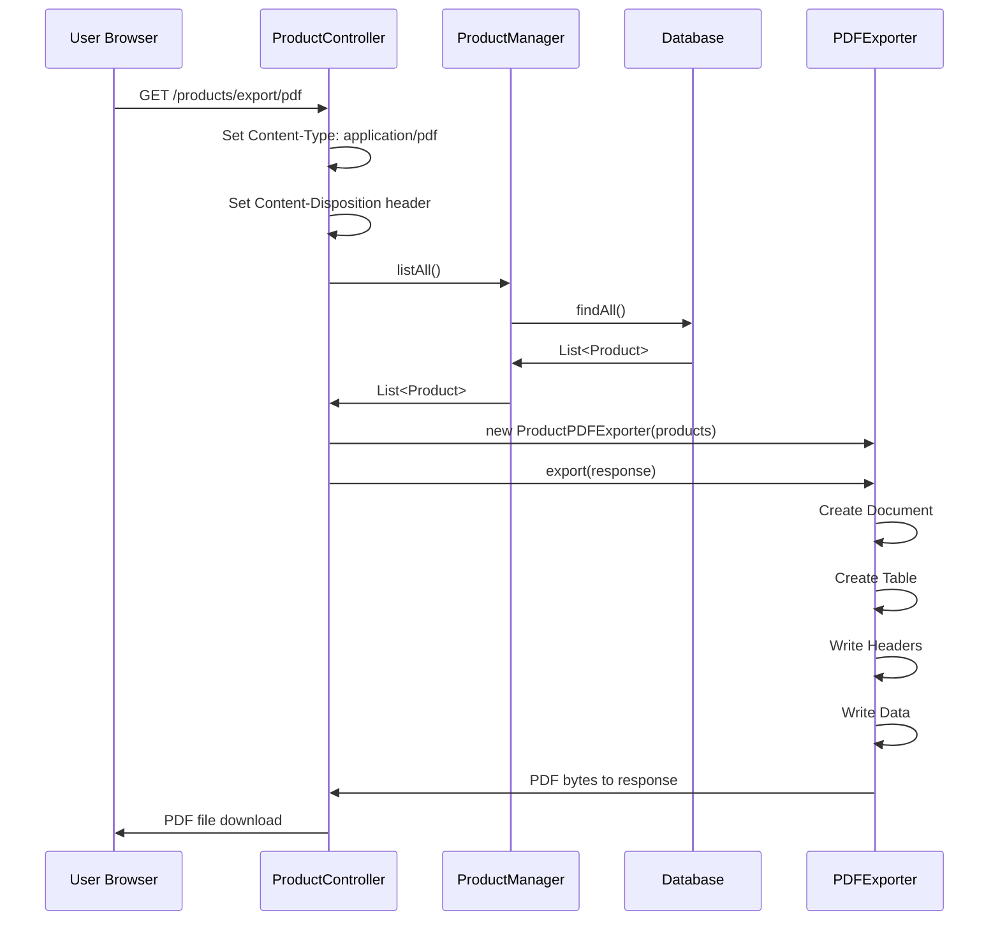

# 📄 PDF Generation in Spring Boot

## Table of Contents
1. [Introduction](#introduction)
2. [iText Library Overview](#itext-library-overview)
3. [Project Setup](#project-setup)
4. [PDF Exporter Implementation](#pdf-exporter-implementation)
5. [Controller for PDF Download](#controller-for-pdf-download)
6. [Complete Application Flow](#complete-application-flow)
7. [Interview Questions](#interview-questions)

---

## Introduction

### What We're Building

```
┌─────────────────────────────────────────────────────────────┐
│           PDF Generation Feature                             │
├─────────────────────────────────────────────────────────────┤
│                                                             │
│  Goal: Generate a PDF file containing product data          │
│                                                             │
│  User clicks:                                               │
│    /products/export/pdf                                     │
│       ↓                                                     │
│  Application:                                               │
│    1. Fetches products from database                        │
│    2. Creates PDF document                                  │
│    3. Adds table with product data                          │
│    4. Sets Content-Disposition header                       │
│       ↓                                                     │
│  Browser:                                                   │
│    Downloads Products_2024-01-15_10:30:45.pdf               │
│                                                             │
└─────────────────────────────────────────────────────────────┘
```

---

## iText Library Overview

### What is iText?

**iText** is a Java library for creating and manipulating PDF documents.

```
┌─────────────────────────────────────────────────────────────┐
│           iText (OpenPDF) Features                           │
├─────────────────────────────────────────────────────────────┤
│                                                             │
│  Capabilities:                                              │
│    ✓ Create PDF documents from scratch                      │
│    ✓ Add text, images, tables                               │
│    ✓ Set fonts, colors, formatting                          │
│    ✓ Generate tables with headers                           │
│    ✓ Write directly to HTTP response                        │
│                                                             │
│  Package Used: com.lowagie.text (OpenPDF fork)              │
│                                                             │
│  Key Classes:                                               │
│    Document → Represents PDF document                       │
│    PdfWriter → Writes PDF to output stream                  │
│    PdfPTable → Creates tables in PDF                        │
│    PdfPCell → Individual cell in table                      │
│    Paragraph → Text element                                 │
│    Font → Text styling                                      │
│                                                             │
└─────────────────────────────────────────────────────────────┘
```

---

## Project Setup

### Dependencies (pom.xml)

```xml
<dependencies>
    <!-- Spring Boot Web -->
    <dependency>
        <groupId>org.springframework.boot</groupId>
        <artifactId>spring-boot-starter-web</artifactId>
    </dependency>
    
    <!-- Spring Boot Data JPA -->
    <dependency>
        <groupId>org.springframework.boot</groupId>
        <artifactId>spring-boot-starter-data-jpa</artifactId>
    </dependency>
    
    <!-- OpenPDF (iText fork) - For PDF Generation -->
    <dependency>
        <groupId>com.github.librepdf</groupId>
        <artifactId>openpdf</artifactId>
        <version>1.3.30</version>
    </dependency>
</dependencies>
```

### Project Structure

```
src/main/java/com/example/demo/
├── PdfProApplication.java      # Main class
├── Product.java                # Entity
├── ProductRepository.java      # JPA Repository
├── ProductManager.java         # Service interface
├── ProductManagerImpl.java     # Service implementation
├── ProductController.java      # Controller with PDF endpoint
└── ProductPDFExporter.java     # PDF generation logic
```

---

## PDF Exporter Implementation

### ProductPDFExporter.java

```java
package com.example.demo;
 
import java.awt.Color;
import java.io.IOException;
import java.util.List;
 
import jakarta.servlet.http.HttpServletResponse;
 
import com.lowagie.text.*;
import com.lowagie.text.pdf.*;
 
public class ProductPDFExporter {
    private List<Product> products;
     
    public ProductPDFExporter(List<Product> products) {
        this.products = products;
    }
 
    private void writeTableHeader(PdfPTable table) {
        PdfPCell cell = new PdfPCell();
        cell.setPadding(5);
        cell.setBackgroundColor(Color.BLUE);
         
        Font font = FontFactory.getFont(FontFactory.HELVETICA);
        font.setColor(Color.WHITE);
         
        cell.setPhrase(new Phrase("Product_Id", font));
        table.addCell(cell);
         
        cell.setPhrase(new Phrase("Product_Name", font));
        table.addCell(cell);
         
        cell.setPhrase(new Phrase("Price", font));
        table.addCell(cell);
         
        cell.setPhrase(new Phrase("Qty", font));
        table.addCell(cell);
    }
     
    private void writeTableData(PdfPTable table) {
        for (Product product : products) {
            table.addCell(String.valueOf(product.getId()));
            table.addCell(product.getName());
            table.addCell(String.valueOf(product.getPrice()));
            table.addCell(String.valueOf(product.getQty()));
        }
    }
     
    public void export(HttpServletResponse response) throws DocumentException, IOException {
        // Create A4 size PDF document
        Document document = new Document(PageSize.A4);
        
        // Attach PDF writer to response output stream
        PdfWriter.getInstance(document, response.getOutputStream());
         
        document.open();
        
        // Create title with styling
        Font font = FontFactory.getFont(FontFactory.HELVETICA_BOLD);
        font.setSize(18);
        font.setColor(Color.BLUE);
         
        Paragraph p = new Paragraph("List of Products", font);
        p.setAlignment(Paragraph.ALIGN_CENTER);
         
        document.add(p);
         
        // Create table with 4 columns
        PdfPTable table = new PdfPTable(4);
        table.setWidthPercentage(100f);
        table.setWidths(new float[] {3.5f, 3.5f, 3.0f, 3.0f});
        table.setSpacingBefore(10);
         
        writeTableHeader(table);
        writeTableData(table);
         
        document.add(table);
        document.close();
    }
}
```

### Line-by-Line Explanation

| Line | Code | Purpose |
|------|------|---------|
| `Document document = new Document(PageSize.A4)` | Create document | A4 size PDF container |
| `PdfWriter.getInstance(document, response.getOutputStream())` | Attach writer | Write directly to HTTP response |
| `document.open()` | Open document | Ready for content |
| `FontFactory.getFont(FontFactory.HELVETICA_BOLD)` | Create font | Bold Helvetica font |
| `font.setSize(18)` | Font size | 18pt title |
| `font.setColor(Color.BLUE)` | Font color | Blue text |
| `Paragraph p = new Paragraph("text", font)` | Create paragraph | Title paragraph |
| `p.setAlignment(Paragraph.ALIGN_CENTER)` | Center align | Center the title |
| `PdfPTable table = new PdfPTable(4)` | Create table | 4 column table |
| `table.setWidthPercentage(100f)` | Table width | Full page width |
| `table.setWidths(new float[] {3.5f, 3.5f, 3.0f, 3.0f})` | Column widths | Relative widths |
| `table.setSpacingBefore(10)` | Spacing | Space after title |
| `PdfPCell cell = new PdfPCell()` | Create cell | Table cell |
| `cell.setBackgroundColor(Color.BLUE)` | Cell background | Blue header |
| `cell.setPhrase(new Phrase("text", font))` | Cell content | Text with font |
| `table.addCell(cell)` | Add to table | Insert cell |
| `document.close()` | Close document | Finish PDF |

---

## Controller for PDF Download

### ProductController.java

```java
package com.example.demo;
 
import java.io.IOException;
import java.text.DateFormat;
import java.text.SimpleDateFormat;
import java.util.Date;
import java.util.List;
 
import jakarta.servlet.http.HttpServletResponse;
 
import org.springframework.beans.factory.annotation.Autowired;
import org.springframework.stereotype.Controller;
import org.springframework.web.bind.annotation.GetMapping;
import com.lowagie.text.DocumentException;
 
@Controller
public class ProductController {
 
    @Autowired
    private ProductManager manager;
         
    @GetMapping("/products/export/pdf")
    public void exportToPDF(HttpServletResponse response) throws DocumentException, IOException {
        // Set content type for PDF
        response.setContentType("application/pdf");
        
        // Create filename with timestamp
        DateFormat dateFormatter = new SimpleDateFormat("yyyy-MM-dd_HH:mm:ss");
        String currentDateTime = dateFormatter.format(new Date());
         
        // Set Content-Disposition header for download
        String headerKey = "Content-Disposition";
        String headerValue = "attachment; filename=Products_" + currentDateTime + ".pdf";
        response.setHeader(headerKey, headerValue);
         
        // Get products from database
        List<Product> products = manager.listAll();
         
        // Create exporter and generate PDF
        ProductPDFExporter exporter = new ProductPDFExporter(products);
        exporter.export(response);
    }
}
```

### Key Headers Explained

```
┌─────────────────────────────────────────────────────────────┐
│           HTTP Headers for PDF Download                      │
├─────────────────────────────────────────────────────────────┤
│                                                             │
│  Content-Type: application/pdf                              │
│    → Tells browser this is a PDF file                       │
│    → Browser knows how to handle it                         │
│                                                             │
│  Content-Disposition: attachment; filename=Products.pdf     │
│    → "attachment" = Force download (not display in browser) │
│    → "filename=" = Suggested filename for save dialog       │
│                                                             │
│  Without Content-Disposition:                               │
│    → PDF might open in browser tab                          │
│                                                             │
│  With Content-Disposition:                                  │
│    → Browser shows "Save As" dialog                         │
│    → File saved with specified name                         │
│                                                             │
└─────────────────────────────────────────────────────────────┘
```

---

## Complete Application Flow

### Flow Diagram



### Step-by-Step Flow

```
┌─────────────────────────────────────────────────────────────┐
│           PDF Generation Flow                                │
├─────────────────────────────────────────────────────────────┤
│                                                             │
│  Step 1: User Requests                                      │
│    Browser → GET /products/export/pdf                       │
│                                                             │
│  Step 2: Controller Prepares Response                       │
│    Set Content-Type: application/pdf                        │
│    Set Content-Disposition: attachment; filename=X.pdf      │
│                                                             │
│  Step 3: Fetch Data                                         │
│    ProductManager.listAll() → Database query                │
│    Returns List<Product>                                    │
│                                                             │
│  Step 4: Create PDF Exporter                                │
│    new ProductPDFExporter(products)                         │
│                                                             │
│  Step 5: Generate PDF                                       │
│    exporter.export(response)                                │
│    - Creates Document                                       │
│    - Attaches to response.getOutputStream()                 │
│    - Writes title, table, data                              │
│    - Closes document                                        │
│                                                             │
│  Step 6: Browser Receives                                   │
│    Browser sees Content-Disposition: attachment             │
│    Shows "Save File" dialog                                 │
│    User saves Products_2024-01-15.pdf                       │
│                                                             │
└─────────────────────────────────────────────────────────────┘
```

---

## Interview Questions

### Q1: Which library is used for PDF generation in this example?
**Answer**: OpenPDF (com.lowagie.text), which is a fork of iText. It provides classes like Document, PdfWriter, PdfPTable, PdfPCell, etc.

### Q2: What is the purpose of Content-Disposition header?
**Answer**: It tells the browser how to handle the response:
- `attachment` = Download the file instead of displaying
- `filename=` = Suggested name for the downloaded file

### Q3: How does the PDF get written to the HTTP response?
**Answer**: By attaching PdfWriter to the response output stream:
```java
PdfWriter.getInstance(document, response.getOutputStream());
```
This writes PDF bytes directly to the response as they're generated.

### Q4: Why use `@Controller` instead of `@RestController`?
**Answer**: The method returns `void` and writes directly to the response output stream. With `@RestController`, Spring would try to serialize the return value as JSON/XML. Since we're writing binary PDF data to the stream, `@Controller` is more appropriate.

---

## Summary

```
┌─────────────────────────────────────────────────────────────┐
│           PDF Generation Summary                             │
├─────────────────────────────────────────────────────────────┤
│                                                             │
│  Library: OpenPDF (com.lowagie.text)                        │
│                                                             │
│  Key Classes:                                               │
│    Document → PDF container                                 │
│    PdfWriter → Output stream writer                         │
│    PdfPTable → Table structure                              │
│    PdfPCell → Table cell                                    │
│    Paragraph → Text element                                 │
│                                                             │
│  Controller Setup:                                          │
│    response.setContentType("application/pdf");              │
│    response.setHeader("Content-Disposition", "attachment"); │
│                                                             │
│  Exporter Pattern:                                          │
│    1. Take data in constructor                              │
│    2. export(response) method generates PDF                 │
│    3. Write directly to response output stream              │
│                                                             │
└─────────────────────────────────────────────────────────────┘
```

---

*Next: [15_Spring_Boot_Email.md](./15_Spring_Boot_Email.md)*
