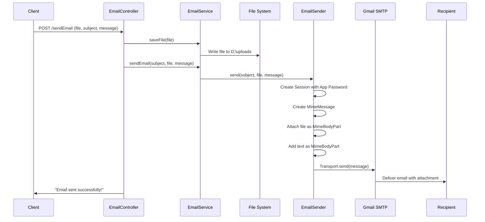

# 📧 Email with Attachments in Spring Boot

## Table of Contents
1. [Introduction](#introduction)
2. [Gmail SMTP Configuration](#gmail-smtp-configuration)
3. [Google App Password Setup](#google-app-password-setup)
4. [Project Setup](#project-setup)
5. [Email Sender Implementation](#email-sender-implementation)
6. [Controller Implementation](#controller-implementation)
7. [Complete Application Flow](#complete-application-flow)
8. [Interview Questions](#interview-questions)

---

## Introduction

### What We're Building

```
┌─────────────────────────────────────────────────────────────┐
│           Email with Attachment Feature                      │
├─────────────────────────────────────────────────────────────┤
│                                                             │
│  Goal: Send email with file attachment via Spring Boot      │
│                                                             │
│  User uploads file via REST API:                            │
│    POST /sendEmail                                          │
│    - Subject                                                │
│    - Message                                                │
│    - File (attachment)                                      │
│       ↓                                                     │
│  Application:                                               │
│    1. Saves file to server                                  │
│    2. Creates MIME message with attachment                  │
│    3. Connects to Gmail SMTP                                │
│    4. Sends email                                           │
│       ↓                                                     │
│  Recipient receives email with attachment                   │
│                                                             │
└─────────────────────────────────────────────────────────────┘
```

---

## Gmail SMTP Configuration

### SMTP Properties

```
┌─────────────────────────────────────────────────────────────┐
│           Gmail SMTP Settings                                │
├─────────────────────────────────────────────────────────────┤
│                                                             │
│  Server: smtp.gmail.com                                     │
│  Port: 587 (TLS) or 465 (SSL)                               │
│  Authentication: Required                                   │
│                                                             │
│  Required Properties:                                       │
│    mail.smtp.auth = true                                    │
│    mail.smtp.starttls.enable = true                         │
│    mail.smtp.host = smtp.gmail.com                          │
│    mail.smtp.port = 587                                     │
│                                                             │
│  ⚠️ Important:                                              │
│    Google disabled "Allow Less Secure Apps" in 2022         │
│    You MUST use App Passwords for authentication            │
│                                                             │
└─────────────────────────────────────────────────────────────┘
```

---

## Google App Password Setup

### Step-by-Step Guide

```
┌─────────────────────────────────────────────────────────────┐
│           Generate Google App Password                       │
├─────────────────────────────────────────────────────────────┤
│                                                             │
│  Step 1: Go to Google Account Security                      │
│    https://myaccount.google.com/security                    │
│                                                             │
│  Step 2: Enable 2-Step Verification (required)              │
│    Security → 2-Step Verification → Turn On                 │
│                                                             │
│  Step 3: Create App Password                                │
│    Security → App passwords                                 │
│    Select app: Mail                                         │
│    Select device: Windows Computer (or Other)               │
│    Click "Generate"                                         │
│                                                             │
│  Step 4: Copy the 16-character password                     │
│    Example: kpdv qbfl rgtq audb                             │
│    Use this in your code instead of Gmail password          │
│                                                             │
│  Why App Password?                                          │
│    ✓ Regular Gmail password won't work                      │
│    ✓ App password is specific to one app                    │
│    ✓ Can be revoked without changing main password          │
│    ✓ More secure than exposing main password                │
│                                                             │
└─────────────────────────────────────────────────────────────┘
```

---

## Project Setup

### Dependencies

```xml
<dependencies>
    <dependency>
        <groupId>org.springframework.boot</groupId>
        <artifactId>spring-boot-starter-web</artifactId>
    </dependency>
    
    <!-- JavaMail API for sending emails -->
    <dependency>
        <groupId>org.springframework.boot</groupId>
        <artifactId>spring-boot-starter-mail</artifactId>
    </dependency>
</dependencies>
```

### application.properties

```properties
# File upload path for attachments
file.path=D:\\uploads
```

### Project Structure

```
src/main/java/com/example/mail/
├── SendEmailAttachmentApplication.java
├── EmailController.java
├── EmailService.java
├── EmailServiceImpl.java
└── EmailSender.java
```

---

## Email Sender Implementation

### EmailSender.java

```java
package com.example.mail;

import java.io.File;
import java.util.Properties;

import org.springframework.beans.factory.annotation.Value;
import org.springframework.stereotype.Component;
import org.springframework.web.multipart.MultipartFile;

import jakarta.activation.DataHandler;
import jakarta.activation.DataSource;
import jakarta.activation.FileDataSource;
import jakarta.mail.BodyPart;
import jakarta.mail.Message;
import jakarta.mail.Multipart;
import jakarta.mail.PasswordAuthentication;
import jakarta.mail.Session;
import jakarta.mail.Transport;
import jakarta.mail.internet.InternetAddress;
import jakarta.mail.internet.MimeBodyPart;
import jakarta.mail.internet.MimeMessage;
import jakarta.mail.internet.MimeMultipart;

@Component
public class EmailSender {
    
    @Value("${file.path}")
    private String path;
    
    public void send(String subject, MultipartFile filename, String message) {
        // Gmail credentials (App Password, NOT regular password)
        final String username = "youremail@gmail.com";
        final String password = "kpdvqbflrgtqaudb";  // App Password
 
        // SMTP properties
        Properties props = new Properties();
        props.put("mail.smtp.auth", "true");
        props.put("mail.smtp.starttls.enable", "true");
        props.put("mail.smtp.host", "smtp.gmail.com");
        props.put("mail.smtp.port", "587");
 
        // Create session with authentication
        Session session = Session.getInstance(props,
          new jakarta.mail.Authenticator() {
            protected PasswordAuthentication getPasswordAuthentication() {
                return new PasswordAuthentication(username, password);
            }
          });
 
        try {
            // Create MIME message
            MimeMessage message1 = new MimeMessage(session);
            message1.setRecipients(Message.RecipientType.TO,
                InternetAddress.parse("recipient@gmail.com"));
            message1.setSubject(subject);

            // Part 1: File attachment
            MimeBodyPart part1 = new MimeBodyPart();  
            String name = filename.getOriginalFilename();
            String filePath = path + File.separator + name;
            DataSource source = new FileDataSource(filePath); 
            System.out.println("File Name is\t" + filePath);
            part1.setDataHandler(new DataHandler(source));  
            part1.setFileName(filePath);  
            
            // Part 2: Text message
            BodyPart part2 = new MimeBodyPart();  
            part2.setText(message);  
            
            // Combine parts into multipart
            Multipart multipart = new MimeMultipart();  
            multipart.addBodyPart(part1);  // Attachment
            multipart.addBodyPart(part2);  // Text
            
            // Set content and send
            message1.setContent(multipart);
            Transport.send(message1);
 
            System.out.println("Done completely");
 
        } catch (Exception e) {
            e.printStackTrace();
        }
    }
}
```

### Line-by-Line Explanation

| Line | Code | Purpose |
|------|------|---------|
| `@Value("${file.path}")` | Inject property | Get upload path from properties |
| `Properties props = new Properties()` | SMTP config | Configure mail server |
| `mail.smtp.auth=true` | Enable auth | Require username/password |
| `mail.smtp.starttls.enable=true` | Enable TLS | Secure connection |
| `mail.smtp.host=smtp.gmail.com` | Gmail server | SMTP host |
| `mail.smtp.port=587` | TLS port | Port 587 for STARTTLS |
| `Session.getInstance(props, Authenticator)` | Create session | Authenticated mail session |
| `PasswordAuthentication` | Credentials | Username and App Password |
| `MimeMessage` | Create email | MIME format message |
| `InternetAddress.parse()` | Parse recipient | Convert to email address |
| `MimeBodyPart` | Create part | Part of multipart message |
| `FileDataSource` | File source | Attach file from disk |
| `DataHandler` | Handle data | Manage binary data |
| `MimeMultipart` | Combine parts | Container for parts |
| `Transport.send()` | Send email | Deliver message |

---

## Controller Implementation

### EmailController.java

```java
package com.example.mail;

import org.springframework.beans.factory.annotation.Autowired;
import org.springframework.web.bind.annotation.PostMapping;
import org.springframework.web.bind.annotation.RequestParam;
import org.springframework.web.bind.annotation.RestController;
import org.springframework.web.multipart.MultipartFile;

@RestController
public class EmailController {

    @Autowired
    private EmailService emailService;
    
    @PostMapping("/sendEmail")
    public String sendEmail(
            @RequestParam("subject") String subject,
            @RequestParam("file") MultipartFile file,
            @RequestParam("message") String message) {
        
        // First save file to disk
        emailService.saveFile(file);
        
        // Then send email with attachment
        emailService.sendEmail(subject, file, message);
        
        return "Email sent successfully!";
    }
}
```

### Testing with API Client

```
┌─────────────────────────────────────────────────────────────┐
│           Testing with ARC/Postman                           │
├─────────────────────────────────────────────────────────────┤
│                                                             │
│  Method: POST                                               │
│  URL: http://localhost:8080/sendEmail                       │
│                                                             │
│  Body type: form-data (multipart/form-data)                 │
│                                                             │
│  Fields:                                                    │
│    subject: "Test Email"                                    │
│    message: "Hello, please find attachment"                 │
│    file: [Select a file]                                    │
│                                                             │
│  Response: "Email sent successfully!"                       │
│                                                             │
└─────────────────────────────────────────────────────────────┘
```

---

## Complete Application Flow

### Flow Diagram



### MIME Message Structure

```
┌─────────────────────────────────────────────────────────────┐
│           MIME Message Structure                             │
├─────────────────────────────────────────────────────────────┤
│                                                             │
│  MimeMessage                                                │
│  ├── To: recipient@gmail.com                                │
│  ├── Subject: "Test Email"                                  │
│  └── Content: MimeMultipart                                 │
│      ├── Part 1: MimeBodyPart (Attachment)                  │
│      │   ├── DataHandler → FileDataSource                   │
│      │   └── FileName: "document.pdf"                       │
│      │                                                      │
│      └── Part 2: MimeBodyPart (Text)                        │
│          └── Text: "Hello, please find attachment"          │
│                                                             │
│  Why Multipart?                                             │
│    • Email can have multiple parts                          │
│    • Each part can be different type                        │
│    • Attachments + Text body together                       │
│                                                             │
└─────────────────────────────────────────────────────────────┘
```

---

## Interview Questions

### Q1: Why do we need App Password instead of regular Gmail password?
**Answer**: Google disabled "Less Secure Apps" access in 2022 for security reasons. App Passwords are:
- Specific to one application
- Can be revoked without changing main password
- Required for third-party email clients

### Q2: What is the difference between MimeBodyPart and BodyPart?
**Answer**: 
- `BodyPart` is an interface/abstract class
- `MimeBodyPart` is concrete implementation for MIME format
- Use `MimeBodyPart` for creating actual email parts

### Q3: What port is used for Gmail SMTP with TLS?
**Answer**: Port 587 with STARTTLS enabled. Alternative is port 465 with SSL.

### Q4: Why use MimeMultipart for email with attachment?
**Answer**: A simple message can only contain text. MimeMultipart allows combining multiple parts (text body + file attachments) into a single email.

### Q5: What does `mail.smtp.starttls.enable=true` do?
**Answer**: Enables STARTTLS which upgrades a plain text connection to encrypted TLS/SSL. This ensures email content is transmitted securely.

---

## Summary

```
┌─────────────────────────────────────────────────────────────┐
│           Email with Attachments Summary                     │
├─────────────────────────────────────────────────────────────┤
│                                                             │
│  SMTP Configuration:                                        │
│    Host: smtp.gmail.com                                     │
│    Port: 587                                                │
│    Auth: true, STARTTLS: true                               │
│                                                             │
│  Authentication:                                            │
│    Use Google App Password (NOT regular password)           │
│    Enable 2-Step Verification first                         │
│                                                             │
│  Key Classes:                                               │
│    Session → Authenticated mail session                     │
│    MimeMessage → Email message                              │
│    MimeBodyPart → Part of message (text or file)            │
│    MimeMultipart → Container for parts                      │
│    Transport → Send the message                             │
│                                                             │
│  Flow:                                                      │
│    1. Create Session with credentials                       │
│    2. Create MimeMessage                                    │
│    3. Create MimeBodyPart for attachment                    │
│    4. Create MimeBodyPart for text                          │
│    5. Combine in MimeMultipart                              │
│    6. Transport.send()                                      │
│                                                             │
└─────────────────────────────────────────────────────────────┘
```

---

*Next: [16_Spring_Boot_Actuator.md](./16_Spring_Boot_Actuator.md)*
